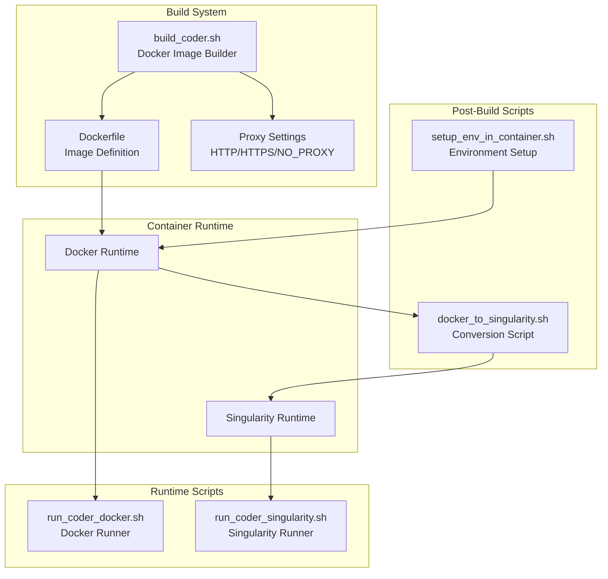
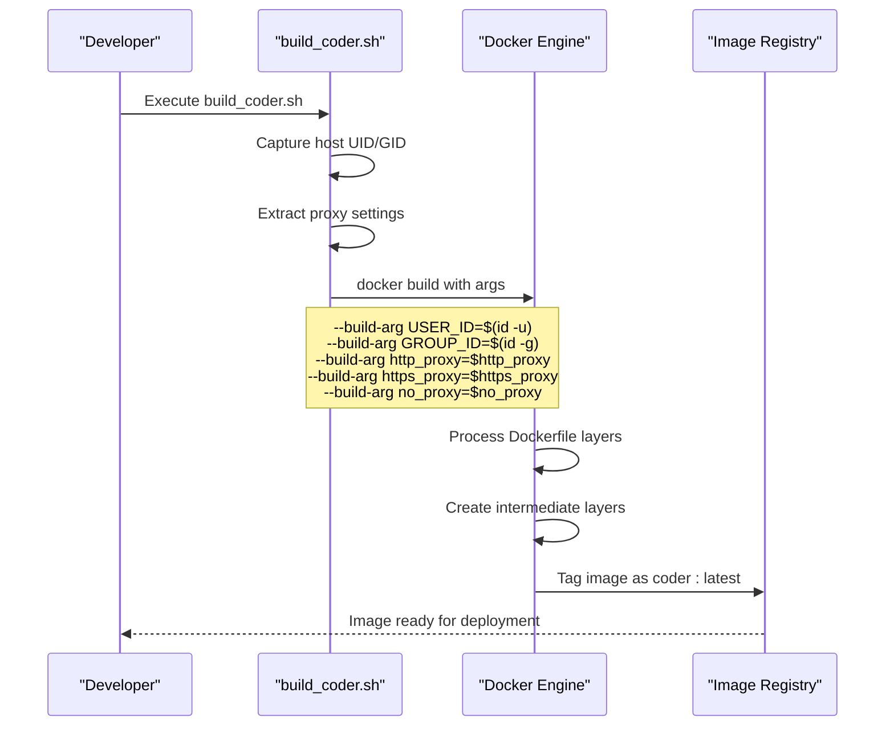
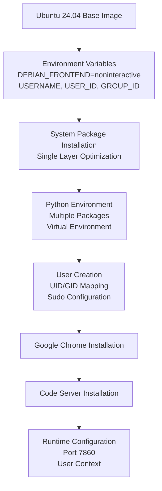
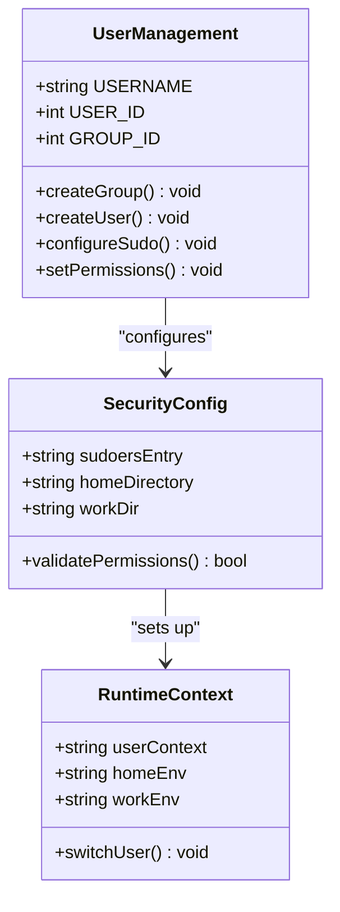
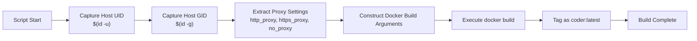
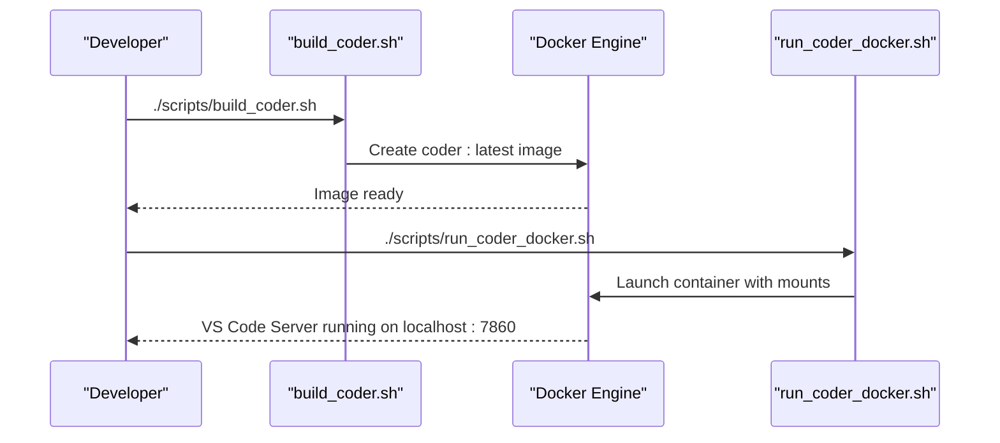
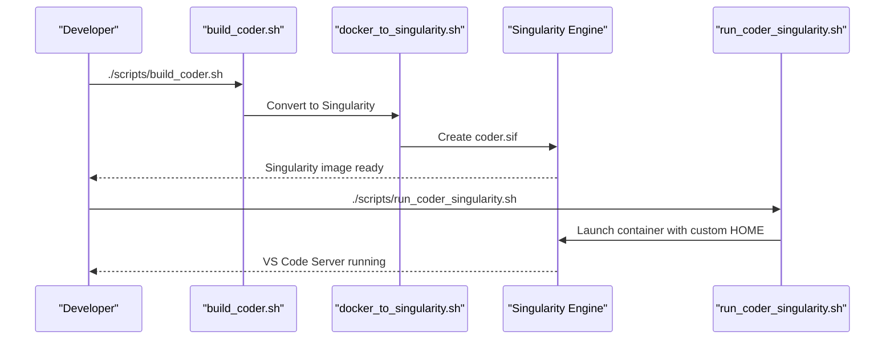
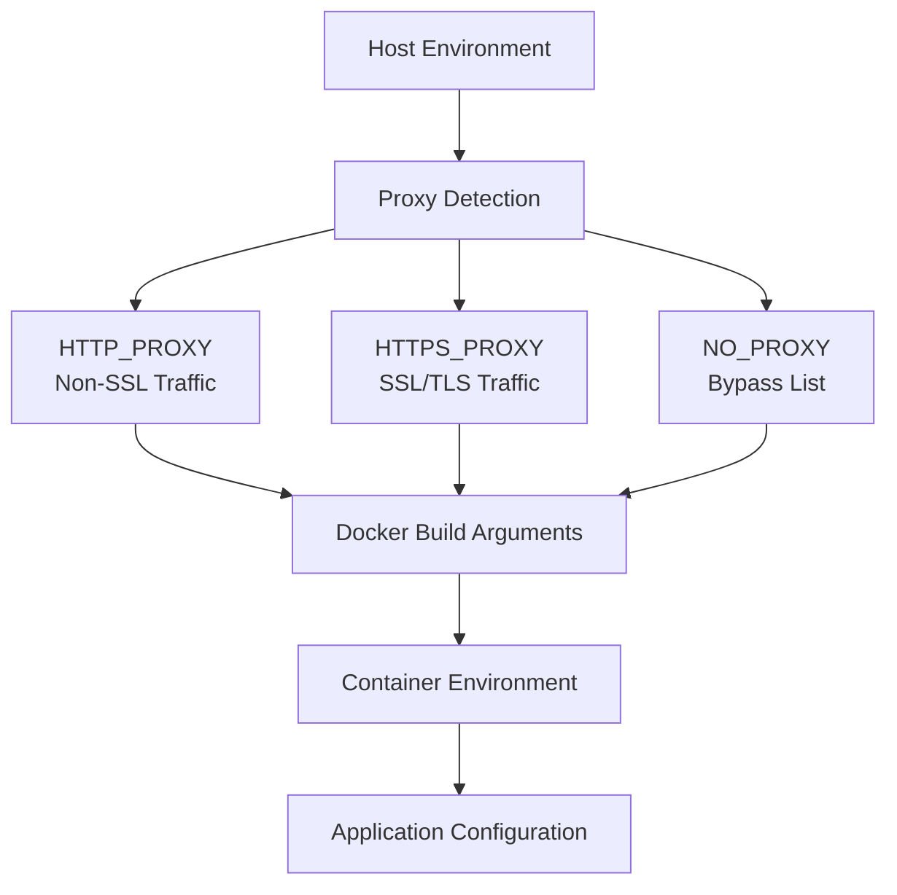
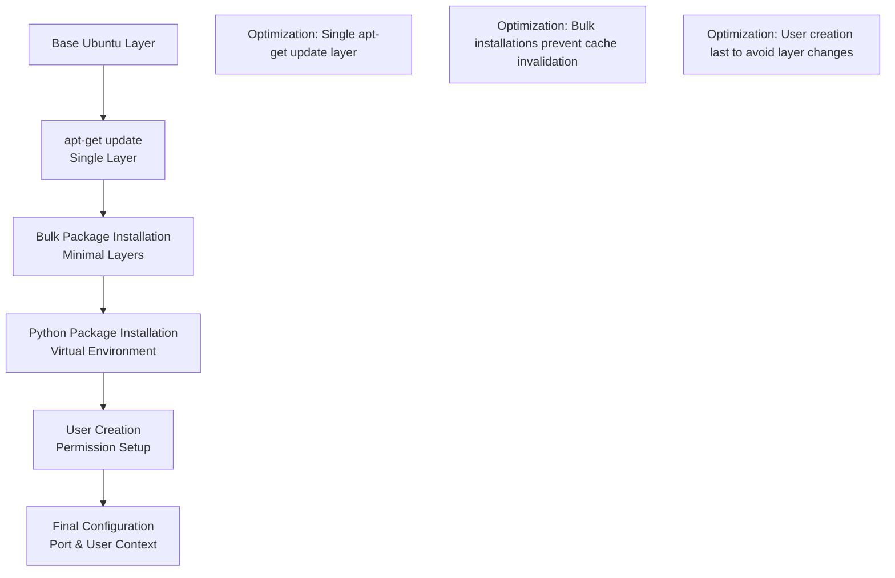

# Build System

<cite>
**Referenced Files in This Document**
- [scripts/build_coder.sh](file://scripts/build_coder.sh)
- [Dockerfile](file://Dockerfile)
- [scripts/docker_to_singularity.sh](file://scripts/docker_to_singularity.sh)
- [scripts/run_coder_docker.sh](file://scripts/run_coder_docker.sh)
- [scripts/run_coder_singularity.sh](file://scripts/run_coder_singularity.sh)
- [scripts/setup_env_in_container.sh](file://scripts/setup_env_in_container.sh)
- [scripts/setup-kiro-xdg.sh](file://scripts/setup-kiro-xdg.sh)
- [hf/install_vscode_copilot_chat.sh](file://hf/install_vscode_copilot_chat.sh)
- [README.md](file://README.md)
</cite>

## Table of Contents
1. [Introduction](#introduction)
2. [Build System Architecture](#build-system-architecture)
3. [Core Components](#core-components)
4. [Docker Image Creation Process](#docker-image-creation-process)
5. [Dockerfile Analysis](#dockerfile-analysis)
6. [Build Script Implementation](#build-script-implementation)
7. [Multi-Stage Workflow](#multi-stage-workflow)
8. [Configuration Management](#configuration-management)
9. [Integration with Container Runtimes](#integration-with-container-runtimes)
10. [Performance Optimization](#performance-optimization)
11. [Troubleshooting Guide](#troubleshooting-guide)
12. [Best Practices](#best-practices)

## Introduction

The Coder development environment build system provides a comprehensive solution for creating containerized development environments using both Docker and Singularity container runtimes. The system centers around two primary orchestration scripts: `build_coder.sh` for Docker image creation and `docker_to_singularity.sh` for converting Docker images to Singularity format. This build system ensures consistent, reproducible development environments while preserving user permissions and supporting enterprise proxy configurations.

The build system is designed to serve multiple deployment scenarios, from local development using Docker to high-performance computing (HPC) environments requiring Singularity containers. It maintains strict separation between build-time and runtime configurations, enabling flexible deployment across different infrastructure types.

## Build System Architecture

The build system follows a modular architecture that separates concerns between image building, conversion, and runtime execution. This design enables independent scaling and maintenance of each component while maintaining compatibility across container runtimes.

**Diagram sources**
- [scripts/build_coder.sh](file://scripts/build_coder.sh#L1-L9)
- [Dockerfile](file://Dockerfile#L1-L150)
- [scripts/docker_to_singularity.sh](file://scripts/docker_to_singularity.sh#L1-L17)

## Core Components

The build system consists of several interconnected components that work together to create and deploy containerized development environments:

### Primary Build Orchestration
- **build_coder.sh**: Orchestrates the Docker image creation process with proper argument passing
- **Dockerfile**: Defines the complete container image specification with multi-stage considerations

### Runtime Integration Scripts
- **docker_to_singularity.sh**: Converts Docker images to Singularity format for HPC environments
- **run_coder_docker.sh**: Manages Docker container execution with proper mounting and networking
- **run_coder_singularity.sh**: Handles Singularity container execution with custom HOME directory support

### Environment Setup
- **setup_env_in_container.sh**: Configures the development environment inside containers
- **setup-kiro-xdg.sh**: Sets up URL handlers for external authentication systems

**Section sources**
- [scripts/build_coder.sh](file://scripts/build_coder.sh#L1-L9)
- [Dockerfile](file://Dockerfile#L1-L150)
- [scripts/docker_to_singularity.sh](file://scripts/docker_to_singularity.sh#L1-L17)

## Docker Image Creation Process

The Docker image creation process is orchestrated through a carefully designed pipeline that ensures proper user mapping, proxy configuration, and image optimization. The process begins with the `build_coder.sh` script, which invokes Docker with specific build arguments.

**Diagram sources**
- [scripts/build_coder.sh](file://scripts/build_coder.sh#L2-L8)
- [Dockerfile](file://Dockerfile#L5-L8)

### Build Argument Processing

The build system captures and passes several critical parameters from the host environment to the Docker build process:

| Parameter | Source | Purpose | Default Value |
|-----------|--------|---------|---------------|
| USER_ID | `$(id -u)` | Host user ID for file permissions | 1001 |
| GROUP_ID | `$(id -g)` | Host group ID for file permissions | 1001 |
| http_proxy | `$http_proxy` | HTTP proxy configuration | None |
| https_proxy | `$https_proxy` | HTTPS proxy configuration | None |
| no_proxy | `$no_proxy` | Proxy bypass list | None |

These parameters ensure that the resulting container maintains proper file ownership and can access network resources through corporate proxies when required.

**Section sources**
- [scripts/build_coder.sh](file://scripts/build_coder.sh#L3-L7)

## Dockerfile Analysis

The Dockerfile defines a comprehensive development environment that includes system packages, programming languages, development tools, and specialized software for AI/ML development.

### Base Image and Environment Setup

The Dockerfile starts with Ubuntu 24.04 as the base image and establishes a controlled environment for reproducible builds:

**Diagram sources**
- [Dockerfile](file://Dockerfile#L1-L150)

### System Package Management

The Dockerfile installs a comprehensive set of development tools and libraries in a single `RUN` instruction to optimize layer caching:

#### Essential Development Tools
- **Build Essentials**: `build-essential`, `cmake`, `gcc`, `g++`, `make`
- **Python Stack**: `python3`, `python3-pip`, `python3-dev`, `python3.12-venv`
- **Package Management**: `pip`, `wheel`, `setuptools`, `virtualenv`
- **Compression Utilities**: `unzip`, `7zip`, `p7zip-full`, `swig`

#### GUI and Development Libraries
- **GTK/X11**: Comprehensive set of development libraries for GUI applications
- **Network Tools**: `openssh-client`, `curl`, `wget`, `lsof`
- **Version Control**: `git`, `git-lfs`, `gitdb`, `smmap`

#### Specialized Dependencies
- **Web Technologies**: `node-gyp`, `playwright`, `chromium`
- **Data Science**: `numpy`, `pandas`, `matplotlib`, `scikit-learn`
- **Security**: `libssl-dev`, `libffi-dev`, `cryptography`

### User and Permission Management

The Dockerfile implements sophisticated user management to ensure proper file ownership and security:

**Diagram sources**
- [Dockerfile](file://Dockerfile#L111-L114)
- [Dockerfile](file://Dockerfile#L144-L147)

The user creation process ensures that files created within the container match the host user's permissions, preventing ownership conflicts during development.

**Section sources**
- [Dockerfile](file://Dockerfile#L111-L147)

## Build Script Implementation

The `build_coder.sh` script serves as the primary entry point for Docker image creation, implementing a clean and efficient build orchestration pattern.

### Script Architecture

The script follows a minimalist design philosophy, focusing on essential functionality while maintaining flexibility:

**Diagram sources**
- [scripts/build_coder.sh](file://scripts/build_coder.sh#L1-L9)

### Argument Construction Strategy

The script intelligently constructs Docker build arguments by:

1. **Dynamic Environment Detection**: Automatically captures host user and group identifiers
2. **Conditional Proxy Handling**: Only includes proxy arguments when environment variables are set
3. **Clean Argument List**: Maintains minimal and readable argument construction

### Error Handling and Validation

While the script maintains simplicity, it incorporates basic validation through Docker's built-in error reporting mechanisms. The script assumes that any failures will be reported clearly by the Docker engine.

**Section sources**
- [scripts/build_coder.sh](file://scripts/build_coder.sh#L1-L9)

## Multi-Stage Workflow

The build system supports multiple deployment scenarios through a well-defined workflow that accommodates both Docker-native and HPC environments.

### Docker Native Workflow

**Diagram sources**
- [scripts/build_coder.sh](file://scripts/build_coder.sh#L1-L9)
- [scripts/run_coder_docker.sh](file://scripts/run_coder_docker.sh#L1-L78)

### Singularity Conversion Workflow

For HPC environments requiring Singularity containers:

**Diagram sources**
- [scripts/build_coder.sh](file://scripts/build_coder.sh#L1-L9)
- [scripts/docker_to_singularity.sh](file://scripts/docker_to_singularity.sh#L1-L17)
- [scripts/run_coder_singularity.sh](file://scripts/run_coder_singularity.sh#L1-L115)

### Workflow Comparison

| Aspect | Docker Workflow | Singularity Workflow |
|--------|----------------|---------------------|
| Image Format | Docker image registry | Singularity image file (.sif) |
| Runtime Requirements | Docker daemon | Singularity installation |
| Port Forwarding | Built-in Docker networking | Manual port mapping |
| Volume Mounting | Docker volumes | Bind mounts |
| Custom HOME Directory | Limited support | Full customization |
| Security Model | Namespace isolation | Process isolation |

**Section sources**
- [scripts/docker_to_singularity.sh](file://scripts/docker_to_singularity.sh#L1-L17)
- [scripts/run_coder_docker.sh](file://scripts/run_coder_docker.sh#L1-L78)
- [scripts/run_coder_singularity.sh](file://scripts/run_coder_singularity.sh#L1-L115)

## Configuration Management

The build system implements comprehensive configuration management to handle various deployment scenarios and enterprise requirements.

### Proxy Configuration Support

The system provides robust support for corporate proxy environments through environment variable propagation:

**Diagram sources**
- [scripts/build_coder.sh](file://scripts/build_coder.sh#L5-L7)

### Environment Variable Propagation

The configuration system handles environment variables across multiple layers:

| Variable Category | Scope | Persistence | Usage |
|------------------|-------|-------------|-------|
| Build-time Args | Docker build | Transient | User ID, Group ID, Proxy settings |
| Runtime Envs | Container startup | Persistent | PORT, DISPLAY, HOME |
| Application Vars | Application level | Session | Python paths, Node.js versions |

### Configuration Validation

The system implements implicit validation through Docker's build process, which validates argument types and availability before attempting to use them in the Dockerfile.

**Section sources**
- [scripts/build_coder.sh](file://scripts/build_coder.sh#L5-L7)
- [Dockerfile](file://Dockerfile#L5-L8)

## Integration with Container Runtimes

The build system is designed to integrate seamlessly with both Docker and Singularity container runtimes, providing runtime flexibility while maintaining consistent behavior.

### Docker Runtime Integration

The Docker runtime integration focuses on ease of use and local development convenience:

#### Key Features
- **Automatic Port Mapping**: Maps container port 7860 to host port 7860
- **Volume Mounting**: Preserves host file system access
- **X11 Forwarding**: Supports GUI applications through display forwarding
- **Proxy Inheritance**: Automatically inherits proxy settings from host

#### Security Considerations
- **User Context**: Runs as mapped host user for file permissions
- **Capabilities**: Requires SYS_ADMIN capability for FUSE mounting
- **IPC Sharing**: Uses host IPC namespace for communication

### Singularity Runtime Integration

Singularity integration provides HPC-compatible containerization with enhanced security:

#### Custom HOME Directory Support
The Singularity runtime supports custom HOME directory specification, crucial for HPC environments where user home directories may differ from standard locations.

#### Enhanced Security Model
- **Natural User Mapping**: Uses host user/group IDs naturally
- **Capability Restrictions**: Minimal capabilities for security
- **Namespace Isolation**: Process-level isolation suitable for shared filesystems

#### Mount Point Management
The system automatically manages necessary mount points for:
- **System Directories**: `/nfs`, `/usr/intel`, `/var/tmp`
- **Device Access**: `/dev/fuse` for file system operations
- **Temporary Storage**: `/tmp`, `/var/tmp` for build processes

**Section sources**
- [scripts/run_coder_docker.sh](file://scripts/run_coder_docker.sh#L39-L76)
- [scripts/run_coder_singularity.sh](file://scripts/run_coder_singularity.sh#L74-L97)

## Performance Optimization

The build system incorporates several performance optimization strategies to minimize build times and image sizes while maintaining functionality.

### Layer Caching Strategy

The Dockerfile implements intelligent layer caching through strategic ordering of instructions:

**Diagram sources**
- [Dockerfile](file://Dockerfile#L13-L108)

### Image Size Optimization

Several techniques are employed to minimize the final image size:

#### Package Selection Strategy
- **No-Install Recommends**: Uses `--no-install-recommends` to avoid unnecessary dependencies
- **Selective Package Installation**: Installs only required packages for development
- **Cleanup Commands**: Removes package caches and temporary files

#### Multi-Stage Considerations
While the current Dockerfile is single-stage, the architecture supports future multi-stage implementations for further size reduction.

### Build Performance Metrics

| Optimization Technique | Impact | Implementation |
|----------------------|--------|----------------|
| Single apt-get update | Reduces layers | Combined in one RUN instruction |
| Package grouping | Minimizes cache invalidation | Related packages grouped together |
| User creation last | Prevents layer changes | Final layer for user setup |
| Cleanup commands | Reduces image size | Automatic cache removal |

**Section sources**
- [Dockerfile](file://Dockerfile#L13-L108)

## Troubleshooting Guide

This section addresses common issues encountered during the build and runtime processes, providing systematic debugging approaches.

### Build-Time Issues

#### Proxy Configuration Problems
**Symptoms**: Build fails with network connectivity errors
**Diagnosis**: Check proxy environment variables and network access
**Resolution**: 
- Verify proxy variables are correctly set: `echo $http_proxy`
- Test network connectivity from host: `curl -I http://example.com`
- Ensure proxy bypass list includes internal domains

#### Permission Errors During Build
**Symptoms**: Docker build fails with permission denied errors
**Diagnosis**: User ID/GID mismatch or insufficient privileges
**Resolution**:
- Verify Docker daemon is running with sufficient privileges
- Check user membership in docker group: `groups`
- Ensure build context permissions are correct

#### Layer Cache Issues
**Symptoms**: Unexpected rebuilds or outdated packages
**Diagnosis**: Layer cache corruption or manual cache clearing
**Resolution**:
- Clear Docker build cache: `docker builder prune`
- Force rebuild without cache: `docker build --no-cache ...`
- Verify package versions in Dockerfile match requirements

### Runtime Issues

#### Container Startup Failures
**Symptoms**: Container exits immediately or fails to start
**Diagnosis**: Port conflicts, volume mount issues, or configuration problems
**Resolution**:
- Check port availability: `netstat -tulpn | grep 7860`
- Verify volume mount paths exist on host
- Review container logs: `docker logs <container_id>`

#### File Permission Problems
**Symptoms**: Files created with incorrect ownership
**Diagnosis**: User ID mismatch between host and container
**Resolution**:
- Rebuild image with correct USER_ID/GROUP_ID
- Verify host user ID matches container expectations
- Check mount point permissions

#### Network Connectivity Issues
**Symptoms**: Cannot access VS Code Server or external resources
**Diagnosis**: Firewall, proxy, or DNS configuration problems
**Resolution**:
- Verify firewall allows port 7860
- Check proxy configuration in container
- Test DNS resolution: `nslookup google.com`

### Debugging Strategies

#### Log Analysis
- **Docker Build Logs**: Monitor layer creation and error messages
- **Container Logs**: Use `docker logs` for runtime diagnostics
- **System Logs**: Check Docker daemon logs for system-level issues

#### Interactive Debugging
- **Shell Access**: Use `--shell` mode to investigate container state
- **Process Inspection**: Examine running processes and network connections
- **File System Analysis**: Verify mount points and file permissions

**Section sources**
- [README.md](file://README.md#L180-L217)

## Best Practices

This section outlines recommended practices for using and extending the build system effectively.

### Development Workflow Best Practices

#### Image Management
- **Tagging Strategy**: Use semantic versioning for production images
- **Cleanup Policy**: Regularly remove unused images and containers
- **Layer Optimization**: Group related operations to maximize cache hits

#### Security Considerations
- **Privilege Minimization**: Run containers with minimal required privileges
- **Network Isolation**: Use Docker networks for container communication
- **Secret Management**: Avoid hardcoding sensitive information in images

#### Performance Optimization
- **Build Context**: Keep build context small to reduce transfer times
- **Layer Ordering**: Place frequently changing instructions last
- **Multi-stage Builds**: Consider multi-stage builds for production images

### Extension Guidelines

#### Adding New Software
When adding new software to the Dockerfile:
1. **Group Related Packages**: Install related packages together to minimize layers
2. **Use Appropriate Versions**: Specify exact versions for reproducibility
3. **Test Installation**: Verify functionality in the container environment
4. **Document Changes**: Update documentation with new requirements

#### Customizing for Specific Environments
- **Enterprise Networks**: Configure proxy settings appropriately
- **HPC Environments**: Optimize for Singularity deployment
- **Development Workstations**: Focus on developer productivity features

### Maintenance Procedures

#### Regular Updates
- **Base Image Updates**: Regularly update Ubuntu base image
- **Package Updates**: Monitor security updates for installed packages
- **Tool Versions**: Keep development tools updated for compatibility

#### Monitoring and Alerting
- **Build Failure Monitoring**: Set up alerts for build failures
- **Image Size Tracking**: Monitor image size growth over time
- **Performance Metrics**: Track build and runtime performance

**Section sources**
- [README.md](file://README.md#L200-L217)