# Container Architecture

<cite>
**Referenced Files in This Document**
- [Dockerfile](file://Dockerfile)
- [hf/Dockerfile](file://hf/Dockerfile)
- [scripts/build_coder.sh](file://scripts/build_coder.sh)
- [scripts/run_coder_docker.sh](file://scripts/run_coder_docker.sh)
- [scripts/run_coder_singularity.sh](file://scripts/run_coder_singularity.sh)
- [scripts/docker_to_singularity.sh](file://scripts/docker_to_singularity.sh)
- [scripts/setup_env_in_container.sh](file://scripts/setup_env_in_container.sh)
- [scripts/setup-kiro-xdg.sh](file://scripts/setup-kiro-xdg.sh)
- [hf/install_vscode_copilot_chat.sh](file://hf/install_vscode_copilot_chat.sh)
- [README.md](file://README.md)
</cite>

## Table of Contents
1. [Introduction](#introduction)
2. [High-Level Architecture](#high-level-architecture)
3. [Base Image Design](#base-image-design)
4. [Layered Installation Approach](#layered-installation-approach)
5. [Alternative Configurations](#alternative-configurations)
6. [Environment Variables and Customization](#environment-variables-and-customization)
7. [Component Interactions](#component-interactions)
8. [Security Considerations](#security-considerations)
9. [Infrastructure Requirements](#infrastructure-requirements)
10. [Scalability and Team Environments](#scalability-and-team-environments)
11. [Design Trade-offs](#design-trade-offs)
12. [HPC Environment Compatibility](#hpc-environment-compatibility)
13. [Troubleshooting and Best Practices](#troubleshooting-and-best-practices)

## Introduction

The Coder development environment provides a comprehensive containerized solution for software development using VS Code Server (code-server) with Docker and Singularity support. This architecture enables consistent development environments across different platforms while maintaining flexibility for various deployment scenarios, particularly in High-Performance Computing (HPC) environments.

The container design follows a layered approach that combines system-level dependencies, development tools, and user-specific configurations into a portable, reproducible environment. The architecture supports both local development with Docker and HPC deployments with Singularity, demonstrating the versatility of container technologies in diverse computing environments.

## High-Level Architecture

The container architecture consists of several interconnected components that work together to provide a complete development environment:

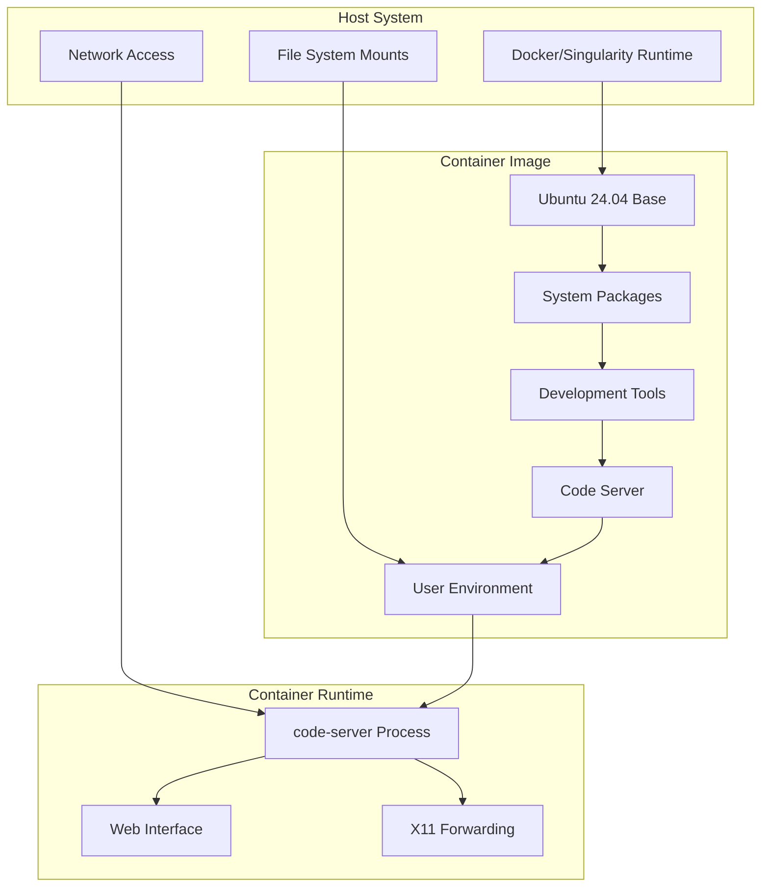

**Diagram sources**
- [Dockerfile](file://Dockerfile#L1-L150)
- [scripts/run_coder_docker.sh](file://scripts/run_coder_docker.sh#L1-L78)

The architecture demonstrates a clear separation of concerns:
- **Base Layer**: Ubuntu 24.04 LTS provides a stable foundation
- **System Layer**: Essential packages and dependencies
- **Application Layer**: Development tools and IDE components
- **Runtime Layer**: Execution environment and user interface

**Section sources**
- [Dockerfile](file://Dockerfile#L1-L150)
- [README.md](file://README.md#L1-L217)

## Base Image Design

### Ubuntu LTS Foundation

The container design begins with Ubuntu 24.04 LTS as the base image, chosen for its stability, long-term support, and extensive package ecosystem. This selection ensures compatibility with enterprise-grade systems while providing access to modern development tools.

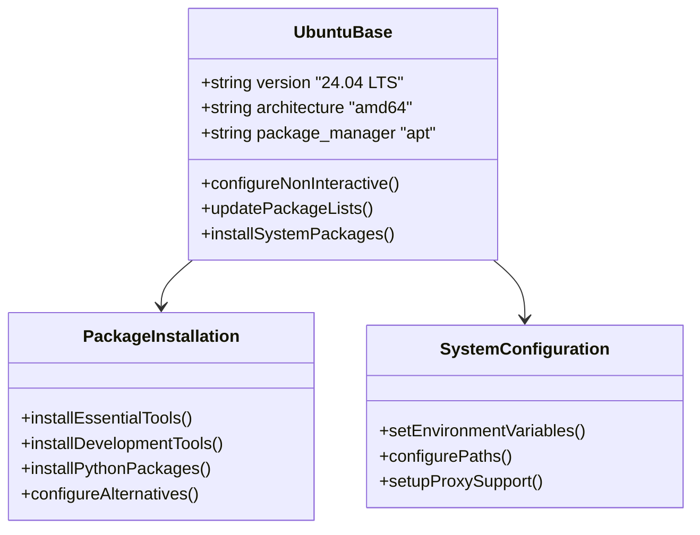

**Diagram sources**
- [Dockerfile](file://Dockerfile#L1-L100)

### Core Dependencies Installation

The system layer installs essential packages in a single Docker layer to optimize build performance and reduce image size. The installation includes:

| Category | Packages | Purpose |
|----------|----------|---------|
| **System Utilities** | curl, wget, git, vim, less, sudo | Basic system tools and version control |
| **Development Tools** | build-essential, cmake, ninja-build, python3, python3-pip | Core compilation and Python support |
| **Libraries** | zlib1g-dev, libreadline-dev, libffi-dev, libgmp3-dev | System libraries for various applications |
| **Graphics & Display** | libgtk-3-dev, libx11-dev, libxkbfile-dev, libsecret-1-dev | GUI and display system integration |
| **Networking** | openssh-client, libkrb5-dev, libnss3-dev | Network connectivity and authentication |

The layered approach ensures that system packages are installed efficiently while maintaining the ability to add application-specific dependencies later in the build process.

**Section sources**
- [Dockerfile](file://Dockerfile#L13-L100)

## Layered Installation Approach

### System Packages Layer

The first major layer focuses on system-level dependencies that form the foundation of the development environment. This layer uses a single `RUN` instruction to minimize the number of layers and improve build efficiency:

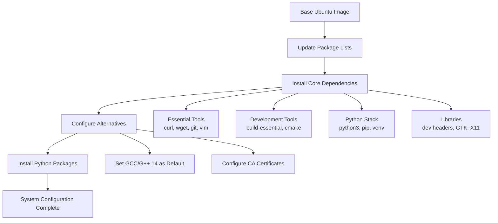

**Diagram sources**
- [Dockerfile](file://Dockerfile#L13-L100)

### Code Server Installation

The second major layer installs code-server, the VS Code Server that provides the web-based IDE interface. This layer demonstrates careful consideration of dependencies and compatibility:

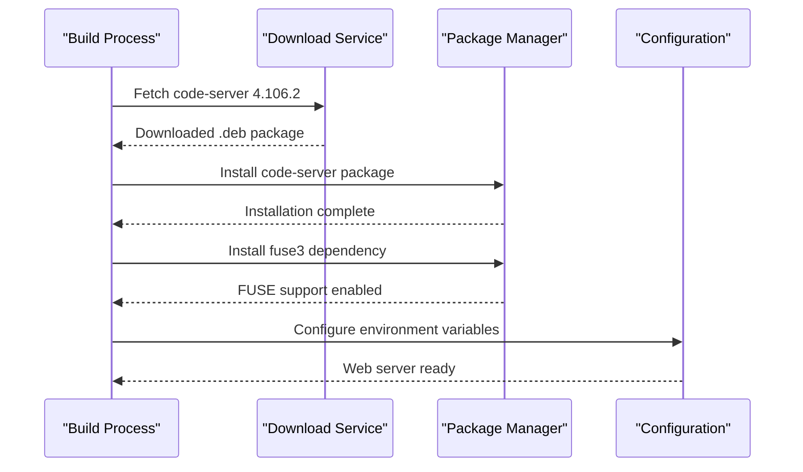

**Diagram sources**
- [Dockerfile](file://Dockerfile#L131-L136)

### User Setup and Permissions

The third layer establishes the user environment with proper UID/GID mapping for file system compatibility:

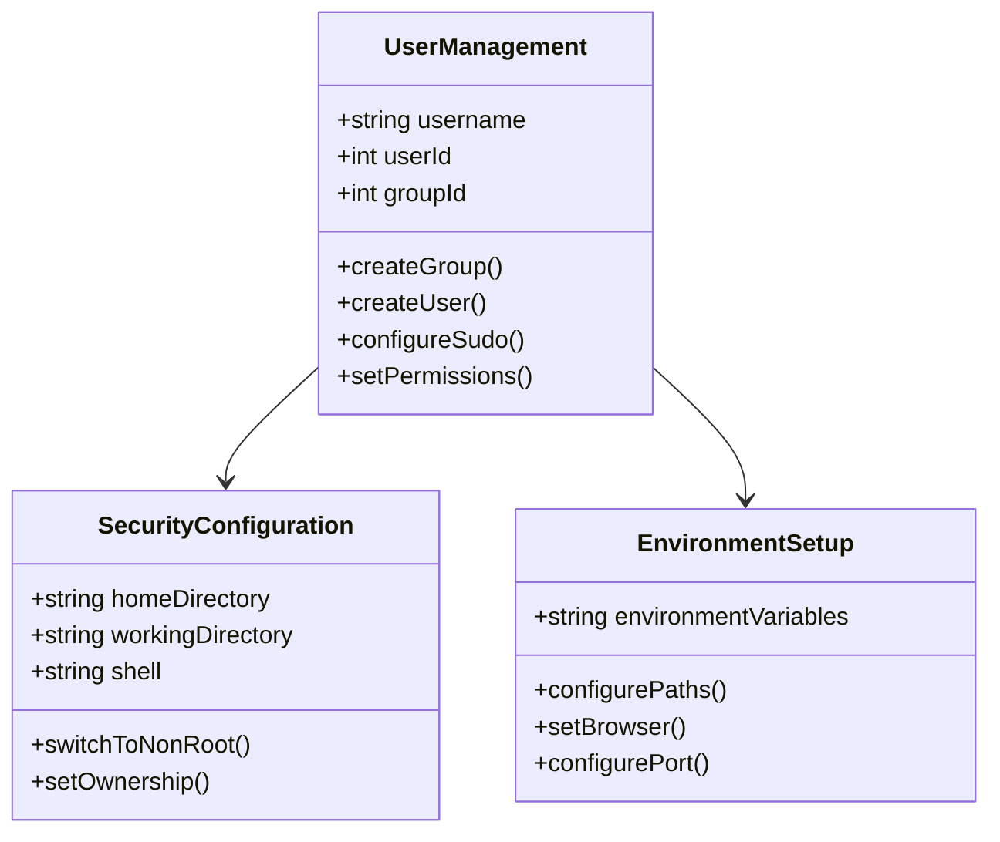

**Diagram sources**
- [Dockerfile](file://Dockerfile#L111-L147)

**Section sources**
- [Dockerfile](file://Dockerfile#L111-L147)

## Alternative Configurations

### Main Dockerfile vs HF Configuration

The repository provides two distinct Dockerfile configurations to address different deployment scenarios:

| Aspect | Main Dockerfile | HF Configuration |
|--------|----------------|------------------|
| **Base User** | Custom username with UID/GID mapping | Existing ubuntu user (UID 1000) |
| **Fixuid Tool** | Disabled (not needed for Singularity) | Removed entirely |
| **Sudo Configuration** | Full sudo access for custom user | Full sudo access for ubuntu user |
| **Code Server Version** | 4.106.2 | 4.105.1 |
| **Additional Tools** | Minimal setup | Extended toolchain (nvm, uv, acli) |
| **Extension Installation** | Bundled with image | Cloned and installed at runtime |

### Feature Comparison

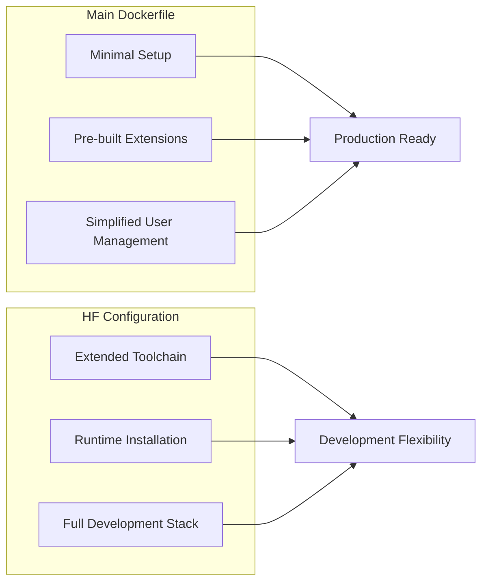

**Diagram sources**
- [Dockerfile](file://Dockerfile#L1-L150)
- [hf/Dockerfile](file://hf/Dockerfile#L1-L146)

The main Dockerfile prioritizes simplicity and production readiness, while the HF configuration emphasizes development flexibility and runtime customization capabilities.

**Section sources**
- [Dockerfile](file://Dockerfile#L1-L150)
- [hf/Dockerfile](file://hf/Dockerfile#L1-L146)

## Environment Variables and Customization

### Build-Time Configuration

The container supports extensive customization through build-time arguments and environment variables:

| Variable | Default Value | Purpose |
|----------|---------------|---------|
| `USER_ID` | 1001 | Container user UID |
| `GROUP_ID` | 1001 | Container group GID |
| `USERNAME` | hfeng1 | Container username |
| `DEBIAN_FRONTEND` | noninteractive | Non-interactive package installation |

### Runtime Environment Variables

During container execution, several environment variables control the behavior:

| Variable | Default | Description |
|----------|---------|-------------|
| `PORT` | 7860 | Web server port |
| `BROWSER` | google-chrome | Default browser |
| `SHELL` | /bin/bash | Default shell |
| `DISPLAY` | - | X11 display for GUI apps |

### Proxy Support

The architecture includes comprehensive proxy support for corporate environments:

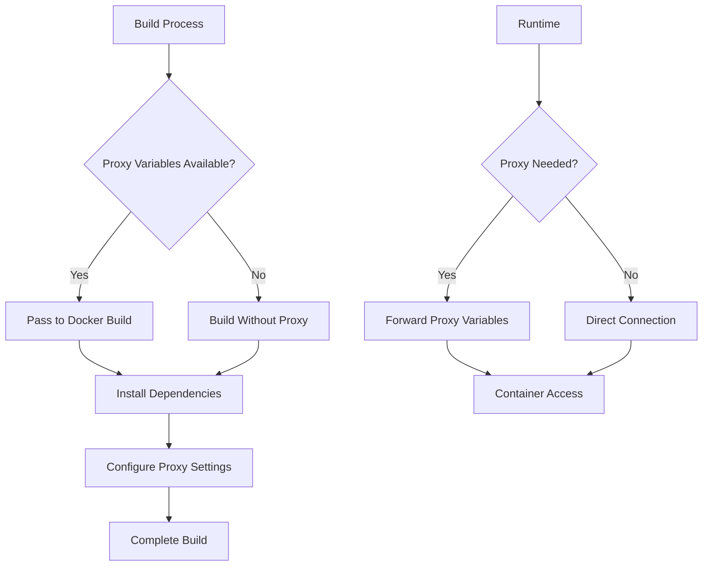

**Diagram sources**
- [scripts/build_coder.sh](file://scripts/build_coder.sh#L1-L9)
- [scripts/run_coder_docker.sh](file://scripts/run_coder_docker.sh#L45-L47)

**Section sources**
- [Dockerfile](file://Dockerfile#L4-L8)
- [scripts/build_coder.sh](file://scripts/build_coder.sh#L1-L9)
- [scripts/run_coder_docker.sh](file://scripts/run_coder_docker.sh#L26-L27)

## Component Interactions

### Build Pipeline Architecture

The container build process involves multiple scripts working together to create a functional development environment:

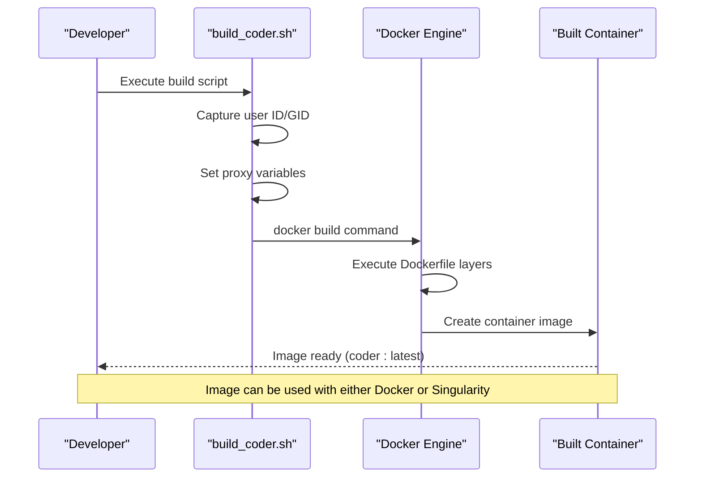

**Diagram sources**
- [scripts/build_coder.sh](file://scripts/build_coder.sh#L1-L9)
- [Dockerfile](file://Dockerfile#L1-L150)

### Runtime Execution Flow

The runtime execution demonstrates how the containerized environment integrates with the host system:

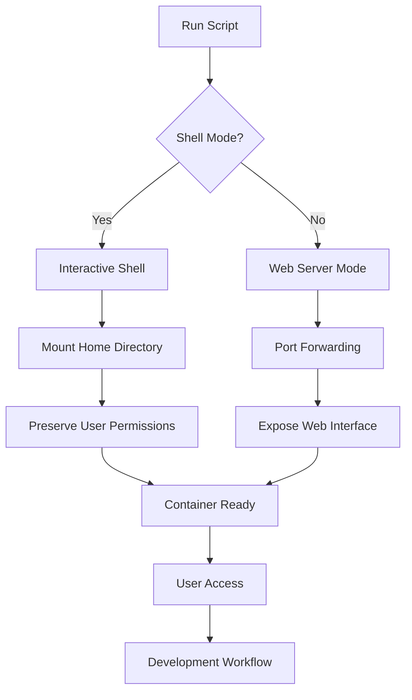

**Diagram sources**
- [scripts/run_coder_docker.sh](file://scripts/run_coder_docker.sh#L34-L77)

### Cross-Platform Compatibility

The architecture supports both Docker and Singularity runtimes, enabling deployment across different environments:

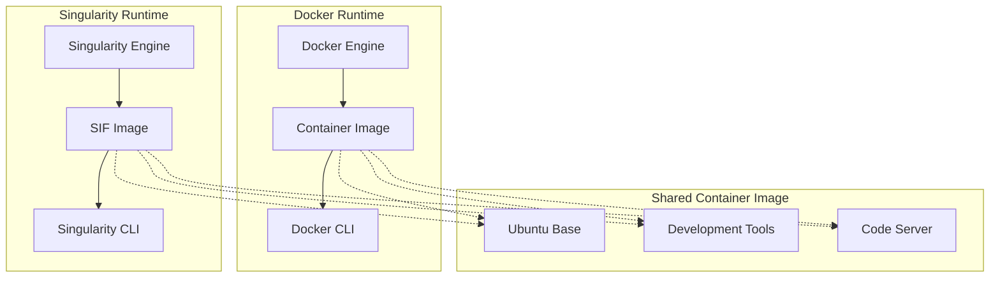

**Diagram sources**
- [scripts/run_coder_docker.sh](file://scripts/run_coder_docker.sh#L1-L78)
- [scripts/run_coder_singularity.sh](file://scripts/run_coder_singularity.sh#L1-L115)
- [scripts/docker_to_singularity.sh](file://scripts/docker_to_singularity.sh#L1-L17)

**Section sources**
- [scripts/build_coder.sh](file://scripts/build_coder.sh#L1-L9)
- [scripts/run_coder_docker.sh](file://scripts/run_coder_docker.sh#L1-L78)
- [scripts/run_coder_singularity.sh](file://scripts/run_coder_singularity.sh#L1-L115)

## Security Considerations

### Non-Root User Execution

The container design implements security best practices through non-root execution:

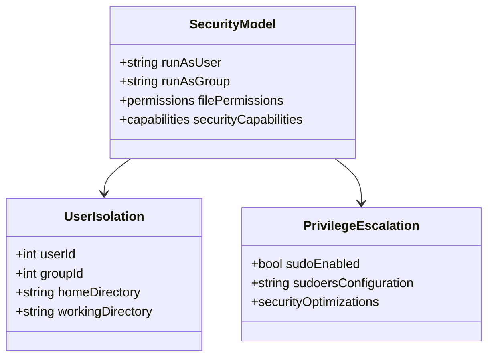

**Diagram sources**
- [Dockerfile](file://Dockerfile#L144-L147)

### Minimal Privilege Principles

The container implements several security measures:

| Security Layer | Implementation | Purpose |
|----------------|----------------|---------|
| **User Isolation** | UID/GID mapping preserves host permissions | Prevents file ownership conflicts |
| **Non-Root Execution** | Runs as specific user, not root | Reduces attack surface |
| **Limited Capabilities** | Selective capability additions | Minimizes system access |
| **Secure Mounts** | Controlled volume mounting | Prevents unauthorized access |

### Container Hardening

The architecture includes several hardening measures:

- **Fixed Versions**: Specific versions of software packages prevent supply chain attacks
- **Minimal Attack Surface**: Only essential packages are installed
- **Network Isolation**: Controlled port exposure for web interface
- **Resource Limits**: Configurable resource constraints

**Section sources**
- [Dockerfile](file://Dockerfile#L144-L147)
- [scripts/run_coder_docker.sh](file://scripts/run_coder_docker.sh#L39-L44)

## Infrastructure Requirements

### Build-Time Requirements

The container build process requires specific infrastructure components:

| Resource Type | Requirement | Rationale |
|---------------|-------------|-----------|
| **Disk Space** | ~2GB for base image + dependencies | Ubuntu 24.04 base + development tools |
| **Memory** | 2GB+ RAM | Compilation of development tools and Python packages |
| **CPU** | Multi-core processor | Parallel package installation and compilation |
| **Network** | Internet access | Package downloads and dependency resolution |

### Runtime Requirements

During container execution, the following resources are utilized:

| Component | Minimum | Recommended | Purpose |
|-----------|---------|-------------|---------|
| **Memory** | 1GB | 2GB+ | Application runtime and web interface |
| **Storage** | 500MB | 2GB+ | Workspace and temporary files |
| **Network** | Port 7860 | HTTP/HTTPS access | Web interface and external services |
| **Display** | X11 support | Modern graphics | GUI applications and browsers |

### Storage Mounts

The container requires specific host system mounts for full functionality:

```mermaid
graph LR
subgraph "Host System"
A[/nfs/site/home]
B[/nfs]
C[/usr/intel]
D[/tmp/.X11-unix]
end
subgraph "Container"
E[Home Directory]
F[System Libraries]
G[Intel Tools]
H[X11 Socket]
end
A --> E
B --> F
C --> G
D --> H
```

**Diagram sources**
- [scripts/run_coder_docker.sh](file://scripts/run_coder_docker.sh#L49-L52)

**Section sources**
- [scripts/run_coder_docker.sh](file://scripts/run_coder_docker.sh#L49-L52)

## Scalability and Team Environments

### Multi-User Support

The container architecture supports team environments through flexible user configuration:

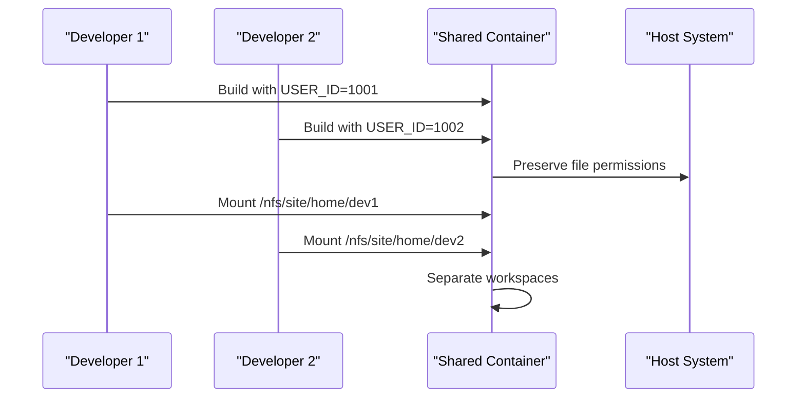

**Diagram sources**
- [Dockerfile](file://Dockerfile#L4-L8)
- [scripts/run_coder_docker.sh](file://scripts/run_coder_docker.sh#L39-L40)

### Team Configuration Benefits

| Benefit | Implementation | Impact |
|---------|----------------|--------|
| **Consistent Environment** | Shared container image | Eliminates "works on my machine" issues |
| **Resource Efficiency** | Single container image | Reduced storage and bandwidth requirements |
| **Standardization** | Uniform tool versions | Consistent development experience |
| **Maintenance** | Centralized updates | Simplified patch management |

### Scaling Considerations

The architecture scales effectively for team environments:

- **Image Sharing**: Single container image distributed across teams
- **Workspace Isolation**: Separate home directories prevent conflicts
- **Resource Allocation**: Configurable resource limits per container
- **Network Management**: Port mapping prevents conflicts

**Section sources**
- [Dockerfile](file://Dockerfile#L4-L8)
- [scripts/run_coder_docker.sh](file://scripts/run_coder_docker.sh#L39-L40)

## Design Trade-offs

### Bundling vs Runtime Installation

The architecture makes deliberate choices between bundling tools in the image versus installing them at runtime:

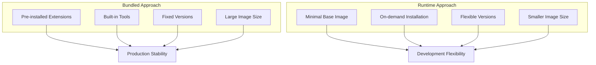

**Diagram sources**
- [Dockerfile](file://Dockerfile#L131-L136)
- [hf/Dockerfile](file://hf/Dockerfile#L103-L139)

### Tool Selection Decisions

The container includes a curated set of development tools:

| Tool Category | Decision | Rationale |
|---------------|----------|-----------|
| **IDE** | code-server | Web-based IDE with VS Code compatibility |
| **Version Control** | git, git-lfs | Essential for modern development workflows |
| **Python** | Full development stack | Comprehensive Python support |
| **Node.js** | nvm + specific version | Flexible JavaScript development |
| **Build Tools** | cmake, ninja, gcc | Modern C/C++ development |
| **Package Managers** | pip, uv | Fast Python package installation |

### Performance vs Flexibility Trade-offs

The architecture balances performance and flexibility:

- **Performance**: Pre-bundled tools reduce startup time
- **Flexibility**: Runtime installation allows customization
- **Size**: Larger images contain more tools
- **Maintenance**: Smaller images require more maintenance

**Section sources**
- [Dockerfile](file://Dockerfile#L131-L136)
- [hf/Dockerfile](file://hf/Dockerfile#L103-L139)

## HPC Environment Compatibility

### Singularity Integration

The container architecture specifically addresses High-Performance Computing requirements through Singularity compatibility:

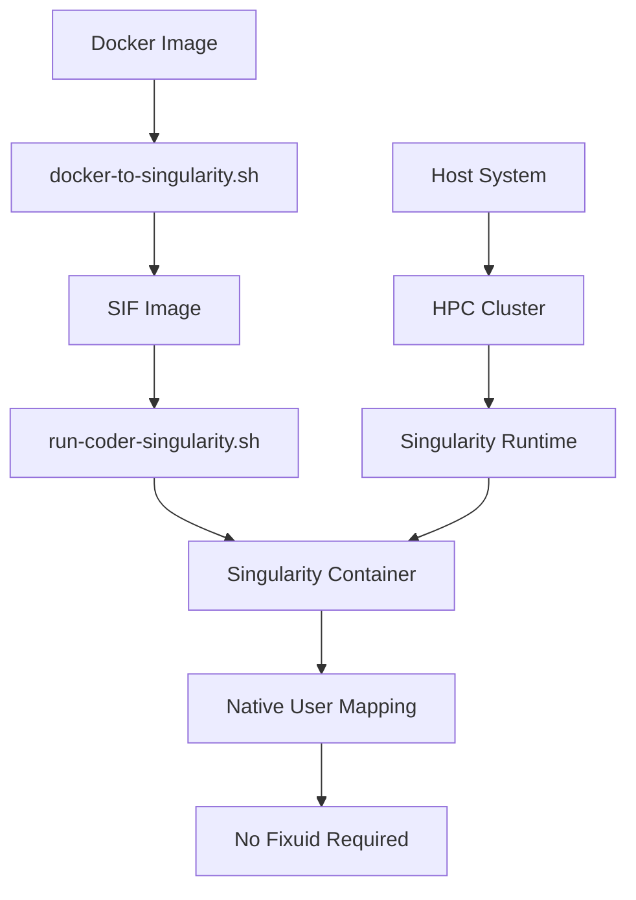

**Diagram sources**
- [scripts/docker_to_singularity.sh](file://scripts/docker_to_singularity.sh#L1-L17)
- [scripts/run_coder_singularity.sh](file://scripts/run_coder_singularity.sh#L1-L115)

### HPC-Specific Features

The architecture includes several features optimized for HPC environments:

| Feature | Implementation | HPC Benefit |
|---------|----------------|-------------|
| **Native User Mapping** | Singularity handles UID/GID | No fixuid tool required |
| **Minimal Dependencies** | Self-contained container | Works in restricted environments |
| **Network Isolation** | Controlled port exposure | Respects cluster firewalls |
| **Resource Control** | Configurable limits | Integrates with HPC schedulers |

### Singularity Compatibility

The design ensures compatibility with HPC cluster requirements:

- **No Root Requirements**: Singularity containers run without root privileges
- **File System Integration**: Proper mount point handling for shared filesystems
- **Network Configuration**: Support for cluster networking and port forwarding
- **GPU Support**: Extensible for GPU-enabled HPC environments

**Section sources**
- [scripts/docker_to_singularity.sh](file://scripts/docker_to_singularity.sh#L1-L17)
- [scripts/run_coder_singularity.sh](file://scripts/run_coder_singularity.sh#L1-L115)

## Troubleshooting and Best Practices

### Common Issues and Solutions

The container architecture includes several mechanisms to handle common deployment issues:

| Issue Category | Symptoms | Solution |
|----------------|----------|----------|
| **Permission Problems** | File ownership conflicts | UID/GID mapping during build |
| **Network Connectivity** | Port binding failures | Configurable port mapping |
| **Proxy Configuration** | Download failures | Proxy environment variables |
| **X11 Forwarding** | GUI application issues | Proper display configuration |

### Best Practices

The architecture incorporates several best practices:

```mermaid
mindmap
root((Container Best Practices))
Security
Non-root execution
Minimal privileges
Regular updates
Performance
Layer optimization
Efficient package management
Resource limits
Maintainability
Clear documentation
Version pinning
Modular design
Compatibility
Cross-platform support
Standard protocols
Environment variables
```

### Monitoring and Maintenance

Key areas for monitoring and maintenance:

- **Image Updates**: Regular security and bug fixes
- **Resource Usage**: Monitor container resource consumption
- **Network Access**: Verify connectivity to external services
- **File System**: Check mount point accessibility

**Section sources**
- [README.md](file://README.md#L178-L217)
- [scripts/run_coder_docker.sh](file://scripts/run_coder_docker.sh#L39-L44)