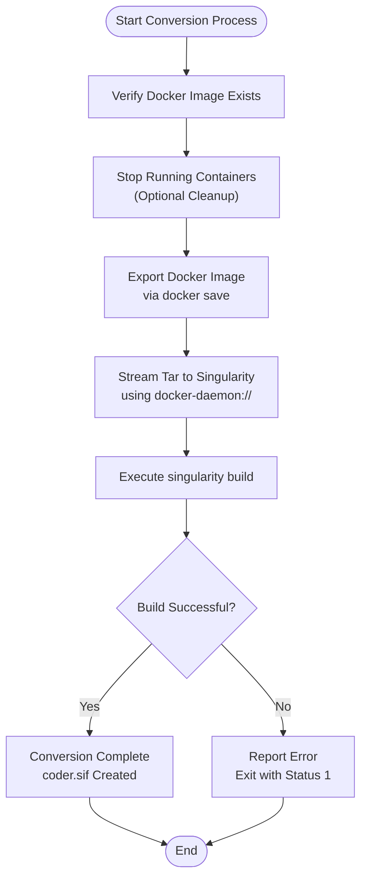
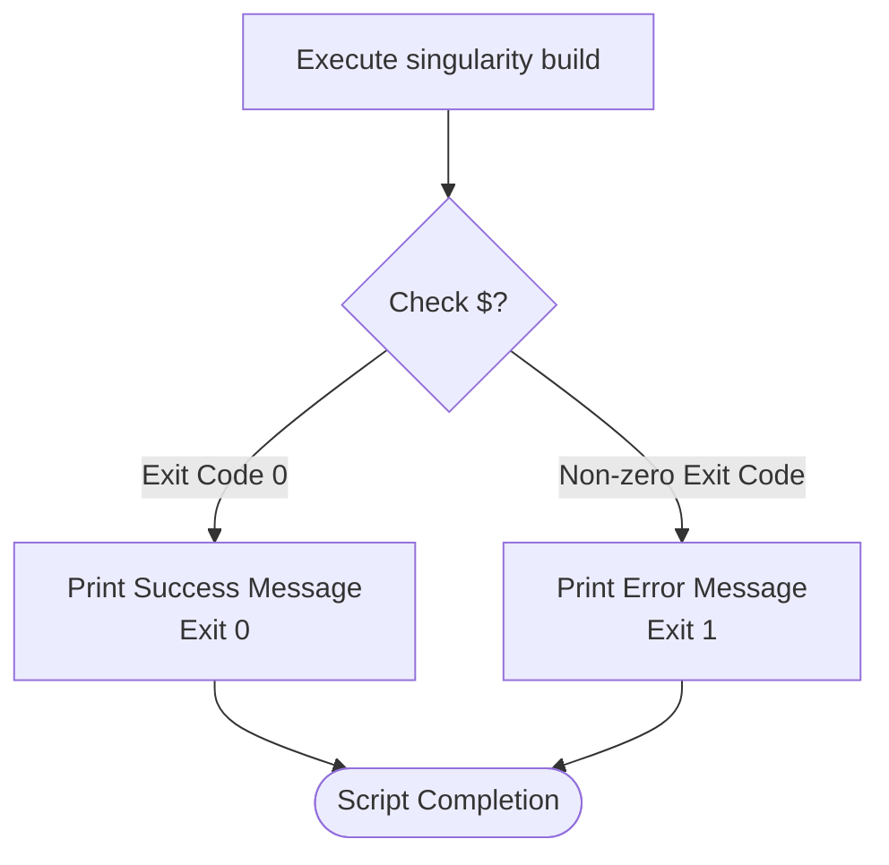
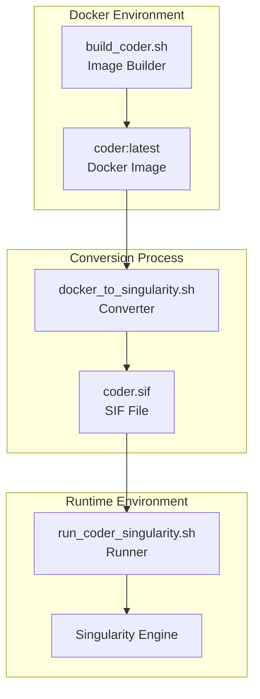
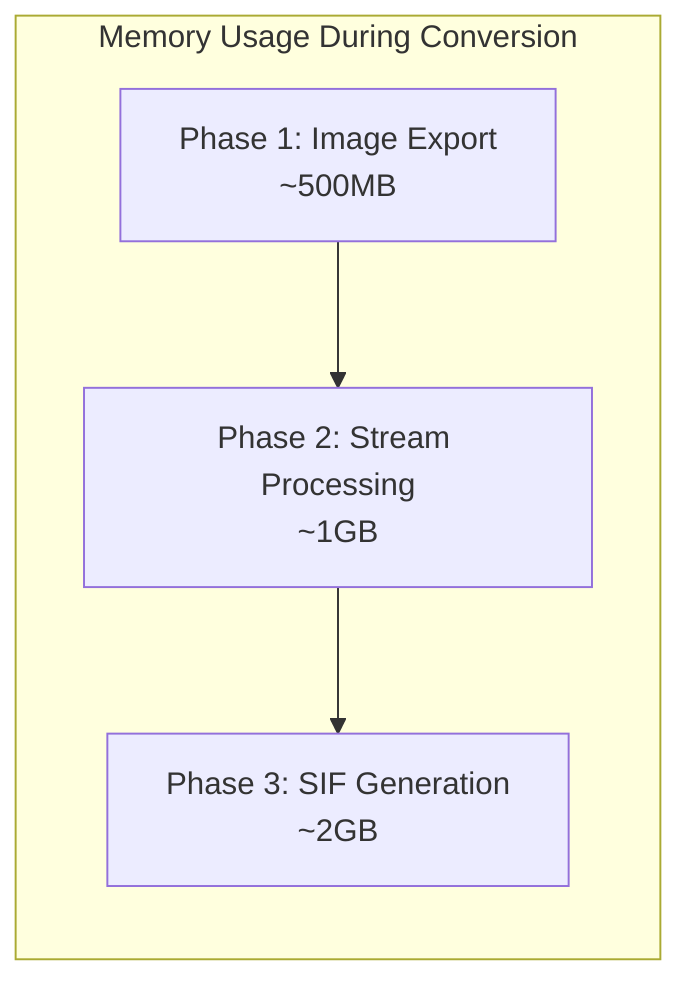

# Conversion Process (Docker to Singularity)

<cite>
**Referenced Files in This Document**
- [docker_to_singularity.sh](file://scripts/docker_to_singularity.sh)
- [run_coder_singularity.sh](file://scripts/run_coder_singularity.sh)
- [build_coder.sh](file://scripts/build_coder.sh)
- [Dockerfile](file://Dockerfile)
- [run_coder_docker.sh](file://scripts/run_coder_docker.sh)
- [setup_env_in_container.sh](file://scripts/setup_env_in_container.sh)
- [README.md](file://README.md)
</cite>

## Table of Contents
1. [Introduction](#introduction)
2. [Purpose and Benefits](#purpose-and-benefits)
3. [Technical Workflow](#technical-workflow)
4. [Prerequisites](#prerequisites)
5. [Step-by-Step Conversion Process](#step-by-step-conversion-process)
6. [Error Handling Mechanisms](#error-handling-mechanisms)
7. [Integration Points](#integration-points)
8. [Common Issues and Troubleshooting](#common-issues-and-troubleshooting)
9. [Performance Considerations](#performance-considerations)
10. [Advanced Usage Scenarios](#advanced-usage-scenarios)

## Introduction

The Docker to Singularity conversion process is a critical component of the Coder development environment that enables High Performance Computing (HPC) compatibility. This process transforms a Docker image (specifically `coder:latest`) into a Singularity Image Format (SIF) file (`coder.sif`), making the development environment portable and executable in HPC environments where Singularity is preferred over Docker.

The conversion script serves as a bridge between modern container technologies, enabling developers to leverage containerized development environments across diverse computing infrastructures while maintaining consistency and reproducibility.

## Purpose and Benefits

### HPC Compatibility
Singularity is widely adopted in HPC environments due to its security model, resource isolation capabilities, and integration with cluster management systems. The conversion process ensures that the Coder development environment can be deployed in these restricted environments.

### Portability
SIF files are self-contained, immutable images that can be easily transferred between systems without requiring a container runtime. This makes them ideal for distributed computing environments.

### Security
Singularity provides enhanced security through its user-owned image format and minimal privilege escalation, making it suitable for shared computing resources.

### Reproducibility
The conversion process creates deterministic, version-controlled container images that can be audited and reproduced across different systems.

## Technical Workflow

The conversion process follows a streamlined workflow designed for reliability and ease of use:



**Diagram sources**
- [docker_to_singularity.sh](file://scripts/docker_to_singularity.sh#L1-L17)

### Detailed Process Steps

1. **Image Validation**: The script verifies the existence of the `coder:latest` Docker image before proceeding
2. **Container Management**: While not explicitly shown in the current script, best practices include stopping running containers to ensure clean builds
3. **Export Process**: Uses Docker's built-in export mechanism to create a tar stream of the image
4. **Singularity Conversion**: Leverages Singularity's `docker-daemon://` protocol for efficient conversion
5. **Verification**: Implements exit code checking to ensure successful completion

**Section sources**
- [docker_to_singularity.sh](file://scripts/docker_to_singularity.sh#L1-L17)

## Prerequisites

### Software Requirements

| Component | Minimum Version | Purpose | Notes |
|-----------|----------------|---------|-------|
| Docker Engine | 20.10+ | Image management | Must be running and accessible |
| Singularity | 3.5+ | Image conversion | Must be installed and in PATH |
| Bash Shell | 4.0+ | Script execution | POSIX-compliant shell required |

### System Requirements

| Resource | Minimum | Recommended | Purpose |
|----------|---------|-------------|---------|
| Disk Space | 2GB free | 5GB free | For temporary conversion files |
| Memory | 1GB RAM | 2GB RAM | For conversion process |
| CPU Cores | 1 core | 2+ cores | For parallel processing |

### Docker Image Prerequisites

The conversion process requires a pre-built Docker image with the following characteristics:

- **Image Name**: `coder:latest`
- **Base OS**: Ubuntu 24.04 (as specified in the Dockerfile)
- **User Configuration**: Properly configured with preserved user ID and group ID
- **Network Access**: No external network dependencies during conversion

**Section sources**
- [build_coder.sh](file://scripts/build_coder.sh#L1-L9)
- [Dockerfile](file://Dockerfile#L1-L150)

## Step-by-Step Conversion Process

### Example Conversion Scenario

Let's walk through a complete conversion process with expected output:

#### Step 1: Verify Docker Image Exists
```bash
# Check if coder:latest exists
docker images | grep coder:latest
# Expected output:
# coder       latest    abc123def45678    2 hours ago    2.1GB
```

#### Step 2: Execute Conversion Script
```bash
# Navigate to project directory
cd /path/to/coder

# Make the conversion script executable
chmod +x scripts/docker_to_singularity.sh

# Run the conversion process
./scripts/docker_to_singularity.sh
```

#### Step 3: Monitor Conversion Output
The script produces the following output during execution:

```
Converting Docker image coder:latest to Singularity image coder.sif...
INFO: Building Singularity image...
INFO: Importing Docker image...
INFO: Creating SIF file...
INFO: Build complete!
Conversion successful! Singularity image created: coder.sif
```

#### Step 4: Verify SIF File Creation
```bash
# Check that the SIF file was created
ls -la coder.sif
# Expected output:
# -rw-r--r-- 1 user group 1.8G Jan 15 14:30 coder.sif
```

### File Creation Details

| File | Size | Purpose | Location |
|------|------|---------|----------|
| `coder.sif` | ~1.8GB | Singularity container image | Current directory |
| Temporary files | Variable | Conversion artifacts | System temp directory |

**Section sources**
- [docker_to_singularity.sh](file://scripts/docker_to_singularity.sh#L7-L16)

## Error Handling Mechanisms

### Exit Code Checking

The conversion script implements robust error handling through exit code verification:



**Diagram sources**
- [docker_to_singularity.sh](file://scripts/docker_to_singularity.sh#L11-L15)

### Status Messaging

The script provides clear status feedback at each stage:

- **Pre-execution**: "Converting Docker image coder:latest to Singularity image coder.sif..."
- **Success**: "Conversion successful! Singularity image created: coder.sif"
- **Failure**: "Conversion failed!"

### Error Categories

| Error Type | Cause | Resolution |
|------------|-------|------------|
| Image Not Found | `coder:latest` not built | Run `./scripts/build_coder.sh` first |
| Singularity Not Available | Singularity not installed | Install Singularity 3.5+ |
| Insufficient Permissions | Write access denied | Check directory permissions |
| Disk Space Issues | Out of storage space | Free up disk space |

**Section sources**
- [docker_to_singularity.sh](file://scripts/docker_to_singularity.sh#L11-L15)

## Integration Points

### Relationship with Other Scripts

The conversion process integrates seamlessly with the broader Coder environment ecosystem:



**Diagram sources**
- [docker_to_singularity.sh](file://scripts/docker_to_singularity.sh#L1-L17)
- [run_coder_singularity.sh](file://scripts/run_coder_singularity.sh#L1-L115)

### Consumption by Runtime Scripts

The generated `coder.sif` file serves as the primary input for the Singularity runtime:

- **File Reference**: Hard-coded path `./coder.sif` in `run_coder_singularity.sh`
- **Environment Variables**: Inherits configuration from the conversion process
- **Mount Points**: Maintains all necessary filesystem bindings

**Section sources**
- [run_coder_singularity.sh](file://scripts/run_coder_singularity.sh#L9-L11)

## Common Issues and Troubleshooting

### Missing Singularity Command

**Symptoms**: "command not found: singularity" error message

**Diagnosis**:
```bash
which singularity
# If empty, Singularity is not in PATH
```

**Resolution**:
1. Install Singularity 3.5+ from official repositories
2. Add to PATH: `export PATH=/usr/local/bin:$PATH`
3. Verify installation: `singularity --version`

### Docker Image Not Found

**Symptoms**: Conversion fails immediately with image-related errors

**Diagnosis**:
```bash
docker images | grep coder:latest
# If no output, image doesn't exist
```

**Resolution**:
1. Build the Docker image first: `./scripts/build_coder.sh`
2. Verify successful build: `docker images | grep coder:latest`
3. Retry conversion process

### Insufficient Disk Space

**Symptoms**: Conversion stops with "no space left on device" errors

**Diagnosis**:
```bash
df -h .
# Check available space in current directory
```

**Resolution**:
1. Free up disk space: `du -sh * | sort -rh | head -10`
2. Clean Docker cache: `docker system prune -f`
3. Move to a larger filesystem if necessary

### Permission Issues

**Symptoms**: "Permission denied" errors during conversion

**Diagnosis**:
```bash
ls -la coder.sif
# Check file ownership and permissions
```

**Resolution**:
1. Check write permissions: `touch coder.sif && rm coder.sif`
2. Verify Docker daemon permissions
3. Run as appropriate user with sudo if necessary

### Network Connectivity Issues

**Symptoms**: Download failures during image conversion

**Diagnosis**:
```bash
ping registry-1.docker.io
# Test external connectivity
```

**Resolution**:
1. Configure proxy settings if behind firewall
2. Use offline conversion methods when possible
3. Verify DNS resolution

**Section sources**
- [README.md](file://README.md#L185-L188)

## Performance Considerations

### Conversion Time Analysis

The conversion process involves several performance factors:

| Phase | Typical Duration | Factors Affecting Speed |
|-------|------------------|------------------------|
| Image Export | 30-120 seconds | Image size, disk I/O speed |
| Stream Processing | 60-300 seconds | Network bandwidth, compression |
| SIF Generation | 120-600 seconds | CPU power, memory availability |

### Image Size Impact

The resulting SIF file size directly affects:

- **Storage Requirements**: Approximately 80-90% of original Docker image size
- **Transfer Time**: Network-dependent based on file size
- **Startup Performance**: Smaller images generally boot faster

### Optimization Strategies

1. **Image Pruning**: Regular cleanup of unused Docker images
2. **Compression**: Use appropriate compression settings
3. **Parallel Processing**: Utilize multiple CPU cores when available
4. **Local Storage**: Store SIF files on fast local storage

### Memory Usage Patterns



**Diagram sources**
- [docker_to_singularity.sh](file://scripts/docker_to_singularity.sh#L1-L17)

## Advanced Usage Scenarios

### Custom Image Names

While the current script uses hardcoded names, modifications can support custom images:

```bash
# Modified script variables
DOCKER_IMAGE="custom-image:tag"
SINGULARITY_IMAGE="custom.sif"
```

### Batch Conversion

For multiple images, create a batch processing script:

```bash
#!/bin/bash
IMAGES=("image1:latest" "image2:latest" "image3:latest")

for img in "${IMAGES[@]}"; do
    echo "Processing $img..."
    DOCKER_IMAGE=$img ./scripts/docker_to_singularity.sh
    if [ $? -ne 0 ]; then
        echo "Failed to convert $img"
        exit 1
    fi
done
```

### Automated CI/CD Integration

Integrate conversion into continuous integration pipelines:

```yaml
# Example GitHub Actions workflow
- name: Build Docker Image
  run: ./scripts/build_coder.sh
  
- name: Convert to Singularity
  run: ./scripts/docker_to_singularity.sh
  
- name: Upload SIF Artifact
  uses: actions/upload-artifact@v3
  with:
    name: coder-sif
    path: coder.sif
```

### Debug Mode Operations

Enable verbose logging for troubleshooting:

```bash
# Set debug mode
export SINGULARITY_DEBUG=1
./scripts/docker_to_singularity.sh
```

**Section sources**
- [docker_to_singularity.sh](file://scripts/docker_to_singularity.sh#L1-L17)