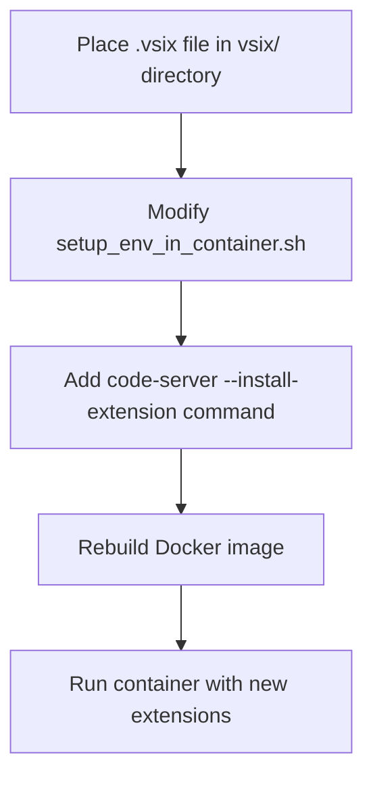
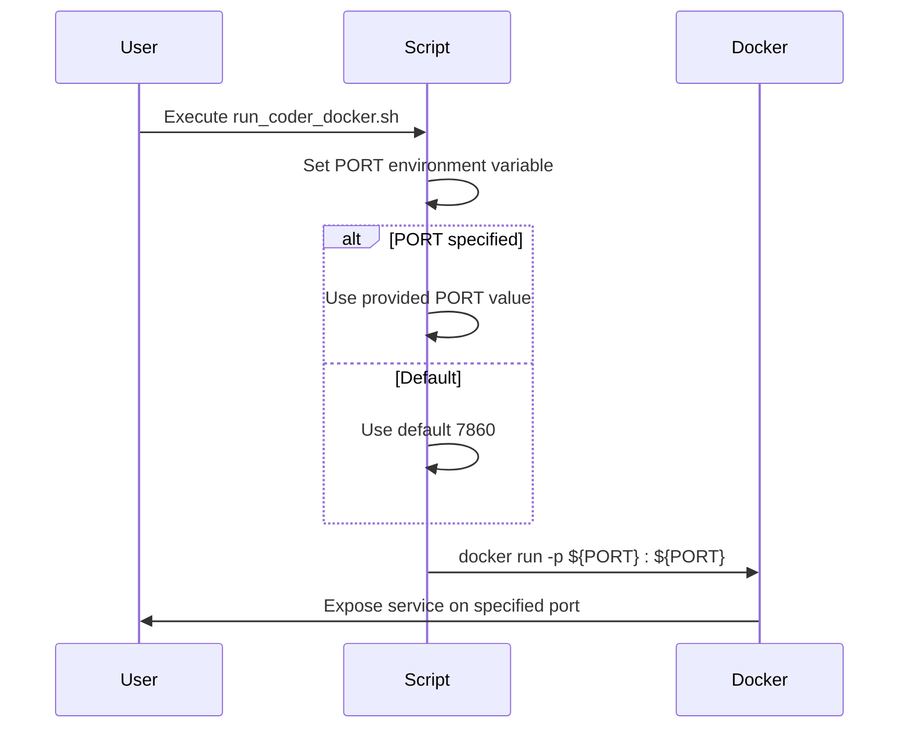
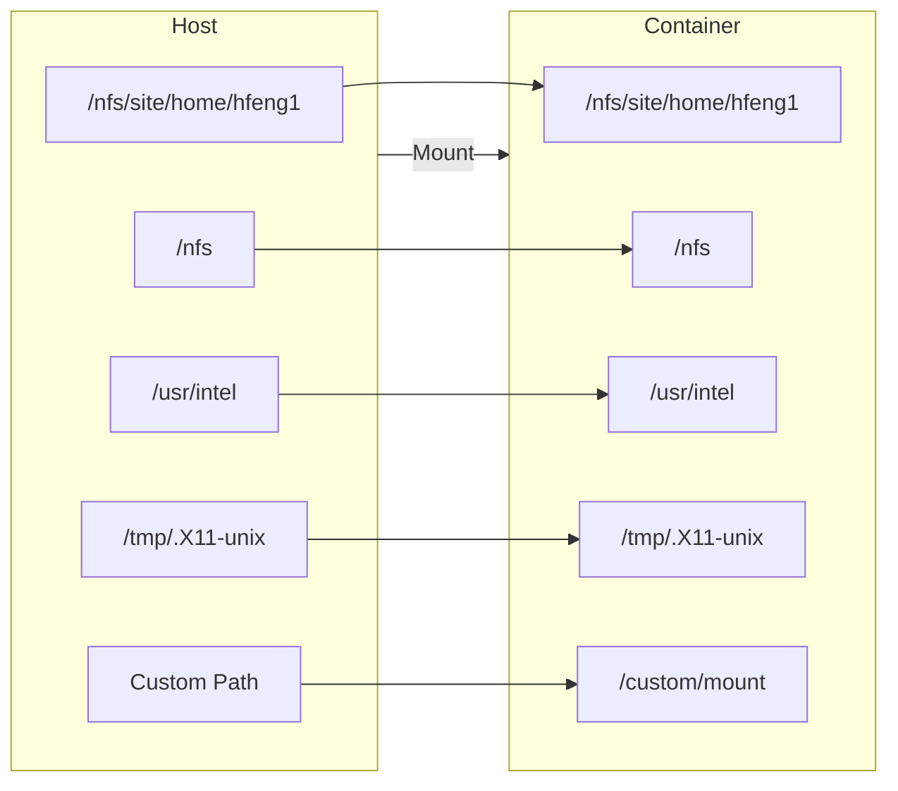
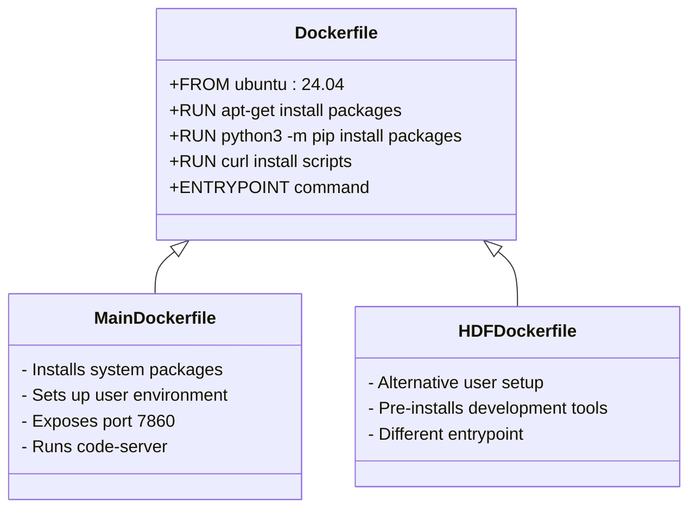
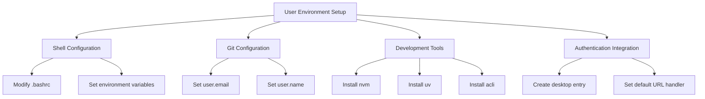
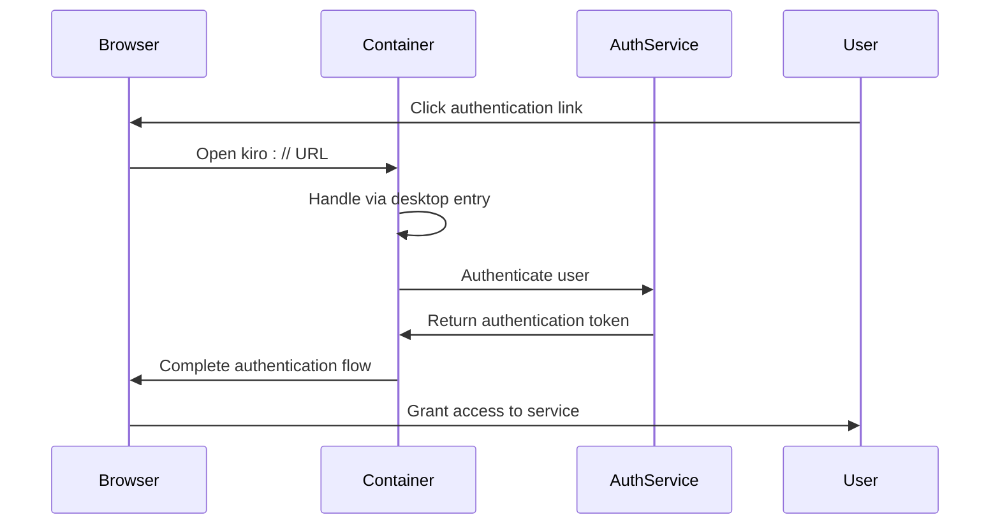

# Customization Guide

<cite>
**Referenced Files in This Document**   
- [Dockerfile](file://Dockerfile)
- [hf/Dockerfile](file://hf/Dockerfile)
- [scripts/run_coder_docker.sh](file://scripts/run_coder_docker.sh)
- [scripts/setup_env_in_container.sh](file://scripts/setup_env_in_container.sh)
- [scripts/build_coder.sh](file://scripts/build_coder.sh)
- [scripts/setup-kiro-xdg.sh](file://scripts/setup-kiro-xdg.sh)
- [hf/install_vscode_copilot_chat.sh](file://hf/install_vscode_copilot_chat.sh)
- [README.md](file://README.md)
</cite>

## Table of Contents
1. [Introduction](#introduction)
2. [Adding VS Code Extensions](#adding-vs-code-extensions)
3. [Port Configuration](#port-configuration)
4. [Custom Volume Mounts](#custom-volume-mounts)
5. [Extending the Dockerfile](#extending-the-dockerfile)
6. [User Environment Customization](#user-environment-customization)
7. [Integration with External Tools](#integration-with-external-tools)
8. [Common Customization Pitfalls](#common-customization-pitfalls)
9. [Best Practices for Maintenance](#best-practices-for-maintenance)
10. [Performance Implications](#performance-implications)

## Introduction
The Coder development environment provides a containerized VS Code Server setup with support for both Docker and Singularity. This guide details the key extension points for customizing the environment to meet specific development needs, including adding extensions, modifying ports, configuring volumes, and extending system capabilities. The architecture is designed to be flexible while maintaining reproducibility and ease of maintenance across different deployment scenarios.

## Adding VS Code Extensions
The Coder environment supports adding custom VS Code extensions through the `vsix/` directory and the `setup_env_in_container.sh` script. The `vsix/` directory contains pre-downloaded extensions that can be installed during container setup. To add new extensions, place the `.vsix` files in this directory and modify the `setup_env_in_container.sh` script to include installation commands using `code-server --install-extension`.

The current implementation includes commented code in `setup_env_in_container.sh` that demonstrates how to install extensions from the local `vsix/` directory. Users can uncomment and modify these lines to install additional extensions. Alternatively, extensions can be installed directly in the running container, but this approach does not persist across container restarts unless the changes are incorporated into the build process.

**Diagram sources**
- [scripts/setup_env_in_container.sh](file://scripts/setup_env_in_container.sh#L59-L64)
- [vsix/](file://vsix/)

**Section sources**
- [scripts/setup_env_in_container.sh](file://scripts/setup_env_in_container.sh#L59-L64)
- [README.md](file://README.md#L201-L205)

## Port Configuration
The default port for the Coder environment is set to 7860, as defined in the main `Dockerfile` with the `ENV PORT=7860` directive and `EXPOSE ${PORT}` instruction. The port mapping is configured in the `run_coder_docker.sh` script using the `-p $PORT:$PORT` flag in the docker run command.

To change the exposed port, users can either set the `PORT` environment variable when running the script (e.g., `PORT=8080 ./scripts/run_coder_docker.sh`) or modify the default value in the script itself. The script also supports an additional `CODE_SERVER_PORT` environment variable for cases where multiple services need to be exposed.

**Diagram sources**
- [Dockerfile](file://Dockerfile#L141-L142)
- [scripts/run_coder_docker.sh](file://scripts/run_coder_docker.sh#L26-L27)

**Section sources**
- [Dockerfile](file://Dockerfile#L141-L142)
- [scripts/run_coder_docker.sh](file://scripts/run_coder_docker.sh#L26-L27)
- [README.md](file://README.md#L206-L208)

## Custom Volume Mounts
The Coder environment supports custom volume mounts through the run scripts, allowing users to expose additional directories from the host system to the container. The `run_coder_docker.sh` script already includes several volume mounts for NFS and Intel paths, as well as X11 forwarding support.

To add custom volume mounts, users can modify the `run_coder_docker.sh` script by adding additional `-v` flags to the docker run command. Each `-v` flag should specify the host path and container path in the format `-v /host/path:/container/path`. This capability enables integration with corporate file systems, shared resources, or local development directories that need to be accessible within the containerized environment.

**Diagram sources**
- [scripts/run_coder_docker.sh](file://scripts/run_coder_docker.sh#L49-L52)

**Section sources**
- [scripts/run_coder_docker.sh](file://scripts/run_coder_docker.sh#L49-L52)
- [README.md](file://README.md#L209-L211)

## Extending the Dockerfile
The Coder environment can be extended by modifying the `Dockerfile` to install additional system packages or development tools. The main `Dockerfile` uses Ubuntu 24.04 as the base image and installs a comprehensive set of development tools through `apt-get`. Users can extend this by adding additional `RUN` instructions to install packages via `apt-get`, `pip`, or other package managers.

For example, to add a new language runtime or system library, users can append to the existing `apt-get install` command or add a new `RUN` instruction. The `hf/Dockerfile` provides an alternative configuration that demonstrates different approaches to environment setup, including installing Node.js and Python tools during the build process rather than at runtime.

**Diagram sources**
- [Dockerfile](file://Dockerfile#L1-L150)
- [hf/Dockerfile](file://hf/Dockerfile#L1-L146)

**Section sources**
- [Dockerfile](file://Dockerfile#L1-L150)
- [hf/Dockerfile](file://hf/Dockerfile#L1-L146)

## User Environment Customization
User environment customization can be achieved through modifications to setup scripts or by mounting dotfiles. The `setup_env_in_container.sh` script provides a framework for configuring the user environment, including installing Node.js via nvm, setting up Python tools, configuring git, and installing additional CLI tools.

Users can customize their environment by modifying this script to change git configuration, install additional npm packages, or configure shell settings. The script also demonstrates how to set up URL handlers for corporate authentication systems, as shown in the `setup-kiro-xdg.sh` script which configures Kiro URL handling for authentication.

**Diagram sources**
- [scripts/setup_env_in_container.sh](file://scripts/setup_env_in_container.sh#L8-L81)
- [scripts/setup-kiro-xdg.sh](file://scripts/setup-kiro-xdg.sh#L1-L52)

**Section sources**
- [scripts/setup_env_in_container.sh](file://scripts/setup_env_in_container.sh#L8-L81)
- [scripts/setup-kiro-xdg.sh](file://scripts/setup-kiro-xdg.sh#L1-L52)

## Integration with External Tools
The Coder environment supports integration with external tools and services through environment variables and mounted credentials. The run scripts already forward common proxy variables (`http_proxy`, `https_proxy`, `no_proxy`) to the container, enabling access to external resources through corporate networks.

For corporate authentication systems, the environment can be extended to support single sign-on or token-based authentication by mounting credential files or configuring URL handlers. The `setup-kiro-xdg.sh` script demonstrates this by creating a desktop entry that handles `kiro://` URLs for authentication purposes, allowing seamless integration with corporate identity providers.

**Diagram sources**
- [scripts/setup-kiro-xdg.sh](file://scripts/setup-kiro-xdg.sh#L1-L52)

**Section sources**
- [scripts/setup-kiro-xdg.sh](file://scripts/setup-kiro-xdg.sh#L1-L52)

## Common Customization Pitfalls
When customizing the Coder environment, users should be aware of several common pitfalls that can break the build process or cause permission conflicts. Modifying the `Dockerfile` incorrectly can result in failed builds, particularly when adding packages that have conflicting dependencies or require interactive installation.

Permission conflicts can occur when the container user ID does not match the host file system permissions, especially when mounting volumes from NFS or other shared storage systems. The build process uses the host user's ID and group ID through build arguments, but customizations that change the user setup can disrupt this mapping.

Another common issue is breaking the entrypoint command, which must correctly start the code-server process with the appropriate bind address and authentication settings. Changes to the `ENTRYPOINT` instruction in the `Dockerfile` should preserve the core functionality while adding any desired enhancements.

**Section sources**
- [Dockerfile](file://Dockerfile#L149)
- [hf/Dockerfile](file://hf/Dockerfile#L145)
- [scripts/build_coder.sh](file://scripts/build_coder.sh#L3-L4)

## Best Practices for Maintenance
To maintain customizations across updates, users should adopt version control for their modified scripts and configuration files. This allows tracking changes, reverting to previous states, and sharing configurations with team members. The use of environment variables for configurable parameters (like port numbers) enables flexibility without requiring code changes.

When extending the environment, it's recommended to create separate scripts for custom functionality rather than modifying the core scripts directly. This approach simplifies updates to the base environment while preserving customizations. For example, instead of modifying `setup_env_in_container.sh`, users can create a new script like `setup_custom_tools.sh` that is called from the main setup process.

Regular testing of the build process ensures that customizations do not break with updates to base images or dependencies. Automated testing can verify that the container starts correctly, all required tools are available, and the code-server interface is accessible on the expected port.

**Section sources**
- [scripts/build_coder.sh](file://scripts/build_coder.sh#L1-L9)
- [README.md](file://README.md#L29-L32)

## Performance Implications
Adding heavy tools or large extensions to the Coder environment has several performance implications. Larger Docker images require more storage space and take longer to build and transfer between systems. Each additional package installed increases the attack surface and may introduce security vulnerabilities that need to be managed.

Runtime performance can be affected by the additional memory and CPU overhead of running extra services or background processes. Large extensions may slow down the VS Code startup time and increase the memory footprint of the code-server process. Network performance can also be impacted when pulling large images or when the container needs to download additional resources during startup.

To mitigate these issues, users should carefully evaluate the necessity of each addition and consider whether tools can be installed on-demand rather than included in the base image. Using multi-stage builds or conditional installation scripts can help maintain a lean base image while still providing access to additional tools when needed.

**Section sources**
- [Dockerfile](file://Dockerfile#L14-L100)
- [hf/Dockerfile](file://hf/Dockerfile#L12-L64)
- [scripts/setup_env_in_container.sh](file://scripts/setup_env_in_container.sh#L10-L79)