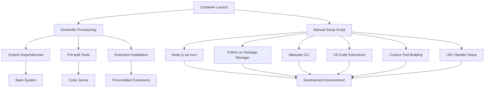
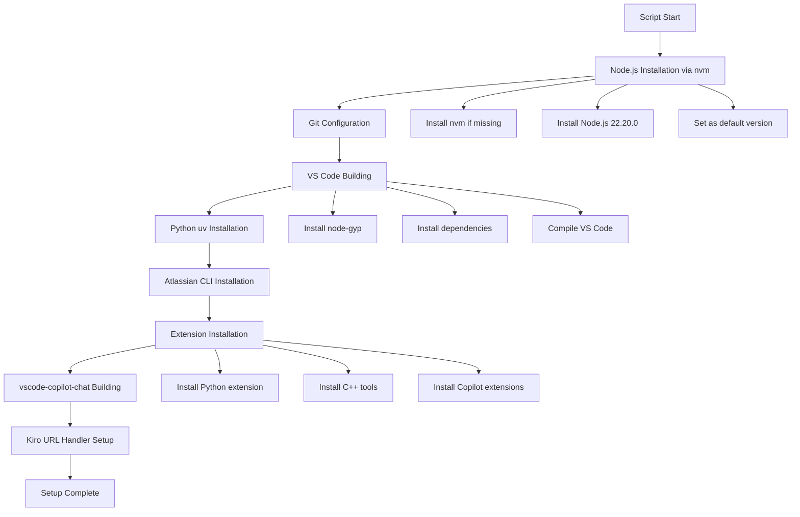
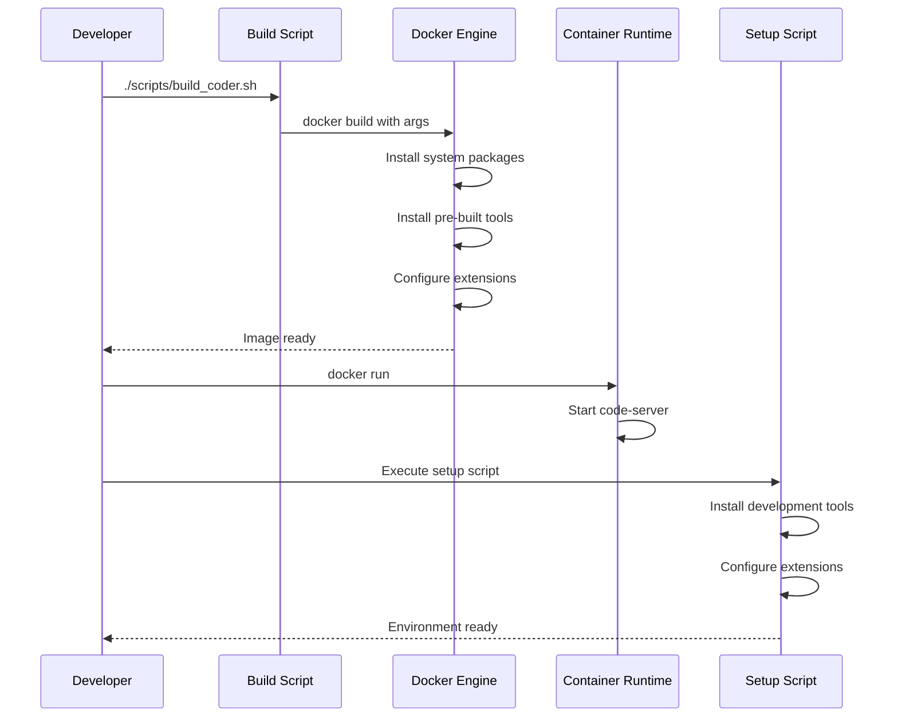
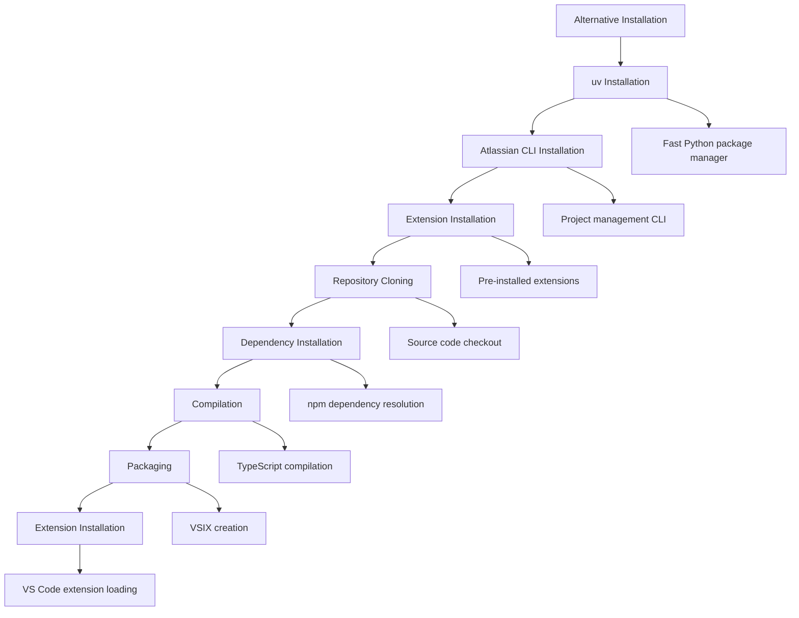

# Environment Configuration

<cite>
**Referenced Files in This Document**
- [setup_env_in_container.sh](file://scripts/setup_env_in_container.sh)
- [Dockerfile](file://Dockerfile)
- [hf/Dockerfile](file://hf/Dockerfile)
- [install_vscode_copilot_chat.sh](file://hf/install_vscode_copilot_chat.sh)
- [setup-kiro-xdg.sh](file://scripts/setup-kiro-xdg.sh)
- [run_coder_docker.sh](file://scripts/run_coder_docker.sh)
- [build_coder.sh](file://scripts/build_coder.sh)
- [README.md](file://README.md)
</cite>

## Table of Contents
1. [Introduction](#introduction)
2. [Environment Setup Architecture](#environment-setup-architecture)
3. [Core Setup Script Analysis](#core-setup-script-analysis)
4. [Container Provisioning Chain](#container-provisioning-chain)
5. [Development Tools Installation](#development-tools-installation)
6. [VS Code Extension Management](#vs-code-extension-management)
7. [One-Time Setup Nature](#one-time-setup-nature)
8. [Integration with Container Lifecycle](#integration-with-container-lifecycle)
9. [Troubleshooting and Solutions](#troubleshooting-and-solutions)
10. [Configuration Parameters](#configuration-parameters)
11. [Usage Examples](#usage-examples)
12. [Alternative Installation Methods](#alternative-installation-methods)

## Introduction

The Coder development environment employs a sophisticated multi-stage setup process that combines container-based provisioning with post-launch environment configuration. This system ensures that essential development tools are installed and configured automatically when the container launches, creating a ready-to-use development environment for AI-powered coding tasks.

The environment configuration process consists of two primary components: automated container provisioning through Dockerfiles and manual post-launch setup through dedicated scripts. This hybrid approach optimizes build times while ensuring that user-specific configurations are applied correctly.

## Environment Setup Architecture

The environment configuration follows a layered architecture that separates concerns between container-level provisioning and runtime environment setup:



**Diagram sources**
- [Dockerfile](file://Dockerfile#L1-L150)
- [setup_env_in_container.sh](file://scripts/setup_env_in_container.sh#L1-L81)

**Section sources**
- [Dockerfile](file://Dockerfile#L1-L150)
- [setup_env_in_container.sh](file://scripts/setup_env_in_container.sh#L1-L81)

## Core Setup Script Analysis

The [`setup_env_in_container.sh`](file://scripts/setup_env_in_container.sh) script serves as the primary environment configuration mechanism, executed inside the container to finalize the development setup. This script implements a comprehensive installation and configuration process:

### Script Execution Flow

The setup script follows a structured execution pattern that ensures proper tool installation order and dependency resolution:



**Diagram sources**
- [setup_env_in_container.sh](file://scripts/setup_env_in_container.sh#L10-L78)

### Key Features and Capabilities

The setup script provides several critical capabilities:

- **Conditional Installation**: Each tool is installed only if it doesn't already exist, preventing redundant operations
- **Environment Persistence**: Configurations are written to shell initialization files (.bashrc, .profile)
- **Version Control**: Specific versions of tools are installed to ensure reproducible environments
- **Error Handling**: The script exits immediately on any error to prevent partial installations

**Section sources**
- [setup_env_in_container.sh](file://scripts/setup_env_in_container.sh#L1-L81)

## Container Provisioning Chain

The environment setup integrates seamlessly with the container provisioning process through a carefully orchestrated build pipeline:



**Diagram sources**
- [build_coder.sh](file://scripts/build_coder.sh#L1-L9)
- [Dockerfile](file://Dockerfile#L144-L150)

### Dockerfile Integration

The main Dockerfile handles initial system provisioning, while the [`hf/Dockerfile`](file://hf/Dockerfile) provides additional specialized configurations. Both Dockerfiles share common patterns for tool installation:

- **System Dependencies**: Essential packages for development and runtime
- **Pre-built Tools**: Tools installed directly from package managers
- **Extension Installation**: VS Code extensions pre-installed during build
- **User Configuration**: Proper user permissions and environment setup

**Section sources**
- [Dockerfile](file://Dockerfile#L1-L150)
- [hf/Dockerfile](file://hf/Dockerfile#L1-L146)

## Development Tools Installation

The environment configuration process installs three categories of development tools, each serving specific development needs:

### Node.js via nvm

Node.js is installed using Node Version Manager (nvm) to provide flexibility and version control:

| Component | Version | Purpose |
|-----------|---------|---------|
| nvm | v0.39.7 | Node.js version manager |
| Node.js | 22.20.0 | Latest stable LTS version |
| npm | Included | Package manager |

The installation process ensures that Node.js is available system-wide and set as the default version for all new shells.

### Python uv Package Manager

uv is installed as a modern, fast alternative to traditional Python package management:

| Component | Version | Purpose |
|-----------|---------|---------|
| uv | Latest | Fast Python package installer |
| Python | System default | Existing Python installation |

uv provides significant performance improvements for package installation and dependency resolution compared to pip alone.

### Atlassian CLI

The Atlassian Command Line Interface enables integration with Jira and Confluence:

| Component | Version | Purpose |
|-----------|---------|---------|
| acli | Latest | Atlassian CLI for project management |

This tool facilitates automation of Atlassian platform operations directly from the development environment.

**Section sources**
- [setup_env_in_container.sh](file://scripts/setup_env_in_container.sh#L10-L57)

## VS Code Extension Management

The environment includes a comprehensive collection of VS Code extensions pre-configured for AI-assisted development:

### Pre-installed Extensions

The system includes several categories of extensions:

| Extension Category | Versions | Purpose |
|-------------------|----------|---------|
| GitHub Copilot | v1.325.0 | AI code completion |
| GitHub Copilot Chat | v0.27.2 | Interactive AI assistance |
| Python | v2024.8.1 | Python development support |
| C/C++ Tools | v1.7.1 | C/C++ language support |
| C/C++ Extension Pack | v1.3.1 | Comprehensive C++ tooling |

### Extension Installation Process

The extension installation occurs in two phases:

1. **Build-time Installation**: Pre-installed extensions included in the Docker image
2. **Runtime Installation**: Custom extensions built from source during container setup

### Local vsix Directory

Extensions are stored in the [`vsix/`](file://vsix/) directory, containing pre-built VSIX files for immediate installation. This approach ensures reliable installation without requiring internet connectivity during container startup.

**Section sources**
- [setup_env_in_container.sh](file://scripts/setup_env_in_container.sh#L59-L68)
- [Dockerfile](file://Dockerfile#L125-L130)

## One-Time Setup Nature

The environment configuration is designed as a one-time setup process that should be executed only during initial container deployment:

### Design Philosophy

The setup script implements several characteristics that reinforce its one-time nature:

- **Conditional Execution**: Each tool is installed only if it doesn't already exist
- **Persistent Configuration**: Settings are written to shell initialization files
- **Idempotent Operations**: Multiple executions don't cause conflicts or errors
- **User Responsibility**: The script explicitly states it should be run once

### Usage Guidelines

The setup script should be executed with specific considerations:

- **Timing**: Run immediately after container startup
- **Shell Integration**: Execute within the container's active shell session
- **User Context**: Must run as the intended user account
- **Network Access**: Requires internet connectivity for tool downloads

### Prevention of Multiple Executions

The script prevents accidental multiple executions through:

- **Existence Checks**: Verifies tool presence before installation
- **Configuration Persistence**: Writes settings to persistent files
- **Clear Documentation**: Explicitly states one-time usage requirement

**Section sources**
- [setup_env_in_container.sh](file://scripts/setup_env_in_container.sh#L1-L81)

## Integration with Container Lifecycle

The environment setup integrates seamlessly with the container lifecycle through multiple mechanisms:

### Dockerfile Provisioning

The Dockerfile handles initial system provisioning, including:

- **System Packages**: Essential development dependencies
- **Pre-built Tools**: Tools installed directly from repositories
- **Extension Pre-installation**: VS Code extensions bundled in the image
- **User Configuration**: Proper ownership and permissions

### Runtime Setup Script

The setup script handles dynamic environment configuration:

- **Development Tools**: Tools requiring compilation or specific versions
- **Custom Extensions**: Extensions built from source
- **User-Specific Configurations**: Personal preferences and settings
- **Integration Setup**: URL handlers and external tool integrations

### Container Entry Point

Both Dockerfiles define appropriate entry points that ensure proper service startup:

- **Code Server**: Primary development interface
- **Port Exposure**: Standard ports for web access
- **User Context**: Proper user permissions and environment

**Section sources**
- [Dockerfile](file://Dockerfile#L144-L150)
- [hf/Dockerfile](file://hf/Dockerfile#L145-L146)

## Troubleshooting and Solutions

Common issues during environment setup and their solutions:

### Network Connectivity Issues

**Problem**: Failed extension installations or tool downloads
**Causes**: Proxy settings, firewall restrictions, DNS issues
**Solutions**:
- Verify proxy configuration in environment variables
- Check firewall rules allowing outbound connections
- Test DNS resolution for download URLs
- Use alternative download mirrors if available

### Permission Problems

**Problem**: Tools fail to install or extensions cannot be loaded
**Causes**: Incorrect user permissions, missing directories
**Solutions**:
- Ensure proper user ownership of installation directories
- Verify write permissions in home directory
- Check that required system directories exist
- Review Docker user mapping configuration

### Tool Installation Failures

**Problem**: Specific tools fail to install or configure correctly
**Causes**: Version conflicts, dependency issues, disk space
**Solutions**:
- Retry installation with fresh network connection
- Check available disk space in container
- Verify system dependencies are installed
- Review tool-specific documentation for requirements

### Extension Installation Issues

**Problem**: VS Code extensions fail to install or load
**Causes**: Corrupted vsix files, version mismatches
**Solutions**:
- Verify vsix file integrity
- Check VS Code version compatibility
- Clear VS Code cache and restart
- Re-download corrupted extension files

**Section sources**
- [setup_env_in_container.sh](file://scripts/setup_env_in_container.sh#L6-L8)
- [README.md](file://README.md#L178-L217)

## Configuration Parameters

The environment setup supports several configuration parameters that can be customized:

### Tool Versions

| Tool | Version Parameter | Default Value | Customization |
|------|------------------|---------------|---------------|
| Node.js | nvm version | 22.20.0 | Edit nvm install command |
| uv | Installation method | Latest | Modify uv install script |
| Atlassian CLI | Download URL | Latest stable | Update download link |

### Extension Versions

| Extension | Version File | Location | Update Method |
|-----------|--------------|----------|---------------|
| Python | ms-python.python-2024.8.1.vsix | vsix/ directory | Replace vsix file |
| C++ Tools | ms-vscode.cpptools-1.7.1.vsix | vsix/ directory | Replace vsix file |
| Copilot | github.copilot-1.325.0.vsix | vsix/ directory | Replace vsix file |

### Environment Variables

The setup process respects several environment variables:

- **http_proxy/https_proxy**: Proxy server configuration
- **no_proxy**: Excluded domains for proxy bypass
- **DISPLAY**: X11 display configuration for GUI applications

**Section sources**
- [setup_env_in_container.sh](file://scripts/setup_env_in_container.sh#L24-L27)
- [Dockerfile](file://Dockerfile#L5-L8)

## Usage Examples

### Basic Setup Execution

Execute the setup script within the running container:

```bash
# Navigate to the setup script directory
cd /nfs/site/home/$(whoami)/coder/scripts

# Run the environment setup
./setup_env_in_container.sh
```

### Interactive Shell Mode

For debugging or manual setup, enter the container with interactive shell:

```bash
# Run container with interactive shell
./scripts/run_coder_docker.sh --shell

# Inside container, execute setup manually
source ~/.bashrc
./scripts/setup_env_in_container.sh
```

### Custom Port Configuration

Configure custom port for web access:

```bash
# Set custom port before running container
export PORT=8080
./scripts/run_coder_docker.sh
```

### Proxy Configuration

Configure proxy settings for restricted networks:

```bash
# Set proxy variables
export http_proxy=http://proxy.company.com:8080
export https_proxy=https://proxy.company.com:8080
export no_proxy=localhost,127.0.0.1

# Build and run with proxy support
./scripts/build_coder.sh
./scripts/run_coder_docker.sh
```

**Section sources**
- [setup_env_in_container.sh](file://scripts/setup_env_in_container.sh#L1-L81)
- [run_coder_docker.sh](file://scripts/run_coder_docker.sh#L1-L78)

## Alternative Installation Methods

The environment provides alternative installation approaches through specialized scripts:

### Specialized Copilot Chat Installation

The [`install_vscode_copilot_chat.sh`](file://hf/install_vscode_copilot_chat.sh) script provides an alternative method for installing vscode-copilot-chat:



**Diagram sources**
- [install_vscode_copilot_chat.sh](file://hf/install_vscode_copilot_chat.sh#L1-L59)

### Comparison with Main Setup Script

| Aspect | setup_env_in_container.sh | install_vscode_copilot_chat.sh |
|--------|---------------------------|---------------------------------|
| Scope | Full environment setup | vscode-copilot-chat only |
| Installation Method | Direct vsix installation | Source compilation |
| Dependencies | Pre-built | From source |
| Speed | Faster | Slower but more flexible |
| Customization | Limited | High customization |

### When to Use Alternatives

Choose alternative installation methods based on requirements:

- **Use main script** for standard environment setup
- **Use alternative script** for custom vscode-copilot-chat builds
- **Use Dockerfile** for system-level tool installation
- **Use proxy scripts** for network-restricted environments

**Section sources**
- [install_vscode_copilot_chat.sh](file://hf/install_vscode_copilot_chat.sh#L1-L59)