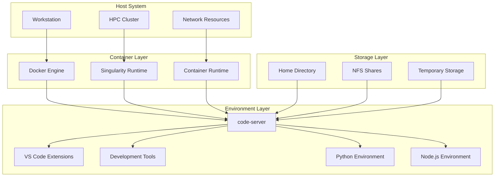
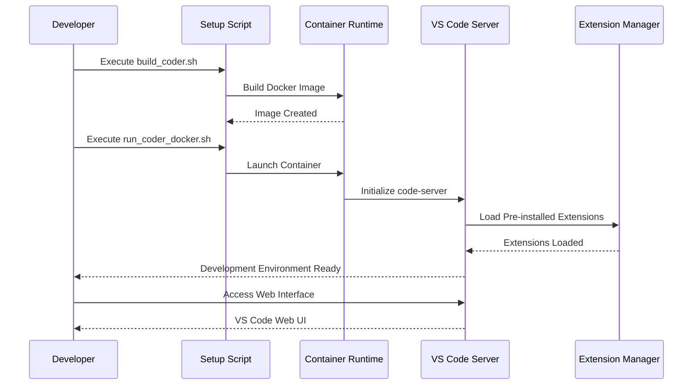
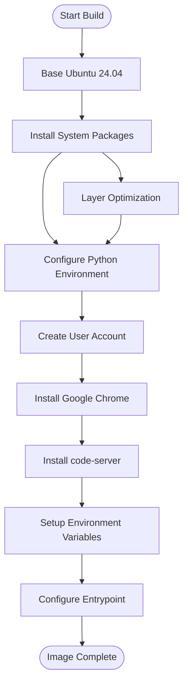
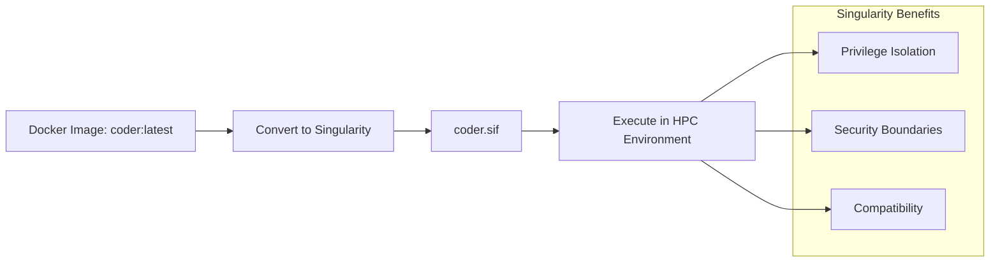
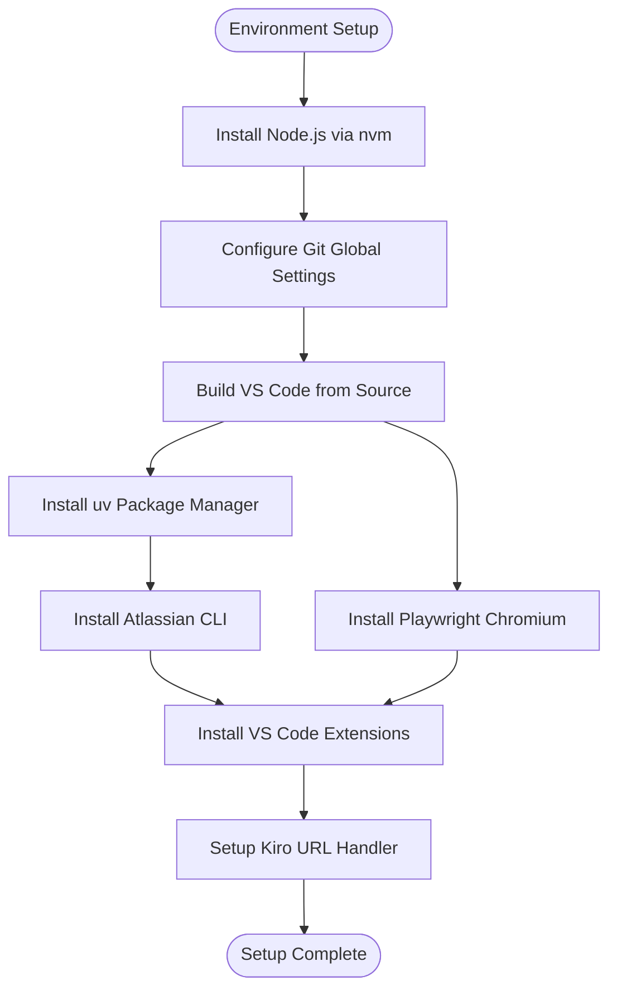
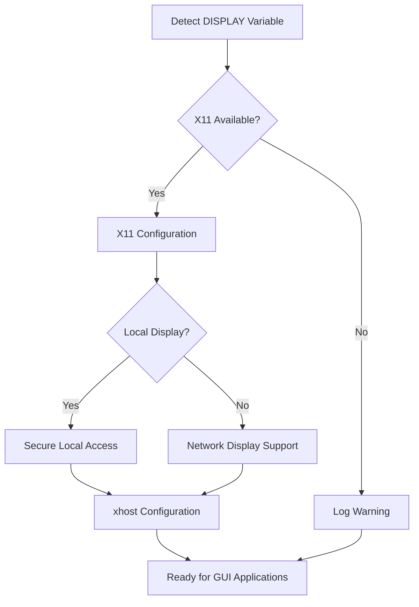
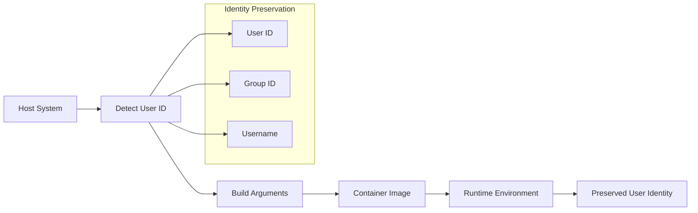

# Project Overview

<cite>
**Referenced Files in This Document**
- [README.md](file://README.md)
- [Dockerfile](file://Dockerfile)
- [scripts/build_coder.sh](file://scripts/build_coder.sh)
- [scripts/setup_env_in_container.sh](file://scripts/setup_env_in_container.sh)
- [scripts/run_coder_docker.sh](file://scripts/run_coder_docker.sh)
- [scripts/docker_to_singularity.sh](file://scripts/docker_to_singularity.sh)
- [scripts/run_coder_singularity.sh](file://scripts/run_coder_singularity.sh)
- [scripts/setup-kiro-xdg.sh](file://scripts/setup-kiro-xdg.sh)
- [hf/Dockerfile](file://hf/Dockerfile)
- [hf/install_vscode_copilot_chat.sh](file://hf/install_vscode_copilot_chat.sh)
</cite>

## Table of Contents
1. [Introduction](#introduction)
2. [Project Purpose and Vision](#project-purpose-and-vision)
3. [Key Features and Capabilities](#key-features-and-capabilities)
4. [Architecture Overview](#architecture-overview)
5. [Container Technologies](#container-technologies)
6. [Development Environment Setup](#development-environment-setup)
7. [Cross-Platform Compatibility](#cross-platform-compatibility)
8. [Integration Points](#integration-points)
9. [User Identity Preservation](#user-identity-preservation)
10. [Value Proposition](#value-proposition)
11. [Getting Started](#getting-started)
12. [Advanced Configuration](#advanced-configuration)
13. [Troubleshooting](#troubleshooting)

## Introduction

The Coder Development Environment is a sophisticated containerized development platform designed to provide developers with a consistent, reproducible, and portable coding experience across diverse computing environments. Built on the foundation of VS Code Server (code-server), this system offers a modern web-based development interface that seamlessly bridges the gap between local workstations and high-performance computing (HPC) environments.

This comprehensive solution addresses the fundamental challenge of maintaining development consistency across different platforms while providing powerful tools for modern software development workflows. Whether you're working on a personal laptop, collaborating in a team setting, or utilizing institutional HPC resources, the Coder Development Environment ensures your development experience remains standardized and efficient.

## Project Purpose and Vision

### Core Mission

The primary mission of the Coder Development Environment is to democratize access to professional-grade development tools while maintaining strict standards for reproducibility and consistency. By leveraging containerization technologies, this project eliminates the "works on my machine" problem and establishes a universal baseline for development activities.

### Architectural Intent

The system is designed with several key architectural principles:

- **Standardization**: Every developer works in an identical environment regardless of their local setup
- **Reproducibility**: Development environments can be precisely recreated across different systems
- **Portability**: The same environment configuration works across Linux distributions and hardware architectures
- **Scalability**: From single-user development to enterprise-scale deployments
- **Security**: Isolated environments prevent conflicts and maintain system integrity

### Target Audience

The Coder Development Environment serves multiple user personas:

- **New Developers**: Provides immediate access to professional tools without complex setup
- **Experienced Developers**: Offers advanced customization and integration capabilities
- **Team Leads**: Enables consistent team development standards
- **System Administrators**: Simplifies deployment and maintenance across organizational infrastructure

## Key Features and Capabilities

### Pre-installed Development Tools

The environment comes equipped with a comprehensive suite of development tools carefully selected for modern software development workflows:

#### VS Code Server with Advanced Extensions
- **GitHub Copilot v1.325.0**: AI-powered code completion and suggestions
- **GitHub Copilot Chat v0.27.2**: Interactive AI-driven development assistance
- **Python v2024.8.1**: Full Python development support with linting, debugging, and testing
- **C/C++ Tools v1.7.1**: Professional C/C++ development with IntelliSense and debugging
- **C/C++ Extension Pack v1.3.1**: Comprehensive C/C++ development toolkit

#### Modern Development Infrastructure
- **Node.js via nvm**: Latest stable Node.js version (22.20.0) with version management
- **Python with uv**: Fast Python package manager for efficient dependency management
- **Atlassian CLI**: Command-line interface for Jira and Confluence integration

### Container Technology Support

The system supports multiple containerization approaches to accommodate different deployment scenarios:

- **Docker**: Industry-standard containerization for local development and cloud deployments
- **Singularity**: Specialized containerization for HPC environments and restricted computing systems

### Cross-Platform Integration

Seamless integration with various development workflows and platforms:

- **X11 Forwarding**: Graphical application support for development tools requiring GUI
- **Proxy Support**: Corporate network compatibility with automatic proxy configuration
- **File System Mounts**: Persistent storage and shared resource access
- **URL Handler Integration**: Custom protocol handling for specialized development tools

**Section sources**
- [README.md](file://README.md#L139-L161)
- [Dockerfile](file://Dockerfile#L131-L133)
- [hf/Dockerfile](file://hf/Dockerfile#L88-L91)

## Architecture Overview

The Coder Development Environment follows a layered architecture that separates concerns while maintaining tight integration between components. This design enables flexibility in deployment while ensuring consistent functionality across different environments.



**Diagram sources**
- [scripts/run_coder_docker.sh](file://scripts/run_coder_docker.sh#L59-L76)
- [scripts/run_coder_singularity.sh](file://scripts/run_coder_singularity.sh#L88-L97)
- [Dockerfile](file://Dockerfile#L148-L149)

### Component Interaction Flow

The system operates through a well-defined sequence of interactions that ensure proper initialization and runtime behavior:



**Diagram sources**
- [scripts/build_coder.sh](file://scripts/build_coder.sh#L1-L9)
- [scripts/run_coder_docker.sh](file://scripts/run_coder_docker.sh#L56-L76)
- [scripts/setup_env_in_container.sh](file://scripts/setup_env_in_container.sh#L1-L81)

**Section sources**
- [scripts/build_coder.sh](file://scripts/build_coder.sh#L1-L9)
- [scripts/run_coder_docker.sh](file://scripts/run_coder_docker.sh#L1-L78)

## Container Technologies

### Docker Implementation

The primary containerization technology utilizes Docker, providing industry-standard container management with extensive ecosystem support. The Docker implementation focuses on:

#### Image Building Process
The Docker image construction follows a multi-stage approach that optimizes layer caching and minimizes final image size:



**Diagram sources**
- [Dockerfile](file://Dockerfile#L14-L106)
- [Dockerfile](file://Dockerfile#L111-L114)

#### Runtime Configuration
Docker containers are configured with specific runtime parameters to ensure optimal functionality:

- **User Identity Preservation**: Maintains original user ID and group ID for file permissions
- **Network Configuration**: Exposes port 7860 for web access with proper binding
- **Resource Management**: Configures IPC namespace and device access for graphical applications
- **Security Context**: Uses seccomp unconfined mode for development tool compatibility

### Singularity Implementation

For HPC environments and systems with restricted container privileges, Singularity provides an alternative containerization approach:

#### Conversion Process
The Singularity implementation involves converting Docker images to Singularity format:



**Diagram sources**
- [scripts/docker_to_singularity.sh](file://scripts/docker_to_singularity.sh#L1-L17)
- [scripts/run_coder_singularity.sh](file://scripts/run_coder_singularity.sh#L88-L97)

#### HPC-Specific Optimizations
Singularity containers are optimized for high-performance computing environments:

- **Native User Mapping**: Automatic user ID translation for seamless integration
- **Minimal Privileges**: Operates with reduced privilege requirements
- **Shared Memory**: Efficient memory sharing across compute nodes
- **Parallel Execution**: Supports MPI and other parallel computing patterns

**Section sources**
- [Dockerfile](file://Dockerfile#L1-L150)
- [scripts/docker_to_singularity.sh](file://scripts/docker_to_singularity.sh#L1-L17)
- [scripts/run_coder_singularity.sh](file://scripts/run_coder_singularity.sh#L1-L115)

## Development Environment Setup

### Initial Environment Configuration

The development environment setup process is automated through a comprehensive script that handles all necessary installations and configurations:

#### Tool Installation Pipeline
The setup script orchestrates the installation of multiple development tools in a specific order to ensure dependencies are properly resolved:



**Diagram sources**
- [scripts/setup_env_in_container.sh](file://scripts/setup_env_in_container.sh#L10-L77)

#### Extension Management
The system includes a sophisticated extension management approach that handles both pre-built and custom extensions:

- **Pre-installed Extensions**: Official VS Code Marketplace extensions bundled with the environment
- **Custom Extensions**: Support for proprietary or modified extensions through VSIX files
- **Build-time Installation**: Extensions are installed during container image creation for optimal performance
- **Version Control**: Specific versions of extensions are pinned to ensure reproducibility

### Development Tool Configuration

#### Node.js Environment
The Node.js setup utilizes nvm (Node Version Manager) for flexible version management:

- **Latest Stable**: Automatically installs the latest LTS version (currently 22.20.0)
- **Version Switching**: Easy switching between Node.js versions for different projects
- **Global Packages**: Pre-installed npm packages for common development tasks
- **Playwright Integration**: Chromium browser installation for end-to-end testing

#### Python Environment
Python development is supported through multiple complementary tools:

- **System Python**: Standard Python 3.12 with essential packages
- **uv Package Manager**: Ultra-fast Python package installation and management
- **Virtual Environments**: Isolated development environments for project-specific dependencies
- **Package Ecosystem**: Support for pip, conda, and uv package management

#### Atlassian CLI Integration
The Atlassian Command Line Interface provides seamless integration with popular development tools:

- **Jira Integration**: Issue tracking and project management commands
- **Confluence Integration**: Documentation and knowledge management commands
- **Authentication**: Secure credential management for enterprise systems
- **Workflow Automation**: Scriptable operations for development workflows

**Section sources**
- [scripts/setup_env_in_container.sh](file://scripts/setup_env_in_container.sh#L1-L81)
- [hf/install_vscode_copilot_chat.sh](file://hf/install_vscode_copilot_chat.sh#L1-L59)

## Cross-Platform Compatibility

### Local Development Support

The Coder Development Environment is optimized for local development scenarios, providing immediate access to professional development tools:

#### Workstation Integration
Local development benefits from native OS integration and hardware acceleration:

- **Hardware Acceleration**: GPU support for graphics-intensive development tasks
- **Local Storage**: Direct access to local file systems and development directories
- **Network Connectivity**: Full internet access for package downloads and external integrations
- **Display Integration**: Native GUI application support through X11 forwarding

#### Development Workflow
Local development follows familiar patterns while providing enhanced capabilities:

- **Instant Access**: No need to wait for container startup for quick edits
- **Local Testing**: Direct execution of applications on the host system
- **Debugging Integration**: Native debugger attachment and breakpoint support
- **File Monitoring**: Real-time file system monitoring for live reloading

### HPC Environment Compatibility

High-performance computing environments present unique challenges that the Coder Development Environment addresses through specialized adaptations:

#### Resource Constraints
HPC environments often have strict resource limitations and security policies:

- **Memory Management**: Efficient memory usage patterns for large-scale computations
- **CPU Optimization**: Multi-threading support for parallel processing workloads
- **Storage Efficiency**: Optimized storage access patterns for distributed file systems
- **Network Optimization**: Efficient communication patterns for cluster environments

#### Security and Compliance
HPC environments require adherence to strict security protocols:

- **Privilege Isolation**: Minimal privilege requirements for container operations
- **Audit Trails**: Comprehensive logging for compliance and troubleshooting
- **Resource Monitoring**: Transparent resource usage tracking and reporting
- **Access Control**: Integration with existing authentication and authorization systems

### Enterprise Deployment Patterns

The system supports various enterprise deployment scenarios:

#### Team Collaboration
Multi-developer environments benefit from centralized configuration management:

- **Shared Configuration**: Consistent development environments across team members
- **Template Systems**: Pre-configured templates for common development patterns
- **Version Control**: Environment configurations stored in version control systems
- **Continuous Integration**: Seamless integration with CI/CD pipeline systems

#### Institutional Integration
Large organizations require integration with existing infrastructure:

- **LDAP Integration**: Authentication through existing directory services
- **Certificate Management**: SSL/TLS certificate handling for secure communications
- **Proxy Configuration**: Corporate proxy support for external connectivity
- **Monitoring Integration**: Integration with existing monitoring and alerting systems

**Section sources**
- [scripts/run_coder_docker.sh](file://scripts/run_coder_docker.sh#L25-L76)
- [scripts/run_coder_singularity.sh](file://scripts/run_coder_singularity.sh#L32-L97)

## Integration Points

### X11 Forwarding Support

Graphical application support is crucial for modern development workflows, particularly for tools requiring GUI interfaces:

#### Configuration Process
X11 forwarding is automatically configured during container startup:



**Diagram sources**
- [scripts/run_coder_docker.sh](file://scripts/run_coder_docker.sh#L29-L32)
- [scripts/run_coder_singularity.sh](file://scripts/run_coder_singularity.sh#L43-L58)

#### Security Considerations
X11 forwarding includes comprehensive security measures:

- **Access Control**: Granular control over which hosts can connect to the display
- **Credential Protection**: Secure handling of X11 authentication credentials
- **Network Isolation**: Protection against unauthorized network access
- **Audit Logging**: Comprehensive logging of X11 connection attempts

### Proxy Support Integration

Corporate environments often require proxy configuration for external connectivity:

#### Automatic Configuration
Proxy settings are automatically detected and configured:

- **Environment Variables**: Automatic detection of http_proxy, https_proxy, and no_proxy
- **Container Propagation**: Proper forwarding of proxy settings to containerized applications
- **SSL Certificate Handling**: Secure handling of corporate SSL certificates
- **Fallback Mechanisms**: Graceful degradation when proxy configuration fails

#### Network Resilience
The system includes robust network connectivity features:

- **Connection Pooling**: Efficient reuse of network connections
- **Retry Logic**: Automatic retry mechanisms for transient network failures
- **Timeout Management**: Configurable timeouts for network operations
- **Bandwidth Optimization**: Intelligent caching and compression for network resources

### File System Mounts

Persistent storage and shared resource access are essential for development workflows:

#### Mount Strategy
The system implements a comprehensive mount strategy:

```mermaid
graph TB
subgraph "Host File System"
HOME[~/.local]
NFS[NFS Shares]
INTEL[Intel Libraries]
TMP[/tmp]
end
subgraph "Container File System"
CONTAINER_HOME[Container Home]
CONTAINER_NFS[NFS Mounts]
CONTAINER_INTEL[Intel Libraries]
CONTAINER_TMP[Temporary Storage]
end
HOME --> CONTAINER_HOME
NFS --> CONTAINER_NFS
INTEL --> CONTAINER_INTEL
TMP --> CONTAINER_TMP
```

**Diagram sources**
- [scripts/run_coder_docker.sh](file://scripts/run_coder_docker.sh#L48-L52)
- [scripts/run_coder_singularity.sh](file://scripts/run_coder_singularity.sh#L75-L81)

#### Storage Optimization
File system mounts are optimized for performance and reliability:

- **Bind Mounts**: Direct host-to-container file system mapping
- **Permission Preservation**: Maintaining original file permissions and ownership
- **Network File System**: Support for distributed file systems and shared storage
- **Temporary Storage**: Efficient temporary file handling for build processes

**Section sources**
- [scripts/run_coder_docker.sh](file://scripts/run_coder_docker.sh#L29-L76)
- [scripts/run_coder_singularity.sh](file://scripts/run_coder_singularity.sh#L38-L97)

## User Identity Preservation

### UID/GID Management

Maintaining user identity across container boundaries is crucial for file permission consistency and development workflow continuity:

#### Automatic Detection
User identity information is automatically detected and propagated:



**Diagram sources**
- [scripts/build_coder.sh](file://scripts/build_coder.sh#L2-L7)
- [Dockerfile](file://Dockerfile#L5-L8)

#### Permission Consistency
User identity preservation ensures consistent file permissions:

- **File Creation**: New files created by the user maintain proper ownership
- **Directory Access**: Existing directories remain accessible with appropriate permissions
- **Home Directory**: Personal development directories retain their original structure
- **Configuration Files**: User-specific configuration files remain intact

### Container Runtime Adaptations

Different container runtimes require specific adaptations for optimal user identity preservation:

#### Docker Runtime
Docker provides native support for user identity management:

- **User Override**: Direct specification of user and group IDs
- **Security Context**: Proper security context for file system access
- **Capability Management**: Appropriate capability assignment for development tools
- **Device Access**: Access to required devices for development activities

#### Singularity Runtime
Singularity implements user identity preservation through different mechanisms:

- **Native Mapping**: Automatic mapping of host user IDs to container user IDs
- **Privilege Translation**: Transparent privilege level translation
- **Home Directory**: Proper handling of home directory mounting
- **Environment Variables**: Preservation of user environment variables

**Section sources**
- [scripts/build_coder.sh](file://scripts/build_coder.sh#L2-L7)
- [Dockerfile](file://Dockerfile#L111-L114)
- [scripts/run_coder_docker.sh](file://scripts/run_coder_docker.sh#L39-L44)

## Value Proposition

### For New Developers

The Coder Development Environment provides exceptional value for developers new to professional development workflows:

#### Immediate Productivity
New developers gain instant access to industry-standard tools without complex setup:

- **Zero Configuration**: No need to research and install individual development tools
- **Pre-configured Environment**: Everything works out of the box with optimal settings
- **Guided Learning**: Built-in examples and tutorials for learning modern development practices
- **Professional Standards**: Exposure to production-ready development practices from day one

#### Learning Curve Reduction
The environment reduces the learning curve associated with development tool selection:

- **Curated Toolset**: Carefully selected tools that represent industry best practices
- **Integrated Workflows**: Tools work together seamlessly without manual configuration
- **Documentation Integration**: Inline documentation and help systems for all included tools
- **Community Support**: Access to a growing community of users and contributors

### For Experienced Developers

Seasoned developers benefit from the environment's advanced features and customization capabilities:

#### Time Savings
Experienced developers save significant time on environment setup and maintenance:

- **Consistent Environments**: Elimination of environment-specific issues and inconsistencies
- **Quick Replication**: Rapid recreation of development environments across different machines
- **Automated Updates**: Automatic updates to tools and extensions while maintaining compatibility
- **Template Reuse**: Easy sharing and replication of custom configurations

#### Enhanced Productivity
The environment provides productivity enhancements for experienced workflows:

- **Custom Extensions**: Ability to add proprietary or specialized extensions
- **Advanced Configuration**: Fine-tuning of development tools for specific workflows
- **Integration Capabilities**: Seamless integration with existing development infrastructure
- **Performance Optimization**: Optimized tool configurations for maximum performance

### For Teams and Organizations

Organizations benefit from standardized development environments across teams and projects:

#### Consistency and Quality
Standardized environments lead to higher quality software development:

- **Uniform Standards**: All team members work with identical toolsets and configurations
- **Reduced Bugs**: Elimination of environment-related bugs and compatibility issues
- **Knowledge Sharing**: Easier knowledge transfer between team members
- **Onboarding Efficiency**: Faster onboarding of new team members with consistent environments

#### Cost and Maintenance Benefits
Organizational benefits extend to cost savings and operational efficiency:

- **Reduced Support**: Fewer environment-related support requests and troubleshooting
- **Standardized Training**: Consistent training materials and development practices
- **Resource Optimization**: Efficient use of development resources across the organization
- **Compliance Assurance**: Easier compliance with organizational standards and regulations

### Technical Advantages

Beyond user experience benefits, the Coder Development Environment provides significant technical advantages:

#### Reproducibility
The containerized approach ensures perfect reproducibility:

- **Exact Replication**: Identical environments across different machines and platforms
- **Version Control**: Environment configurations stored in version control systems
- **Historical Accuracy**: Ability to recreate historical development environments
- **Testing Consistency**: Reliable testing environments that match production conditions

#### Portability
The environment works consistently across diverse computing platforms:

- **Cross-Platform**: Works equally well on Windows, macOS, and Linux systems
- **Cloud Compatibility**: Seamless migration to cloud development environments
- **Hardware Independence**: Functions consistently across different hardware architectures
- **Future-Proof**: Adaptable to emerging technologies and development practices

**Section sources**
- [README.md](file://README.md#L1-L217)

## Getting Started

### Prerequisites and Setup

Before beginning, ensure your system meets the basic requirements for the Coder Development Environment:

#### System Requirements
- **Operating System**: Linux distribution with Docker or Singularity support
- **Docker**: Version 20.10 or later for Docker-based deployment
- **Singularity**: Version 3.5 or later for Singularity-based deployment
- **Network Access**: Internet connectivity for downloading dependencies
- **Storage Space**: Minimum 10GB free space for container images and development files

#### Initial Repository Setup
Begin by cloning the repository and initializing submodules:

```bash
# Clone the repository
git clone https://github.com/fenghaitao/coder /nfs/site/home/$(whoami)/coder

# Navigate to the repository
cd /nfs/site/home/$(whoami)/coder

# Initialize submodules
git submodule update --init --recursive
```

This setup process will download the necessary VS Code and Copilot Chat repositories for the development environment.

### Quick Start Options

The system provides two primary deployment options to accommodate different development environments:

#### Docker-Based Development (Recommended)
For local development and standard deployment scenarios:

1. **Build the Docker Image**:
   ```bash
   ./scripts/build_coder.sh
   ```

2. **Run the Container**:
   ```bash
   ./scripts/run_coder_docker.sh
   ```

3. **Access the Environment**:
   Open your web browser and navigate to `http://localhost:7860`

#### Singularity-Based Development
For HPC environments and systems with restricted container privileges:

1. **Build the Docker Image First**:
   ```bash
   ./scripts/build_coder.sh
   ```

2. **Convert to Singularity Format**:
   ```bash
   ./scripts/docker_to_singularity.sh
   ```

3. **Run the Singularity Container**:
   ```bash
   ./scripts/run_coder_singularity.sh
   ```

### Environment Verification

After starting the development environment, verify that all components are functioning correctly:

#### Basic Functionality Test
- **Web Interface**: Confirm access to the VS Code web interface at the specified port
- **Extension Loading**: Verify that pre-installed extensions are properly loaded
- **Tool Accessibility**: Test that development tools (Node.js, Python, etc.) are available
- **File System Access**: Confirm access to mounted directories and file permissions

#### Advanced Functionality Test
- **X11 Forwarding**: Test graphical application support if applicable
- **Proxy Configuration**: Verify external connectivity through corporate proxies
- **Extension Installation**: Test custom extension installation capabilities
- **Performance Metrics**: Monitor resource usage and performance characteristics

**Section sources**
- [README.md](file://README.md#L15-L60)
- [scripts/build_coder.sh](file://scripts/build_coder.sh#L1-L9)
- [scripts/run_coder_docker.sh](file://scripts/run_coder_docker.sh#L1-L78)

## Advanced Configuration

### Customizing the Development Environment

The Coder Development Environment is designed for extensibility and customization to meet specific development requirements:

#### Adding Custom Extensions
Extend the environment with additional VS Code extensions:

1. **Place VSIX Files**: Add `.vsix` files to the `vsix/` directory
2. **Modify Setup Script**: Update `scripts/setup_env_in_container.sh` to install new extensions
3. **Rebuild Image**: Execute `./scripts/build_coder.sh` to apply changes
4. **Verify Installation**: Confirm new extensions are available in the development environment

#### Port Configuration
Customize port assignments for the development environment:

- **Primary Port**: Modify the `PORT` environment variable in run scripts
- **Code Server Port**: Adjust the `CODE_SERVER_PORT` for internal server communication
- **Network Binding**: Update port mapping in Docker and Singularity run scripts
- **Firewall Configuration**: Ensure appropriate firewall rules for custom ports

#### Mount Point Customization
Extend file system access through additional mount points:

- **Additional Directories**: Add `-v` flags to mount scripts for extra directories
- **Network File Systems**: Configure NFS or other network file system mounts
- **Temporary Storage**: Customize temporary directory locations for build processes
- **Device Access**: Add device mounts for specialized hardware requirements

### Performance Optimization

Optimize the development environment for specific use cases and hardware configurations:

#### Memory Management
Configure memory allocation for optimal performance:

- **Container Limits**: Set appropriate memory limits in Docker/Singularity run commands
- **Swap Configuration**: Optimize swap space for memory-intensive development tasks
- **Garbage Collection**: Tune garbage collection settings for Java-based development tools
- **Cache Management**: Configure caching strategies for package managers and build tools

#### CPU Utilization
Maximize CPU utilization for parallel development tasks:

- **Core Assignment**: Pin container processes to specific CPU cores when appropriate
- **Thread Management**: Configure thread pools for concurrent development operations
- **Build Optimization**: Enable parallel builds for supported development frameworks
- **Resource Scheduling**: Optimize resource scheduling for development workflows

### Security Hardening

Implement additional security measures for sensitive development environments:

#### Access Control
Enhance security through granular access controls:

- **User Permissions**: Configure minimal required permissions for container operations
- **Network Isolation**: Implement network segmentation for development environments
- **File System Security**: Set appropriate file system permissions and ownership
- **Audit Logging**: Enable comprehensive audit logging for security monitoring

#### Container Security
Apply security best practices to container deployments:

- **Security Scanning**: Regular scanning of container images for vulnerabilities
- **Runtime Security**: Implement runtime security monitoring and protection
- **Secret Management**: Secure handling of credentials and sensitive configuration data
- **Update Management**: Automated security updates for container base images

**Section sources**
- [README.md](file://README.md#L200-L217)
- [scripts/run_coder_docker.sh](file://scripts/run_coder_docker.sh#L25-L76)
- [scripts/run_coder_singularity.sh](file://scripts/run_coder_singularity.sh#L32-L97)

## Troubleshooting

### Common Issues and Solutions

The Coder Development Environment includes comprehensive troubleshooting guidance for common deployment and runtime issues:

#### Docker-Related Problems

**Docker Daemon Not Running**
- **Symptoms**: Cannot start containers, Docker commands fail
- **Solution**: Ensure Docker daemon is running and accessible
- **Verification**: Run `docker ps` to confirm daemon accessibility

**Port Conflicts**
- **Symptoms**: Port 7860 already in use, container fails to start
- **Solution**: Change port assignment using `PORT=8080` environment variable
- **Alternative**: Stop conflicting services or use different port numbers

**Proxy Configuration Issues**
- **Symptoms**: Cannot download extensions or packages behind corporate firewall
- **Solution**: Verify proxy environment variables are properly set
- **Configuration**: Check `http_proxy`, `https_proxy`, and `no_proxy` variables

#### Singularity-Related Problems

**Singularity Not Installed**
- **Symptoms**: Command not found errors for Singularity
- **Solution**: Install Singularity version 3.5 or later
- **Verification**: Run `singularity --version` to confirm installation

**Image Conversion Failures**
- **Symptoms**: `docker_to_singularity.sh` fails to create `coder.sif`
- **Solution**: Ensure Docker image `coder:latest` exists before conversion
- **Debugging**: Check Docker daemon status and image availability

**Mount Path Issues**
- **Symptoms**: Files not accessible in container, permission denied errors
- **Solution**: Verify mount paths exist on host system and have appropriate permissions
- **Validation**: Check directory existence and access rights on host system

#### Permission and Identity Issues

**File Ownership Problems**
- **Symptoms**: Files created with incorrect ownership, access denied errors
- **Solution**: Rebuild container image to restore proper user identity
- **Prevention**: Ensure user ID and group ID are preserved during container creation

**X11 Forwarding Failures**
- **Symptoms**: Cannot run graphical applications, X11 connection refused
- **Solution**: Verify X11 server is running and xhost permissions are configured
- **Troubleshooting**: Check `DISPLAY` environment variable and X11 authentication

#### Network and Connectivity Issues

**Firewall Blocking**
- **Symptoms**: Cannot access development environment from browser
- **Solution**: Configure firewall to allow traffic on development port
- **Verification**: Test port accessibility using network tools

**Remote Access Problems**
- **Symptoms**: Development environment not accessible from remote systems
- **Solution**: Implement SSH port forwarding or VPN access
- **Configuration**: Set up appropriate network routing and security

### Diagnostic Procedures

#### Log Analysis
Systematic log analysis helps identify and resolve issues:

- **Container Logs**: Examine container logs using `docker logs` or `singularity logs`
- **Application Logs**: Review VS Code server logs for extension loading issues
- **System Logs**: Check system logs for permission and security-related problems
- **Network Logs**: Analyze network connectivity issues through system networking logs

#### Environment Validation
Comprehensive environment validation ensures proper functionality:

- **Tool Availability**: Verify all development tools are accessible and functional
- **Extension Loading**: Confirm all extensions load without errors
- **File System Access**: Test read/write access to mounted directories
- **Network Connectivity**: Validate external connectivity and proxy configuration

#### Performance Monitoring
Monitor system performance to identify bottlenecks and optimization opportunities:

- **Resource Usage**: Track CPU, memory, and disk usage patterns
- **Network Performance**: Monitor network throughput and latency
- **Container Efficiency**: Analyze container resource utilization
- **Application Performance**: Measure development tool response times

**Section sources**
- [README.md](file://README.md#L178-L217)
- [scripts/run_coder_docker.sh](file://scripts/run_coder_docker.sh#L1-L78)
- [scripts/run_coder_singularity.sh](file://scripts/run_coder_singularity.sh#L1-L115)