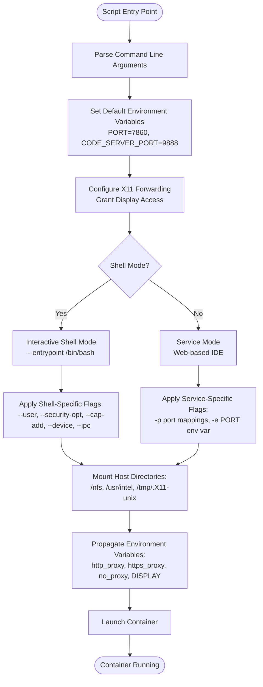
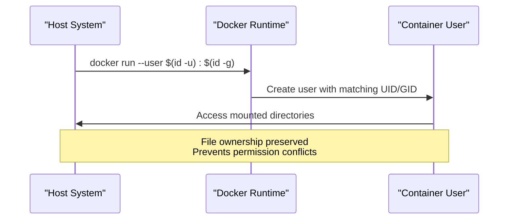
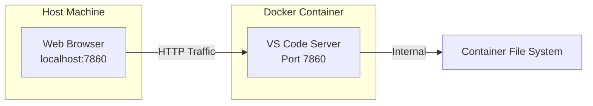
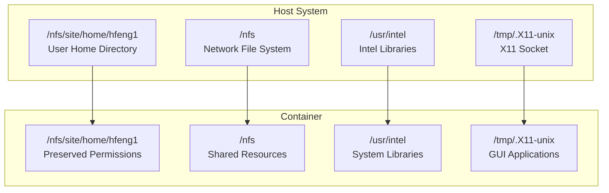
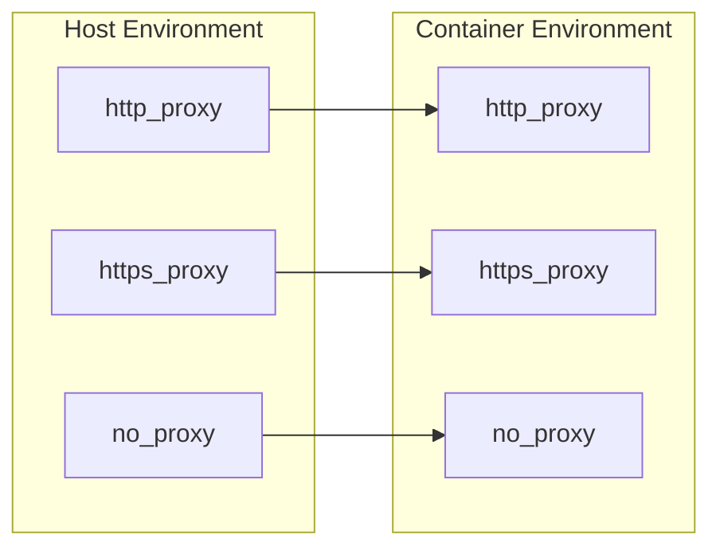
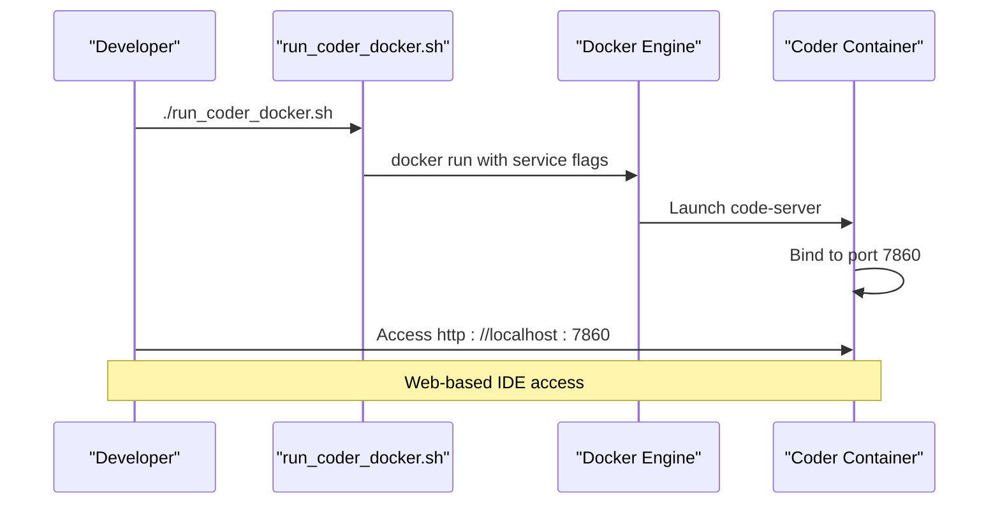
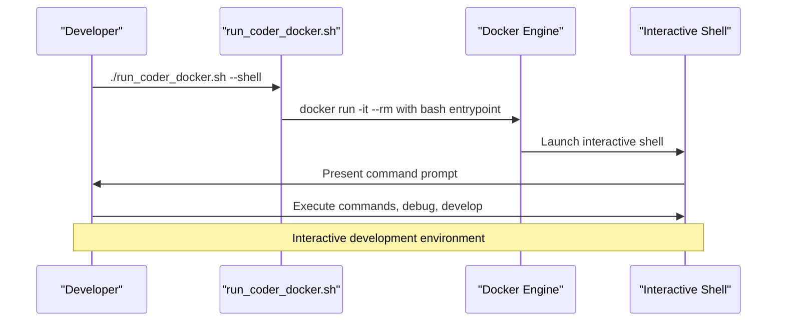
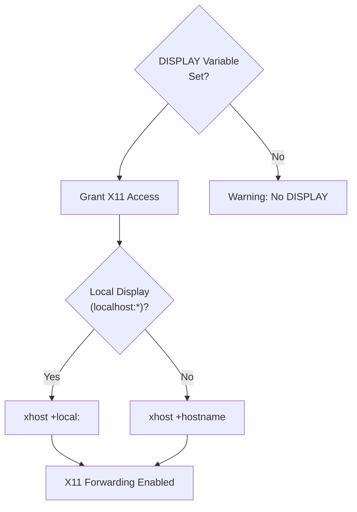
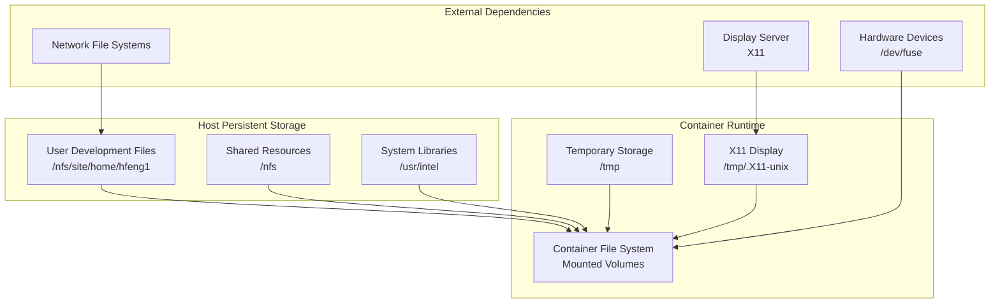

# Docker Execution

<cite>
**Referenced Files in This Document**
- [run_coder_docker.sh](file://scripts/run_coder_docker.sh)
- [Dockerfile](file://Dockerfile)
- [build_coder.sh](file://scripts/build_coder.sh)
- [run_coder_singularity.sh](file://scripts/run_coder_singularity.sh)
- [setup_env_in_container.sh](file://scripts/setup_env_in_container.sh)
- [README.md](file://README.md)
</cite>

## Table of Contents
1. [Introduction](#introduction)
2. [Script Architecture Overview](#script-architecture-overview)
3. [Core Docker Flags and Security Configuration](#core-docker-flags-and-security-configuration)
4. [Port Exposure and Network Configuration](#port-exposure-and-network-configuration)
5. [Volume Mounting Strategy](#volume-mounting-strategy)
6. [Environment Variable Propagation](#environment-variable-propagation)
7. [Execution Modes](#execution-modes)
8. [X11 Forwarding and Display Configuration](#x11-forwarding-and-display-configuration)
9. [Real-World Usage Examples](#real-world-usage-examples)
10. [Data Flow and Storage Architecture](#data-flow-and-storage-architecture)
11. [Common Issues and Troubleshooting](#common-issues-and-troubleshooting)
12. [Performance and Security Considerations](#performance-and-security-considerations)
13. [Conclusion](#conclusion)

## Introduction

The `run_coder_docker.sh` script serves as the primary orchestration mechanism for launching the Coder development environment in Docker containers. This sophisticated script implements a comprehensive container startup process that preserves file ownership, enables privileged operations, facilitates GUI application access, and maintains seamless integration between host and container environments.

The script operates in two distinct modes: service mode for standard web-based IDE access and shell mode for interactive debugging and development. It employs advanced Docker security configurations, extensive volume mounting strategies, and intelligent environment variable propagation to create a robust development platform.

## Script Architecture Overview

The Docker execution system follows a modular architecture with clear separation of concerns:



**Diagram sources**
- [run_coder_docker.sh](file://scripts/run_coder_docker.sh#L8-L77)

**Section sources**
- [run_coder_docker.sh](file://scripts/run_coder_docker.sh#L1-L78)

## Core Docker Flags and Security Configuration

The script implements several critical Docker security and capability flags that enable advanced functionality while maintaining operational safety:

### UID/GID Preservation with --user Flag

The `--user $(id -u):$(id -g)` flag ensures file ownership preservation between host and container environments. This critical feature prevents permission conflicts when accessing mounted directories:



**Diagram sources**
- [run_coder_docker.sh](file://scripts/run_coder_docker.sh#L39-L76)

### Privileged Operations with Security and Capabilities

The script employs three essential security and capability flags for specialized functionality:

| Flag | Purpose | Security Implications |
|------|---------|----------------------|
| `--security-opt seccomp=unconfined` | Disable syscall filtering | Allows unrestricted system calls |
| `--cap-add=SYS_ADMIN` | Add administrative capabilities | Enables FUSE mounting and IPC operations |
| `--device /dev/fuse` | Access FUSE filesystem | Required for user-space filesystem operations |

These flags collectively enable:
- **FUSE Mounting**: File system operations in user space
- **Shared Memory Access**: Required for GUI applications
- **System Administration Tasks**: Extended container capabilities

**Section sources**
- [run_coder_docker.sh](file://scripts/run_coder_docker.sh#L40-L44)
- [Dockerfile](file://Dockerfile#L135-L136)

### IPC Sharing with --ipc=host

The `--ipc=host` flag provides containers access to the host's inter-process communication resources, enabling:

- **Shared Memory Segments**: Essential for GUI applications
- **Message Queues**: Inter-container communication
- **Semaphore Operations**: Process synchronization

This configuration eliminates IPC namespace isolation while maintaining other container security boundaries.

## Port Exposure and Network Configuration

The script implements a dual-port architecture for comprehensive web-based development access:

### Primary Development Port (7860)

The main development port (`$PORT`) serves the VS Code Server web interface:



**Diagram sources**
- [run_coder_docker.sh](file://scripts/run_coder_docker.sh#L70)

### Secondary IDE Port (9888)

The secondary port (`$CODE_SERVER_PORT`) provides direct code-server access for advanced configurations:

| Port | Purpose | Usage Pattern |
|------|---------|---------------|
| 7860 | Web IDE Access | Standard browser-based development |
| 9888 | Direct Server Access | Advanced debugging and API access |

### Port Binding Strategy

The script implements flexible port binding through environment variable override:

```bash
# Override default ports
PORT=8080 ./scripts/run_coder_docker.sh
CODE_SERVER_PORT=9999 ./scripts/run_coder_docker.sh
```

**Section sources**
- [run_coder_docker.sh](file://scripts/run_coder_docker.sh#L25-L27)
- [run_coder_docker.sh](file://scripts/run_coder_docker.sh#L70-L71)

## Volume Mounting Strategy

The volume mounting strategy creates a comprehensive bridge between host and container file systems, enabling seamless development workflows:

### Critical Mount Points



**Diagram sources**
- [run_coder_docker.sh](file://scripts/run_coder_docker.sh#L49-L52)
- [run_coder_docker.sh](file://scripts/run_coder_docker.sh#L72-L75)

### Mount Point Analysis

| Mount Point | Purpose | Security Considerations |
|-------------|---------|------------------------|
| `/nfs/site/home/hfeng1` | Personal development files | Maintains user ownership |
| `/nfs` | Shared network resources | Network access permissions |
| `/usr/intel` | Intel development libraries | System library access |
| `/tmp/.X11-unix` | X11 display forwarding | Display server access |

### Resource Sharing Benefits

The mounting strategy provides several advantages:
- **Persistent Storage**: Development files survive container restarts
- **Resource Access**: System libraries and tools remain accessible
- **Cross-Platform Compatibility**: Network file system integration
- **GUI Application Support**: X11 forwarding for graphical applications

**Section sources**
- [run_coder_docker.sh](file://scripts/run_coder_docker.sh#L49-L52)
- [run_coder_docker.sh](file://scripts/run_coder_docker.sh#L72-L75)

## Environment Variable Propagation

The script intelligently propagates environment variables to ensure proper network connectivity and display configuration:

### Network Proxy Configuration



**Diagram sources**
- [run_coder_docker.sh](file://scripts/run_coder_docker.sh#L45-L47)

### Display Configuration Variables

| Variable | Purpose | Container Impact |
|----------|---------|------------------|
| `http_proxy` | HTTP proxy configuration | Network access through corporate proxies |
| `https_proxy` | HTTPS proxy configuration | Secure network access |
| `no_proxy` | Bypass proxy for specific hosts | Internal network access |
| `DISPLAY` | X11 display specification | GUI application forwarding |

### Conditional Environment Propagation

The script applies different environment variable strategies based on execution mode:

- **Service Mode**: Propagates `PORT` variable for web server configuration
- **Shell Mode**: Uses standard environment inheritance for interactive sessions

**Section sources**
- [run_coder_docker.sh](file://scripts/run_coder_docker.sh#L45-L48)
- [run_coder_docker.sh](file://scripts/run_coder_docker.sh#L65-L69)

## Execution Modes

The script supports two distinct execution modes, each optimized for different development scenarios:

### Service Mode (Default)

Service mode launches the container as a long-running web server:



**Diagram sources**
- [run_coder_docker.sh](file://scripts/run_coder_docker.sh#L55-L77)

### Shell Mode (--shell)

Shell mode provides interactive access for debugging and development tasks:



**Diagram sources**
- [run_coder_docker.sh](file://scripts/run_coder_docker.sh#L34-L54)

### Mode Comparison

| Aspect | Service Mode | Shell Mode |
|--------|--------------|------------|
| Entry Point | code-server process | /bin/bash shell |
| Resource Usage | Persistent server | Temporary container |
| Network Exposure | Port 7860+9888 | None (interactive) |
| Use Case | Web IDE access | Debugging, development |
| Cleanup | Manual termination | Automatic cleanup |

**Section sources**
- [run_coder_docker.sh](file://scripts/run_coder_docker.sh#L11-L23)
- [run_coder_docker.sh](file://scripts/run_coder_docker.sh#L34-L54)

## X11 Forwarding and Display Configuration

The script implements comprehensive X11 forwarding capabilities for GUI application support:

### X11 Access Configuration



**Diagram sources**
- [run_coder_docker.sh](file://scripts/run_coder_docker.sh#L29-L32)

### X11 Security and Permissions

The script implements careful X11 security measures:

| Security Measure | Implementation | Purpose |
|------------------|----------------|---------|
| `xhost +local:` | Allow local connections | Enable localhost display access |
| Conditional execution | Check `DISPLAY` variable | Prevent unnecessary operations |
| Warning fallback | Graceful degradation | Continue operation without X11 |

### Display Variable Propagation

The `DISPLAY` environment variable is propagated to ensure GUI applications function correctly:

- **Local Displays**: `localhost:0`, `:0`, `127.0.0.1:0`
- **Remote Displays**: `hostname:0`, `IP:0`
- **Security Context**: Respects existing X11 security policies

**Section sources**
- [run_coder_docker.sh](file://scripts/run_coder_docker.sh#L29-L32)
- [run_coder_docker.sh](file://scripts/run_coder_docker.sh#L48)
- [run_coder_docker.sh](file://scripts/run_coder_docker.sh#L68)

## Real-World Usage Examples

### Basic Container Startup

Standard development environment launch:
```bash
./scripts/run_coder_docker.sh
```

### Custom Port Configuration

Override default ports for conflict avoidance:
```bash
PORT=8080 ./scripts/run_coder_docker.sh
CODE_SERVER_PORT=9999 ./scripts/run_coder_docker.sh
```

### Interactive Development Session

Debug and develop within the container:
```bash
./scripts/run_coder_docker.sh --shell
```

### Corporate Network Configuration

Configure proxy settings for enterprise environments:
```bash
export http_proxy=http://proxy.company.com:8080
export https_proxy=https://proxy.company.com:8080
export no_proxy=localhost,127.0.0.1,.company.com
./scripts/run_coder_docker.sh
```

### Remote Display Access

Enable GUI application access from remote clients:
```bash
export DISPLAY=remote-host:0
./scripts/run_coder_docker.sh
```

### Development Workflow Example

Complete development cycle using the container:
```bash
# 1. Build the container image
./scripts/build_coder.sh

# 2. Launch development environment
./scripts/run_coder_docker.sh

# 3. Access web interface at http://localhost:7860
# 4. Use VS Code Server for development
# 5. Access logs and debug with shell mode
./scripts/run_coder_docker.sh --shell
```

**Section sources**
- [run_coder_docker.sh](file://scripts/run_coder_docker.sh#L4-L6)
- [run_coder_docker.sh](file://scripts/run_coder_docker.sh#L25-L27)

## Data Flow and Storage Architecture

The container architecture implements a sophisticated data flow model that maintains persistence while enabling seamless host-container integration:

### Persistent Storage Model



**Diagram sources**
- [run_coder_docker.sh](file://scripts/run_coder_docker.sh#L49-L52)
- [run_coder_docker.sh](file://scripts/run_coder_docker.sh#L72-L75)

### Data Flow Patterns

| Direction | Path | Purpose | Persistence |
|-----------|------|---------|-------------|
| Host → Container | `/nfs/site/home/hfeng1` | Development files | Persistent |
| Host → Container | `/nfs` | Shared resources | Persistent |
| Host → Container | `/usr/intel` | System libraries | Persistent |
| Host → Container | `/tmp/.X11-unix` | Display sockets | Session-based |
| Container → Host | Generated files | Output artifacts | Configurable |

### Storage Optimization Strategies

The mounting strategy balances performance and functionality:

- **Bind Mounts**: Direct host-to-container mapping for optimal performance
- **Named Volumes**: Container-managed storage for temporary data
- **Memory Backed**: `/tmp` mounts for high-performance temporary storage

**Section sources**
- [run_coder_docker.sh](file://scripts/run_coder_docker.sh#L49-L52)
- [run_coder_docker.sh](file://scripts/run_coder_docker.sh#L72-L75)

## Common Issues and Troubleshooting

### Port Conflicts

**Problem**: Container fails to start due to port conflicts
**Symptoms**: "Address already in use" errors on port 7860 or 9888
**Resolution Steps**:
1. Check port usage: `netstat -tulpn | grep :7860`
2. Kill conflicting processes: `kill -9 <PID>`
3. Use alternative ports: `PORT=8080 ./scripts/run_coder_docker.sh`
4. Verify port availability: `telnet localhost 7860`

### Missing X11 Sockets

**Problem**: GUI applications fail to launch due to missing X11 socket
**Symptoms**: "Cannot open display" errors
**Resolution Steps**:
1. Verify X11 server is running: `ps aux | grep Xorg`
2. Check socket existence: `ls -la /tmp/.X11-unix/`
3. Ensure proper mounting: Verify `/tmp/.X11-unix` mount in container
4. Test X11 connection: `xhost +local:`

### Xhost Permission Denials

**Problem**: X11 access denied despite proper configuration
**Symptoms**: "Permission denied" when launching GUI applications
**Resolution Steps**:
1. Check current X11 permissions: `xhost`
2. Grant access: `xhost +SI:localuser:$(whoami)`
3. Verify container display access: `DISPLAY=:0 xclock` (from container)
4. Review security policies: Check SELinux/AppArmor settings

### Fuse Device Access Errors

**Problem**: FUSE operations fail due to device access restrictions
**Symptoms**: "Operation not permitted" errors with FUSE mounts
**Resolution Steps**:
1. Verify device access: `ls -la /dev/fuse`
2. Check container capabilities: Ensure `--cap-add=SYS_ADMIN` is present
3. Test FUSE functionality: `cat /dev/fuse > /dev/null` (should hang)
4. Review security contexts: Check Docker security policies

### Container Startup Failures

**Problem**: Container fails to start or immediately exits
**Symptoms**: Container starts then stops immediately
**Resolution Steps**:
1. Check container logs: `docker logs <container-id>`
2. Verify image build: Ensure `./scripts/build_coder.sh` succeeded
3. Test minimal configuration: Use `--shell` mode for debugging
4. Review resource limits: Check available memory and CPU

### Network Connectivity Issues

**Problem**: Cannot access web interface or external resources
**Symptoms**: Connection timeouts or proxy errors
**Resolution Steps**:
1. Verify port accessibility: `curl http://localhost:7860`
2. Check proxy configuration: Verify `http_proxy` and `https_proxy` variables
3. Test DNS resolution: `nslookup google.com`
4. Review firewall rules: Check host and container firewall settings

**Section sources**
- [run_coder_docker.sh](file://scripts/run_coder_docker.sh#L29-L32)
- [Dockerfile](file://Dockerfile#L135-L136)

## Performance and Security Considerations

### Performance Implications of Mount Strategies

#### Bind Mounts vs Named Volumes

| Mount Type | Performance | Use Case | Security |
|------------|-------------|----------|----------|
| Bind Mounts | High (direct host access) | Development files, shared resources | Host security controls apply |
| Named Volumes | Medium (Docker-managed) | Temporary data, configuration | Container isolation maintained |
| Memory Mounts | Very High | Temporary files, caches | No persistence |

#### Optimization Strategies

- **Selective Mounting**: Only mount necessary directories
- **Read-Only Mounts**: Use `:ro` for immutable data
- **Directory Specificity**: Mount individual directories instead of parent paths
- **Network Optimization**: Use local network paths for NFS mounts

### Security Trade-offs of Privileged Flags

#### Risk Assessment Matrix

| Flag | Risk Level | Mitigation | Justification |
|------|------------|------------|---------------|
| `--security-opt seccomp=unconfined` | High | Limited to development context | Required for system operations |
| `--cap-add=SYS_ADMIN` | High | Minimal attack surface | Containerized environment |
| `--device /dev/fuse` | Medium | Controlled access | Specific device requirement |

#### Security Best Practices

1. **Principle of Least Privilege**: Use only necessary capabilities
2. **Container Isolation**: Maintain separate containers for different tasks
3. **Network Segmentation**: Limit container network access
4. **Regular Audits**: Monitor container security posture
5. **Image Scanning**: Regular vulnerability assessments

### Development Context Security

The privileged configuration is justified in development contexts because:

- **Controlled Environment**: Development machines typically have lower threat exposure
- **Temporary Nature**: Containers are ephemeral and easily recreated
- **Isolated Workloads**: Development activities don't impact production systems
- **Monitoring**: Development environments often have comprehensive monitoring

### Production Considerations

For production deployments, consider:

- **Capability Reduction**: Remove unnecessary capabilities
- **Security Policies**: Implement strict security contexts
- **Network Isolation**: Use dedicated networks for containers
- **Resource Limits**: Apply CPU and memory constraints
- **Regular Updates**: Keep container images current

**Section sources**
- [run_coder_docker.sh](file://scripts/run_coder_docker.sh#L40-L44)
- [Dockerfile](file://Dockerfile#L135-L136)

## Conclusion

The `run_coder_docker.sh` script represents a sophisticated orchestration solution for containerized development environments. Its comprehensive approach to security, networking, storage, and user experience demonstrates best practices in Docker containerization for development workflows.

Key strengths of the implementation include:

- **Intelligent Security Configuration**: Balanced privilege granting with security awareness
- **Flexible Execution Modes**: Accommodates both service and interactive development needs
- **Robust Network Configuration**: Comprehensive port exposure and proxy support
- **Seamless Integration**: Extensive volume mounting for persistent development workflows
- **User Experience Focus**: Intelligent X11 forwarding and environment variable propagation

The script's modular design and extensive configuration options make it suitable for diverse development environments, from local development to enterprise-scale deployments. Its emphasis on file ownership preservation, GUI application support, and network connectivity ensures developers can work efficiently across different platforms and organizational requirements.

Future enhancements could include automated security scanning, enhanced logging capabilities, and expanded integration with CI/CD pipelines. However, the current implementation provides a solid foundation for modern development containerization needs.