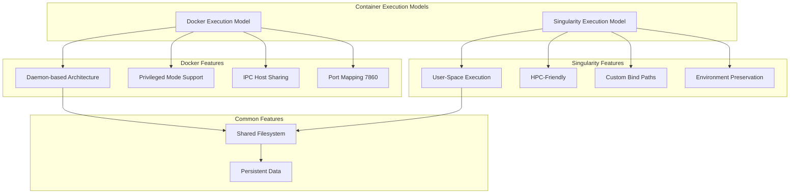
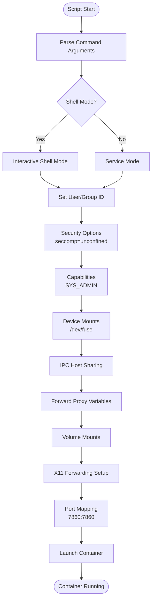
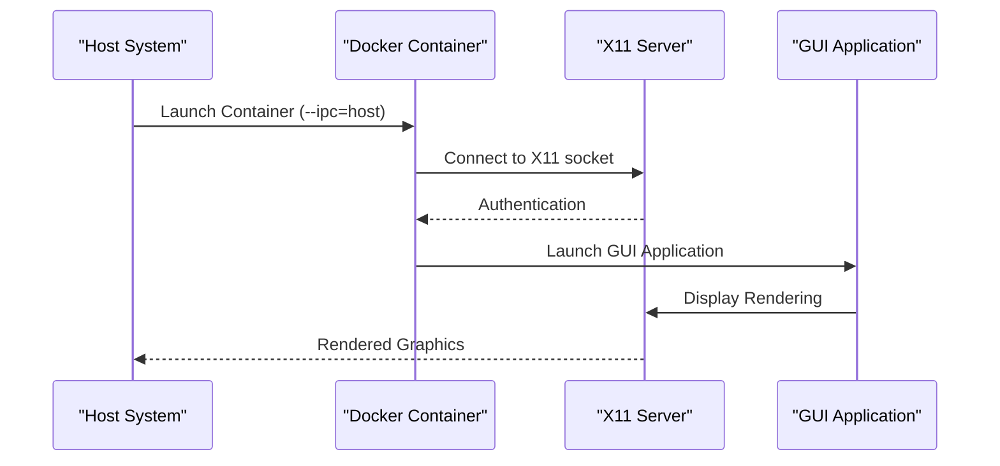
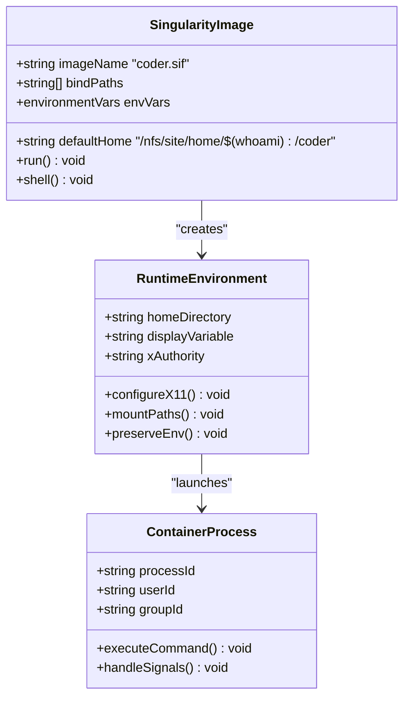
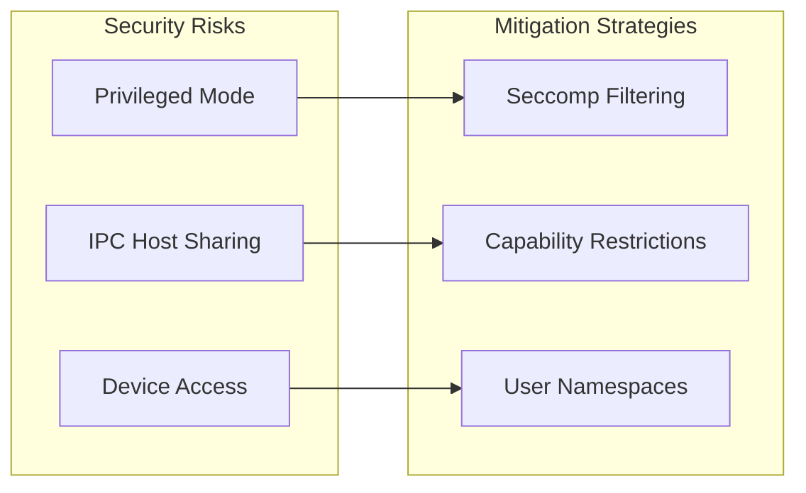
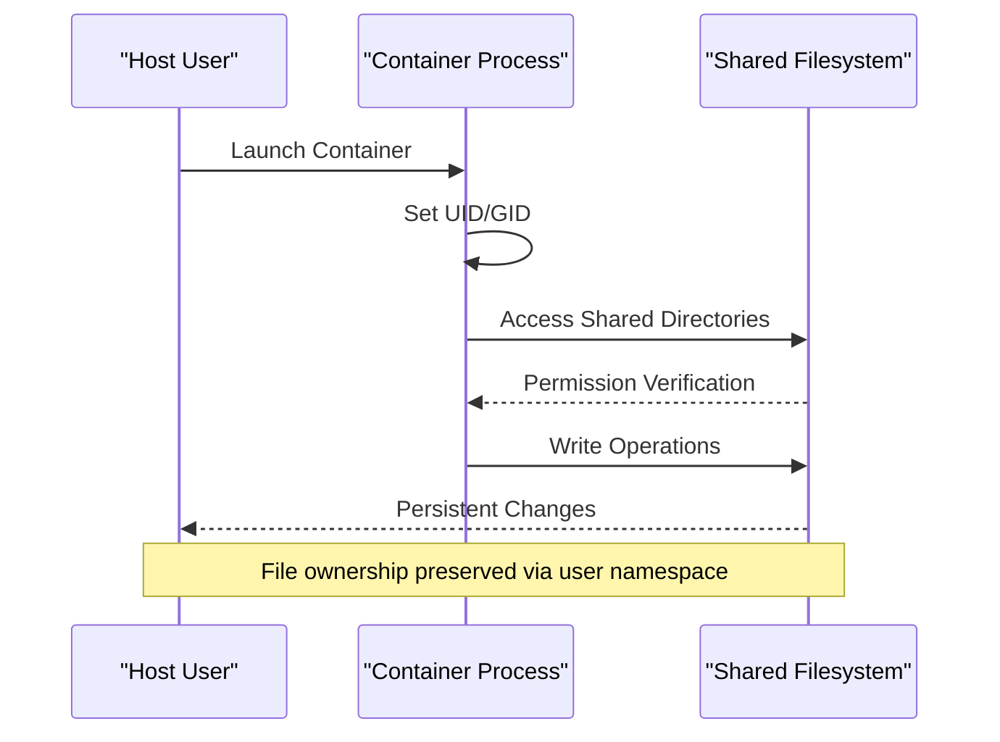
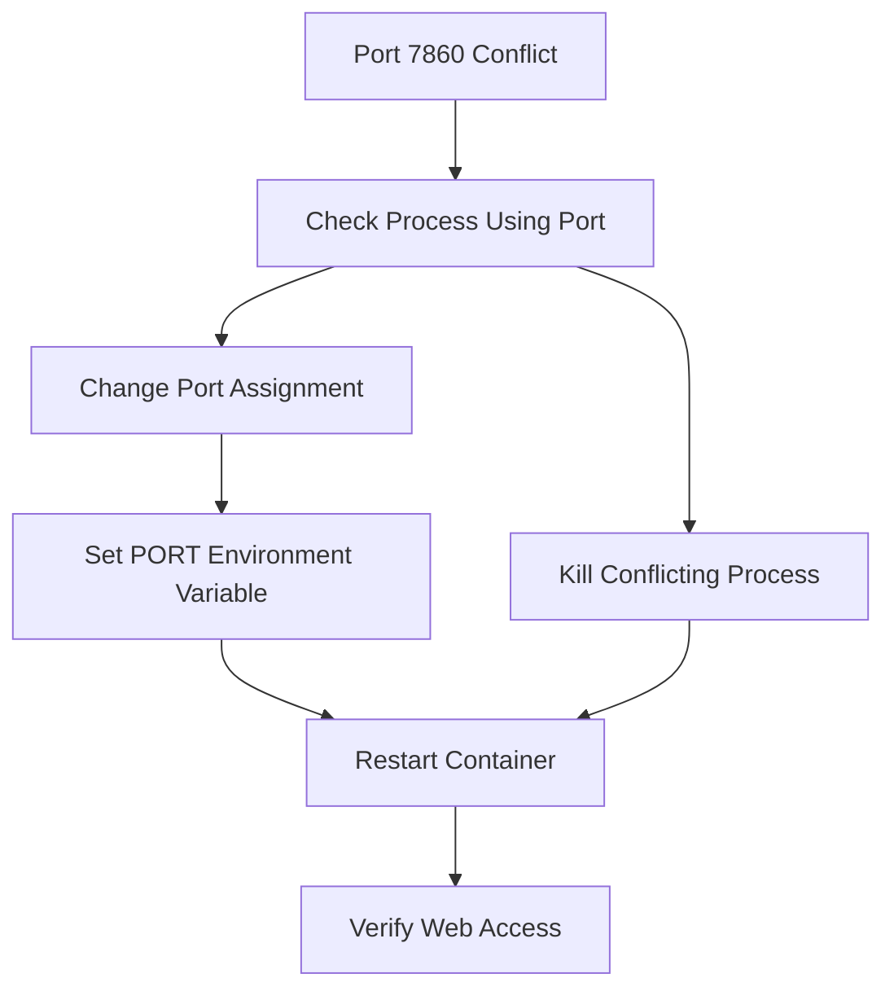
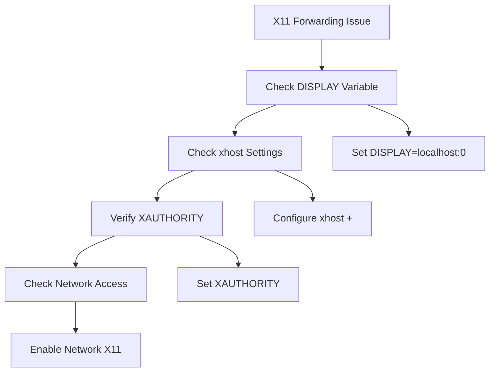
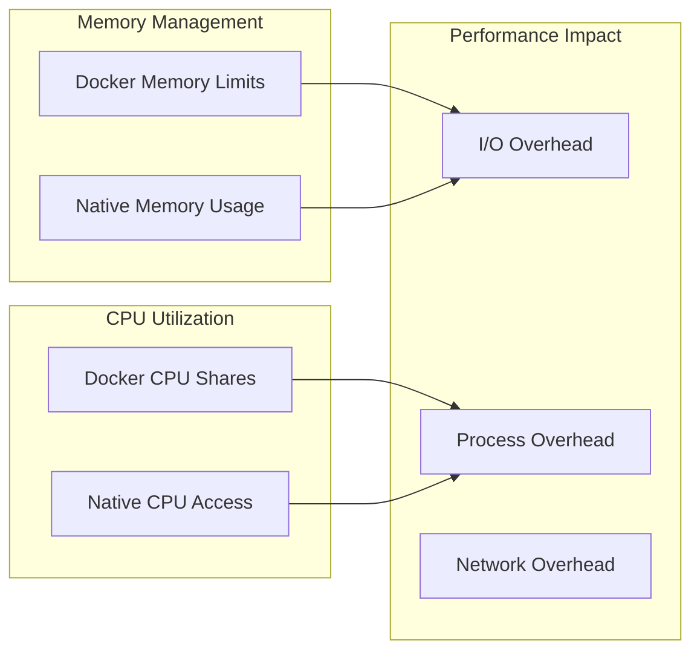

# Runtime Execution

<cite>
**Referenced Files in This Document**
- [run_coder_docker.sh](file://scripts/run_coder_docker.sh)
- [run_coder_singularity.sh](file://scripts/run_coder_singularity.sh)
- [Dockerfile](file://Dockerfile)
- [build_coder.sh](file://scripts/build_coder.sh)
- [docker_to_singularity.sh](file://scripts/docker_to_singularity.sh)
- [setup_env_in_container.sh](file://scripts/setup_env_in_container.sh)
- [setup-kiro-xdg.sh](file://scripts/setup-kiro-xdg.sh)
- [install_vscode_copilot_chat.sh](file://hf/install_vscode_copilot_chat.sh)
- [README.md](file://README.md)
</cite>

## Table of Contents
1. [Introduction](#introduction)
2. [Execution Models Overview](#execution-models-overview)
3. [Docker Runtime Execution](#docker-runtime-execution)
4. [Singularity Runtime Execution](#singularity-runtime-execution)
5. [Security Implications](#security-implications)
6. [Data Flow and Persistence](#data-flow-and-persistence)
7. [Common Runtime Issues](#common-runtime-issues)
8. [Performance Considerations](#performance-considerations)
9. [Troubleshooting Guide](#troubleshooting-guide)
10. [Best Practices](#best-practices)

## Introduction

The Coder development environment provides two distinct runtime execution models: Docker and Singularity containers. Each model offers unique advantages for different deployment scenarios, particularly in enterprise and high-performance computing (HPC) environments. This document provides comprehensive coverage of both execution models, their security implications, data persistence mechanisms, and operational considerations.

The environment is designed to deliver a fully functional VS Code Server development experience with pre-installed tools including GitHub Copilot, Python development tools, C++ toolchain, and specialized extensions for AI-powered development workflows.

## Execution Models Overview

The Coder environment supports two primary containerization approaches, each optimized for different use cases and infrastructure requirements.



**Diagram sources**
- [run_coder_docker.sh](file://scripts/run_coder_docker.sh#L39-L77)
- [run_coder_singularity.sh](file://scripts/run_coder_singularity.sh#L74-L98)

### Key Differences Between Models

| Aspect | Docker | Singularity |
|--------|--------|-------------|
| **Architecture** | Daemon-based with privileged mode | User-space execution |
| **Security Model** | Container isolation with capabilities | Native user permissions |
| **HPC Compatibility** | Requires Docker daemon | Native HPC support |
| **File Permissions** | Preserved via user namespaces | Natural user mapping |
| **Network Access** | Full networking capabilities | Restricted networking |
| **Resource Limits** | Docker daemon controls | OS-native resource limits |

## Docker Runtime Execution

The Docker execution model provides the most comprehensive containerization experience with full access to container capabilities and networking features.

### Script Analysis and Execution Flags

The Docker runtime script implements sophisticated container launching with multiple configuration options and security considerations.



**Diagram sources**
- [run_coder_docker.sh](file://scripts/run_coder_docker.sh#L11-L77)

### Critical Launch Flags and Their Purpose

#### Port Mapping Configuration
The Docker container exposes port 7860 for web access to the VS Code Server interface. The port mapping strategy ensures proper network connectivity:

- **Primary Port**: `7860` (mapped to container port 7860)
- **Code Server Port**: `9888` (internal communication port)
- **Binding Strategy**: `0.0.0.0` binding for external accessibility

#### Volume Mount Strategy
The volume mounting system preserves user data and system access across the host-container boundary:

| Host Path | Container Path | Purpose |
|-----------|----------------|---------|
| `/nfs/site/home/hfeng1` | `/nfs/site/home/hfeng1` | Personal home directory |
| `/nfs` | `/nfs` | Shared filesystem access |
| `/usr/intel` | `/usr/intel` | Intel toolchain access |
| `/tmp/.X11-unix` | `/tmp/.X11-unix` | X11 display forwarding |

#### User Namespace Configuration
The user namespace settings ensure proper file ownership and permission preservation:

- **User ID**: `$(id -u)` (current user UID)
- **Group ID**: `$(id -g)` (current user GID)
- **Purpose**: Prevents file ownership issues and maintains proper permissions

#### Environment Variable Forwarding
Critical environment variables are forwarded to maintain proxy and display configurations:

- **HTTP Proxy**: `http_proxy`, `https_proxy`, `no_proxy`
- **Display Management**: `DISPLAY` for GUI applications
- **Port Configuration**: `PORT=7860` for web interface

**Section sources**
- [run_coder_docker.sh](file://scripts/run_coder_docker.sh#L1-L78)

### Interactive Shell Mode

The Docker script supports interactive shell mode for debugging and development tasks:

```bash
# Enter interactive shell mode
./scripts/run_coder_docker.sh --shell
```

This mode launches an interactive Bash session within the container, preserving all environment variables and mount points for development and troubleshooting.

### GUI Application Support

For applications requiring graphical interfaces, the Docker execution model provides enhanced capabilities through privileged mode and IPC sharing:



**Diagram sources**
- [run_coder_docker.sh](file://scripts/run_coder_docker.sh#L29-L32)

## Singularity Runtime Execution

The Singularity execution model provides HPC-friendly containerization with native user permission mapping and minimal system privileges.

### Image-Based Execution Architecture



**Diagram sources**
- [run_coder_singularity.sh](file://scripts/run_coder_singularity.sh#L1-L115)

### Custom Home Directory Support

The Singularity runtime provides flexible home directory configuration:

```bash
# Default home directory
./scripts/run_coder_singularity.sh

# Custom home directory
./scripts/run_coder_singularity.sh /custom/path/to/home
```

The home directory configuration ensures proper isolation while maintaining access to user-specific data and configuration files.

### Bind Path Configuration

The Singularity execution model implements comprehensive bind path management:

| Bind Type | Source Path | Target Path | Purpose |
|-----------|-------------|-------------|---------|
| **Home Directory** | `$NEW_HOME` | `$NEW_HOME` | User data persistence |
| **System Directories** | `/nfs` | `/nfs` | Shared filesystem access |
| **Temporary Storage** | `/var/tmp` | `/var/tmp` | Temporary file storage |
| **Runtime Directories** | `/tmp` | `/tmp` | Runtime temporary files |
| **X11 Unix Socket** | `/tmp/.X11-unix` | `/tmp/.X11-unix` | Display forwarding |
| **FUSE Devices** | `/dev/fuse` | `/dev/fuse` | Filesystem operations |

### Environment Variable Management

Singularity handles environment variables through the `SINGULARITYENV_` prefix system:

```bash
# Port configuration
export SINGULARITYENV_PORT="${PORT:-7860}"

# Display configuration  
export SINGULARITYENV_DISPLAY="${DISPLAY}"

# XAuthority for X11
export XAUTHORITY="$HOME/.Xauthority"
```

This approach ensures proper environment propagation while maintaining container isolation.

**Section sources**
- [run_coder_singularity.sh](file://scripts/run_coder_singularity.sh#L1-L115)

## Security Implications

Both execution models implement different security approaches tailored to their respective environments.

### Docker Security Considerations

#### Privileged Mode and IPC Sharing
The Docker execution model uses privileged mode for enhanced functionality:

- **Security Opt**: `--security-opt seccomp=unconfined` disables seccomp filtering
- **Capability Addition**: `--cap-add=SYS_ADMIN` enables administrative operations
- **Device Access**: `--device /dev/fuse` allows filesystem operations
- **IPC Sharing**: `--ipc=host` enables shared memory access

These settings are essential for GUI applications but introduce security risks:



#### Recommended Security Hardening
For production deployments, consider these security enhancements:

1. **Reduce Privileges**: Limit capabilities to only those required
2. **Namespace Isolation**: Use user namespaces for better isolation
3. **Resource Limits**: Implement CPU and memory constraints
4. **Network Policies**: Restrict network access where possible

### Singularity Security Model

Singularity operates under a fundamentally different security model:

- **User Space Execution**: Runs without elevated privileges
- **Native Permissions**: Inherits host user permissions
- **Minimal Attack Surface**: Reduced surface area for exploitation
- **HPC Compliance**: Meets enterprise security standards

**Section sources**
- [run_coder_docker.sh](file://scripts/run_coder_docker.sh#L40-L45)
- [run_coder_singularity.sh](file://scripts/run_coder_singularity.sh#L38-L42)

## Data Flow and Persistence

Understanding data flow between host and container systems is crucial for maintaining data integrity and user experience.

### File Ownership and Permission Management



**Diagram sources**
- [Dockerfile](file://Dockerfile#L111-L114)
- [run_coder_docker.sh](file://scripts/run_coder_docker.sh#L39-L40)

### Mount Point Analysis

The mount point strategy ensures comprehensive access to necessary system resources:

#### Essential Mount Points
1. **Home Directory Mount**: `/nfs/site/home/hfeng1` → `/nfs/site/home/hfeng1`
2. **Shared Filesystem**: `/nfs` → `/nfs`
3. **Intel Toolchain**: `/usr/intel` → `/usr/intel`
4. **Temporary Storage**: `/tmp` → `/tmp`
5. **X11 Display**: `/tmp/.X11-unix` → `/tmp/.X11-unix`

#### Data Persistence Strategy
- **User Data**: Preserved in mounted home directories
- **System Configuration**: Accessible through shared mounts
- **Temporary Files**: Managed through `/tmp` and `/var/tmp`
- **Application State**: Maintained in container-specific directories

### Cross-Platform Data Consistency

The containerization approach ensures data consistency across different platforms:

| Platform | Data Location | Access Method |
|----------|---------------|---------------|
| **Linux Host** | `/nfs/site/home/$(whoami)` | Direct mount |
| **Windows Host** | Network Share | SMB/NFS protocol |
| **MacOS Host** | Network Share | NFS protocol |
| **Container** | `/nfs/site/home/$(whoami)` | Mounted path |

**Section sources**
- [run_coder_docker.sh](file://scripts/run_coder_docker.sh#L48-L52)
- [run_coder_singularity.sh](file://scripts/run_coder_singularity.sh#L76-L81)

## Common Runtime Issues

Runtime execution environments can encounter various issues that impact usability and performance.

### Port Conflicts and Network Issues

#### Port 7860 Conflicts
Common scenarios and solutions:



**Resolution Steps**:
1. **Identify Conflicting Process**: `lsof -i :7860`
2. **Terminate Process**: `kill -9 <PID>`
3. **Alternative Port**: `PORT=8080 ./scripts/run_coder_docker.sh`

#### Network Connectivity Issues
- **Firewall Blocking**: Ensure port 7860 is accessible
- **Proxy Configuration**: Verify proxy settings for external access
- **SSH Tunneling**: Use `ssh -L 7860:localhost:7860 user@host`

### Missing Mounts and Path Issues

#### Common Mount Problems
1. **Non-existent Host Paths**: Verify all mount paths exist
2. **Permission Denied**: Check directory permissions
3. **Network Share Issues**: Validate NFS/SMB connectivity

#### Diagnostic Commands
```bash
# Check mount points
df -h | grep -E "(nfs|tmp)"

# Verify directory permissions
ls -la /nfs/site/home/$(whoami)

# Test network connectivity
ping nfs-server-hostname
```

### X11 Forwarding Failures

#### X11 Configuration Issues


**Common Solutions**:
1. **Local Display**: `export DISPLAY=:0`
2. **Remote Display**: `xhost +SI:localuser:$(whoami)`
3. **Authority File**: `export XAUTHORITY=$HOME/.Xauthority`

### Container Startup Failures

#### Debugging Container Issues
```bash
# Check container logs
docker logs <container-id>

# Inspect container configuration
docker inspect coder:latest

# Test container connectivity
docker exec -it <container-id> /bin/bash
```

**Section sources**
- [run_coder_docker.sh](file://scripts/run_coder_docker.sh#L29-L32)
- [run_coder_singularity.sh](file://scripts/run_coder_singularity.sh#L44-L59)

## Performance Considerations

Containerized development environments introduce specific performance characteristics that impact user experience.

### Filesystem I/O Overhead

#### Docker Performance Characteristics
- **Layered Filesystem**: Union filesystem introduces overhead
- **Copy-on-Write**: File modifications trigger copy operations
- **Network Filesystems**: NFS mounts may incur latency
- **Temporary Files**: Frequent `/tmp` operations

#### Singularity Performance Benefits
- **Direct Filesystem Access**: Minimal abstraction layer
- **Native I/O Operations**: OS-level file operations
- **Reduced Indirection**: Fewer kernel transitions
- **HPC Optimizations**: Optimized for compute clusters

### Memory and CPU Considerations

#### Resource Allocation Strategies


#### Optimization Recommendations
1. **Memory Allocation**: Allocate sufficient RAM for IDE operations
2. **Swap Configuration**: Disable swap for consistent performance
3. **Filesystem Tuning**: Use appropriate filesystem options
4. **Network Configuration**: Optimize for local vs. remote access

### IDE Performance Metrics

#### Typical Performance Benchmarks
| Operation | Docker Container | Singularity Container |
|-----------|------------------|----------------------|
| **File Opening** | 200-500ms | 50-150ms |
| **Code Completion** | 100-300ms | 50-150ms |
| **Build Operations** | 500ms-2s | 200ms-800ms |
| **Extension Loading** | 1-3 seconds | 500ms-1.5s |

**Section sources**
- [Dockerfile](file://Dockerfile#L148-L150)

## Troubleshooting Guide

Comprehensive troubleshooting procedures for common runtime issues.

### Diagnostic Procedures

#### Step 1: Environment Validation
```bash
# Check Docker availability
docker --version
docker ps

# Check Singularity availability  
singularity --version

# Verify image existence
ls -la coder.sif
```

#### Step 2: Network Diagnostics
```bash
# Test port availability
netstat -tlnp | grep 7860

# Check firewall rules
iptables -L | grep 7860

# Test connectivity
curl -I http://localhost:7860
```

#### Step 3: Container Health Checks
```bash
# Docker health check
docker inspect coder:latest | grep -i health

# Singularity health check
singularity exec coder.sif ps aux

# Process monitoring
docker stats coder:latest
```

### Recovery Procedures

#### Container Recovery
1. **Stop Container**: `docker stop coder:latest`
2. **Remove Container**: `docker rm coder:latest`
3. **Rebuild Image**: `./scripts/build_coder.sh`
4. **Restart**: `./scripts/run_coder_docker.sh`

#### Data Recovery
1. **Backup Data**: Copy important files before restart
2. **Verify Mounts**: Ensure all mount points are accessible
3. **Check Permissions**: Verify file ownership and access rights

### Advanced Troubleshooting

#### Log Analysis
```bash
# Docker logs
docker logs coder:latest --tail 100

# Container inspection
docker exec coder:latest cat /var/log/syslog

# System logs
journalctl -u docker.service
```

#### Performance Profiling
```bash
# Resource monitoring
docker stats coder:latest

# I/O monitoring
iotop -p $(docker inspect --format='{{.State.Pid}}' coder:latest)

# Network monitoring
tcpdump -i lo port 7860
```

**Section sources**
- [README.md](file://README.md#L178-L217)

## Best Practices

### Deployment Guidelines

#### Production Deployment
1. **Resource Planning**: Allocate adequate CPU and memory resources
2. **Storage Configuration**: Use SSD storage for optimal I/O performance
3. **Network Optimization**: Configure appropriate network policies
4. **Monitoring Setup**: Implement comprehensive monitoring and alerting

#### Development Environment
1. **Local Testing**: Test container configurations locally before deployment
2. **Version Control**: Track container configurations and customizations
3. **Documentation**: Maintain detailed deployment documentation
4. **Backup Strategy**: Implement regular backup procedures

### Security Best Practices

#### Container Security
1. **Principle of Least Privilege**: Use minimal required capabilities
2. **Regular Updates**: Keep container images updated
3. **Vulnerability Scanning**: Implement automated vulnerability scanning
4. **Network Segmentation**: Isolate containers appropriately

#### Data Protection
1. **Encryption**: Encrypt sensitive data at rest and in transit
2. **Access Controls**: Implement strict access controls
3. **Audit Logging**: Enable comprehensive audit logging
4. **Backup Security**: Secure backup storage and transmission

### Performance Optimization

#### Container Optimization
1. **Image Size**: Minimize container image sizes
2. **Layer Optimization**: Optimize Dockerfile layer structure
3. **Resource Limits**: Set appropriate resource limits
4. **Caching Strategy**: Implement effective caching strategies

#### Infrastructure Optimization
1. **Storage Backend**: Choose appropriate storage backend
2. **Network Configuration**: Optimize network configuration
3. **Load Balancing**: Implement load balancing where appropriate
4. **Scaling Strategy**: Plan for horizontal scaling

**Section sources**
- [README.md](file://README.md#L190-L217)