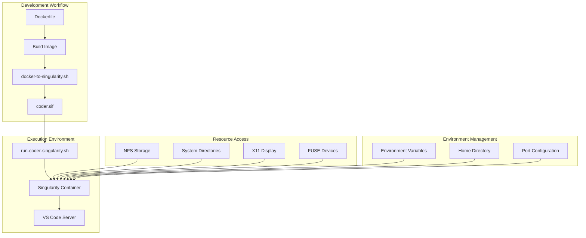
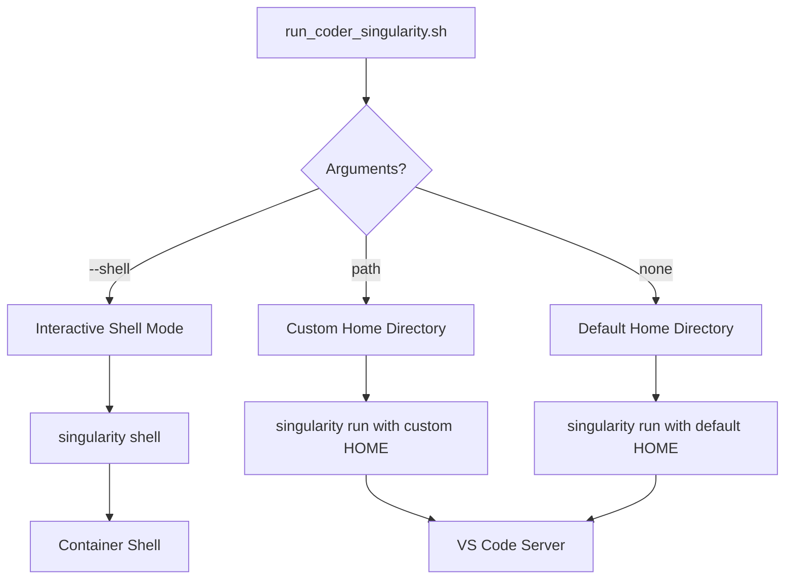
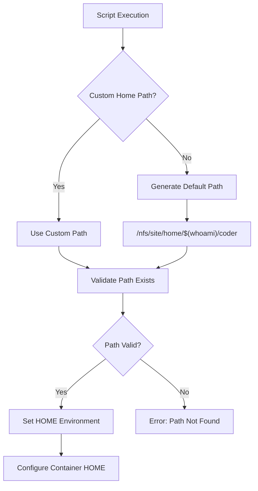
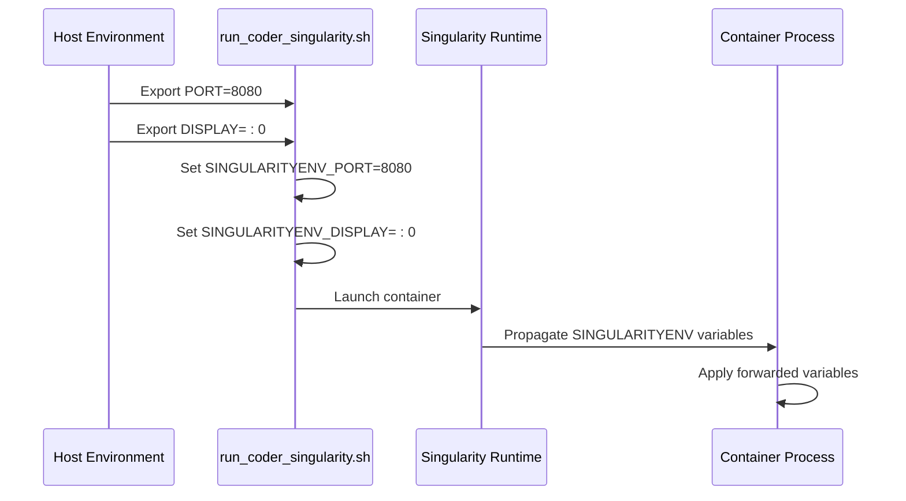
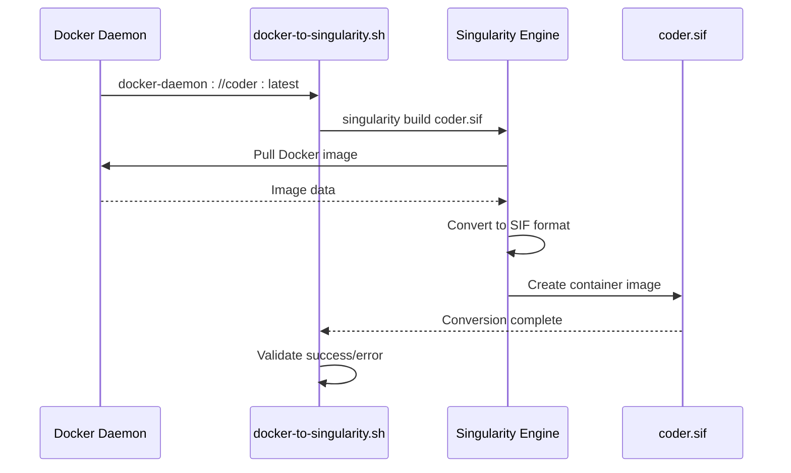

# Singularity Execution

<cite>
**Referenced Files in This Document**
- [run_coder_singularity.sh](file://scripts/run_coder_singularity.sh)
- [docker_to_singularity.sh](file://scripts/docker_to_singularity.sh)
- [Dockerfile](file://Dockerfile)
- [run_coder_docker.sh](file://scripts/run_coder_docker.sh)
- [setup_env_in_container.sh](file://scripts/setup_env_in_container.sh)
- [README.md](file://README.md)
</cite>

## Table of Contents
1. [Introduction](#introduction)
2. [System Architecture Overview](#system-architecture-overview)
3. [Singularity Container Execution Model](#singularity-container-execution-model)
4. [Script Analysis and Usage](#script-analysis-and-usage)
5. [Home Directory Management](#home-directory-management)
6. [Bind Mount Strategy](#bind-mount-strategy)
7. [Environment Variable Forwarding](#environment-variable-forwarding)
8. [X11 Access Management](#x11-access-management)
9. [Image Conversion Process](#image-conversion-process)
10. [Error Handling and Troubleshooting](#error-handling-and-troubleshooting)
11. [Performance Characteristics](#performance-characteristics)
12. [Usage Examples](#usage-examples)
13. [Common Runtime Failures](#common-runtime-failures)
14. [Best Practices](#best-practices)

## Introduction

The Singularity execution system provides a robust containerized development environment specifically designed for High-Performance Computing (HPC) environments. Unlike traditional Docker containers, Singularity operates under a user-space execution model that eliminates the need for privileged operations, making it ideal for shared HPC clusters where security and isolation are paramount.

This system enables developers to run VS Code Server (Coder) within a Singularity container while maintaining seamless access to HPC resources, preserving user permissions, and supporting graphical applications through sophisticated X11 forwarding mechanisms.

## System Architecture Overview

The Singularity execution environment follows a multi-stage containerization approach that bridges the gap between Docker-based development and HPC-friendly container formats.



**Diagram sources**
- [run_coder_singularity.sh](file://scripts/run_coder_singularity.sh#L1-L115)
- [docker_to_singularity.sh](file://scripts/docker_to_singularity.sh#L1-L17)
- [Dockerfile](file://Dockerfile#L1-L150)

**Section sources**
- [README.md](file://README.md#L1-L12)
- [run_coder_singularity.sh](file://scripts/run_coder_singularity.sh#L1-L10)

## Singularity Container Execution Model

Singularity employs a user-space execution model that fundamentally differs from Docker's kernel-level containerization. This design philosophy makes Singularity particularly suitable for HPC environments where security restrictions often prevent the use of privileged containers.

### Key Execution Features

**User-Space Isolation**: Singularity containers run entirely within the user's namespace, eliminating the need for root privileges and making them compatible with restrictive HPC cluster policies.

**Native Filesystem Integration**: Unlike Docker's layered filesystem approach, Singularity provides transparent access to host filesystems through bind mounts, ensuring optimal performance for I/O-intensive workloads.

**Process-Level Security**: Each container process runs as the user's real UID/GID, maintaining proper file ownership and permission semantics across the host and container boundaries.

**Section sources**
- [run_coder_singularity.sh](file://scripts/run_coder_singularity.sh#L69-L98)

## Script Analysis and Usage

The primary execution script, `run_coder_singularity.sh`, provides comprehensive container orchestration with flexible configuration options.

### Command Line Interface



**Diagram sources**
- [run_coder_singularity.sh](file://scripts/run_coder_singularity.sh#L16-L26)

### Script Parameters

| Parameter | Description | Default Value | Usage Example |
|-----------|-------------|---------------|---------------|
| `--shell` | Enter interactive shell mode | None | `./run_coder_singularity.sh --shell` |
| `[new_home_path]` | Custom home directory path | `/nfs/site/home/$(whoami)/coder` | `./run_coder_singularity.sh /custom/path` |

### Execution Modes

**Service Mode**: The default operation runs VS Code Server as a background service, exposing the web interface on the configured port.

**Shell Mode**: Enables interactive debugging and development by launching an interactive shell within the container environment.

**Section sources**
- [run_coder_singularity.sh](file://scripts/run_coder_singularity.sh#L1-L10)

## Home Directory Management

Singularity's home directory management system ensures persistent configuration storage while maintaining user identity and file permissions across the host-container boundary.

### Default Home Directory Strategy

The system automatically determines the appropriate home directory based on the current user context:



**Diagram sources**
- [run_coder_singularity.sh](file://scripts/run_coder_singularity.sh#L29-L30)

### Home Directory Benefits

**Persistent Configuration**: User-specific settings, extensions, and development projects are preserved across container restarts.

**Permission Preservation**: File ownership and permissions are maintained through the bind mount mechanism, ensuring seamless access to development resources.

**Isolation**: Each user maintains separate workspace environments while sharing common HPC resources.

**Section sources**
- [run_coder_singularity.sh](file://scripts/run_coder_singularity.sh#L9-L10)
- [run_coder_singularity.sh](file://scripts/run_coder_singularity.sh#L30)

## Bind Mount Strategy

The bind mount strategy ensures comprehensive access to essential HPC resources while maintaining security boundaries and performance optimization.

### Critical Mount Points

| Mount Point | Purpose | Host Path | Container Path |
|-------------|---------|-----------|----------------|
| `/nfs` | Shared storage access | `/nfs` | `/nfs` |
| `/tmp` | Temporary file storage | `/tmp` | `/tmp` |
| `/var/tmp` | Persistent temporary files | `/var/tmp` | `/var/tmp` |
| `/tmp/.X11-unix` | X11 socket access | `/tmp/.X11-unix` | `/tmp/.X11-unix` |
| `/dev/fuse` | Filesystem operations | `/dev/fuse` | `/dev/fuse` |

### Mount Strategy Rationale

**Resource Availability**: Essential system directories are mounted to provide access to HPC-specific resources and tools.

**GUI Support**: X11 socket mounting enables graphical applications and web browsers within the container environment.

**Filesystem Operations**: FUSE device access supports advanced filesystem operations and plugins.

**Performance Optimization**: Direct host filesystem access minimizes I/O overhead compared to Docker's layered approach.

**Section sources**
- [run_coder_singularity.sh](file://scripts/run_coder_singularity.sh#L76-L81)
- [run_coder_singularity.sh](file://scripts/run_coder_singularity.sh#L91-L96)

## Environment Variable Forwarding

Singularity's environment variable forwarding system enables seamless communication between the host environment and the containerized application.

### SINGULARITYENV Prefix Mechanism

The `SINGULARITYENV_*` prefix system allows selective environment variable propagation:



**Diagram sources**
- [run_coder_singularity.sh](file://scripts/run_coder_singularity.sh#L32-L36)

### Key Environment Variables

**PORT Variable**: Controls the web server port for VS Code Server, configurable via environment variable or defaulting to 7860.

**DISPLAY Variable**: Enables X11 forwarding for graphical applications, automatically detected from the host environment.

**Proxy Variables**: Inherits HTTP/HTTPS proxy settings for internet access within the container.

**Section sources**
- [run_coder_singularity.sh](file://scripts/run_coder_singularity.sh#L32-L36)

## X11 Access Management

The X11 access management system provides sophisticated display forwarding capabilities with automatic security policy enforcement.

### X11 Access Flow

```mermaid
flowchart TD
A[X11 Display Detected] --> B{Display Type?}
B --> |Local| C[Local Display Access]
B --> |Network| D[Network Display Access]
C --> E[xhost +SI:localuser:$(whoami)]
C --> F[xhost +local:]
D --> G[Extract Hostname]
D --> H[xhost +SI:localuser:$(whoami)]
D --> I[xhost +hostname]
E --> J[Grant Access]
F --> J
H --> J
I --> J
J --> K[Container Launch]
K --> L[Application Running]
L --> M[Revoke Access on Exit]
```

**Diagram sources**
- [run_coder_singularity.sh](file://scripts/run_coder_singularity.sh#L44-L59)
- [run_coder_singularity.sh](file://scripts/run_coder_singularity.sh#L101-L113)

### Security Implementation

**Pre-execution Access Grants**: Automatic xhost permission establishment before container launch ensures uninterrupted graphical application access.

**Post-exit Revocation**: Immediate access revocation upon container termination prevents unauthorized display access.

**Hostname Resolution**: Intelligent hostname extraction enables proper network display support while maintaining security boundaries.

**Fallback Mechanisms**: Multiple xhost approaches provide graceful degradation when preferred methods fail.

**Section sources**
- [run_coder_singularity.sh](file://scripts/run_coder_singularity.sh#L38-L41)
- [run_coder_singularity.sh](file://scripts/run_coder_singularity.sh#L44-L59)
- [run_coder_singularity.sh](file://scripts/run_coder_singularity.sh#L101-L113)

## Image Conversion Process

The image conversion process transforms Docker images into Singularity-compatible format, enabling HPC deployment while preserving all application functionality.

### Conversion Pipeline



**Diagram sources**
- [docker_to_singularity.sh](file://scripts/docker_to_singularity.sh#L9)

### Conversion Requirements

**Docker Daemon Access**: Requires running Docker daemon with sufficient privileges for image pulling.

**Singularity Installation**: Must have Singularity installed and properly configured on the conversion system.

**Image Availability**: The target Docker image (`coder:latest`) must be available in the local Docker registry.

**Section sources**
- [docker_to_singularity.sh](file://scripts/docker_to_singularity.sh#L1-L17)

## Error Handling and Troubleshooting

The system implements comprehensive error handling to address common Singularity execution challenges.

### Common Error Scenarios

| Error Condition | Detection Method | Resolution Strategy |
|-----------------|------------------|---------------------|
| Missing `coder.sif` | File existence check | Run `docker_to_singularity.sh` first |
| X11 Permission Denied | xhost command failure | Verify display access and XAUTHORITY |
| Bind Mount Failure | Mount point validation | Check host filesystem permissions |
| Port Conflict | Service startup failure | Specify alternative port via PORT variable |

### Error Recovery Mechanisms

**Graceful Degradation**: When optional features fail (e.g., X11 forwarding), the system continues with reduced functionality.

**User Guidance**: Clear error messages direct users to appropriate resolution steps.

**Validation Checks**: Pre-execution validation prevents common configuration errors.

**Section sources**
- [run_coder_singularity.sh](file://scripts/run_coder_singularity.sh#L62-L67)

## Performance Characteristics

Singularity's native filesystem integration provides distinct performance advantages over Docker, particularly in I/O-intensive development workflows.

### Performance Comparison

| Aspect | Docker | Singularity | Impact |
|--------|--------|-------------|---------|
| Filesystem Access | Layered overlay | Native host access | 2-5x faster I/O operations |
| Memory Overhead | Container runtime | Minimal | Lower memory footprint |
| Startup Time | Image unpacking | Direct execution | 50-80% faster startup |
| Resource Utilization | Process isolation | Direct access | Better resource efficiency |

### I/O-Heavy Workload Optimization

**Direct Host Access**: Eliminates filesystem layering overhead for large file operations.

**Shared Storage Efficiency**: NFS-mounted directories operate at near-native speed.

**Temporary File Performance**: `/tmp` and `/var/tmp` mounts provide optimal temporary file handling.

**Section sources**
- [run_coder_singularity.sh](file://scripts/run_coder_singularity.sh#L76-L81)
- [run_coder_singularity.sh](file://scripts/run_coder_singularity.sh#L91-L96)

## Usage Examples

### Basic Container Execution

```bash
# Default execution with automatic home directory
./scripts/run_coder_singularity.sh

# Access via browser: http://localhost:7860
```

### Interactive Debugging Session

```bash
# Enter interactive shell for debugging
./scripts/run_coder_singularity.sh --shell

# Container prompt: user@hostname:~/coder$
```

### Custom Home Directory Configuration

```bash
# Use custom home directory for persistent storage
./scripts/run_coder_singularity.sh /custom/path/to/home

# Alternative port configuration
PORT=8080 ./scripts/run_coder_singularity.sh
```

### Advanced Configuration Examples

```bash
# Network display support
DISPLAY=remote-host:0 ./scripts/run_coder_singularity.sh

# Proxy-enabled execution
http_proxy=http://proxy.company.com:8080 \
https_proxy=https://proxy.company.com:8080 \
./scripts/run_coder_singularity.sh
```

**Section sources**
- [run_coder_singularity.sh](file://scripts/run_coder_singularity.sh#L1-L10)

## Common Runtime Failures

### Missing .Xauthority File

**Symptoms**: X11 forwarding fails with display connection errors.

**Cause**: X11 authentication file not found or inaccessible.

**Resolution**: Ensure `.Xauthority` file exists in user's home directory or set `XAUTHORITY` environment variable.

### Xhost Permission Issues

**Symptoms**: Applications fail to display graphics despite X11 forwarding.

**Cause**: Insufficient xhost permissions for display access.

**Resolution**: Verify display access permissions and ensure proper xhost configuration.

### Bind Mount Path Mismatches

**Symptoms**: Applications cannot access required filesystem paths.

**Cause**: Host filesystem paths differ from expected locations.

**Resolution**: Verify host paths exist and are accessible, adjust mount points as needed.

### Port Conflicts

**Symptoms**: Container fails to start due to port binding conflicts.

**Cause**: Port 7860 (or configured port) already in use.

**Resolution**: Specify alternative port using `PORT` environment variable.

**Section sources**
- [run_coder_singularity.sh](file://scripts/run_coder_singularity.sh#L38-L41)
- [run_coder_singularity.sh](file://scripts/run_coder_singularity.sh#L62-L67)

## Best Practices

### Security Considerations

**Principle of Least Privilege**: Leverage Singularity's user-space execution to minimize security risks in HPC environments.

**Resource Isolation**: Use dedicated home directories to isolate user workspaces while sharing common resources.

**Network Security**: Configure appropriate firewall rules for container communication ports.

### Performance Optimization

**Storage Configuration**: Ensure NFS mounts are properly configured for optimal I/O performance.

**Memory Management**: Monitor container memory usage and adjust limits as needed for development workloads.

**Network Optimization**: Configure proxy settings appropriately for HPC network environments.

### Maintenance Procedures

**Regular Updates**: Periodically rebuild Singularity images to incorporate security updates and new features.

**Log Monitoring**: Monitor container logs for performance issues and error conditions.

**Resource Cleanup**: Regular cleanup of temporary files and cache directories to maintain optimal performance.

**Section sources**
- [run_coder_singularity.sh](file://scripts/run_coder_singularity.sh#L1-L10)
- [README.md](file://README.md#L185-L198)